 

| Books & Resources                                                | Completion Status |
|------------------------------------------------------------------|-------------------|
| [Deep Learning Playlist @CampusX](https://www.youtube.com/playlist?list=PLKnIA16_RmvYuZauWaPlRTC54KxSNLtNn) | 🏊                 |
| [ MIT Deep Learning Playlist](https://www.youtube.com/playlist?list=PLtBw6njQRU-rwp5__7C0oIVt26ZgjG9NI) | 🏊                 |

  # Day 1

  Deep Learning is the subset of Artificial Learning and Machine learning which is inspired by human brain and works on the concept of **Representational Learning**. That means, We don't have to do feature engineering like we do in machine learning, all we have to do is feed the proper and big data to deep learning algorithms and it will have layers which will automatically detect the features and then predicts.This is also the main difference between Machine Learning and Deep Learning.
  
  ### Key Difference Between Deep Learning and Machine Learning
 - **Data Dependecies:** Deep Learning need large data for prediction whereas minimal data can be used in machine learning.
 - **Hardware Dependencies:** Deep Learning is very slow with cpu only, hence need gpus with good memory whereas machine learning models can be train only on cpu.
 - **Training Time:** The training time for deep learning algorithm is very huge whereas ml model needs less training time.
 - **Feature Selection:** It is automatically done ny algo itself whereas feature engineering is manually done by humans in ml.
 - **Interpretability:** DL works in black box software engineering concpet so everything is hidden whereas in ml we know how we got that specific result.

 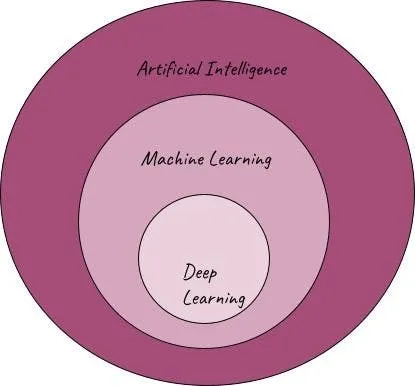

 # Day 2
 
 In Deep Learning, the word deep means multiple hidden layers. Learning about the history of deep learning is very amazing. Deep Diving into the topic, today i learned about the certain types of neural network, they are; **Artificial Neural Network(ANN), Convoluational Neural Network(CNN), Recurrent Neural Network(RNN), etc.** All these have diiferent fucntionalities according to different use-cases. Multiple hidden neural network is later termed as **Deep Learning.**
 
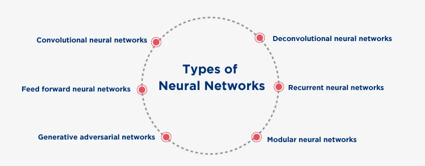

# Day 3

**Perceptron** is the basic unit of whole neural network. It is weakly inspired by Nerurons from human nervous system. Today, I understood the basics of perceptron and its geometric intuition. Perceptron works similar to that of machine learning models where data inputs are given and the preceptron will do prediction based on it's training with dataset. Perceptron works with more of linear sort of data and failes to maintain good accuracy on non linear data. 

- Basic Pictoral Representation of Perceptron:
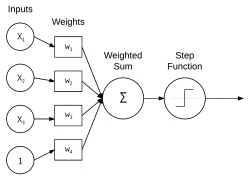

- Data for perceptron:

- classified Data using perceptron:
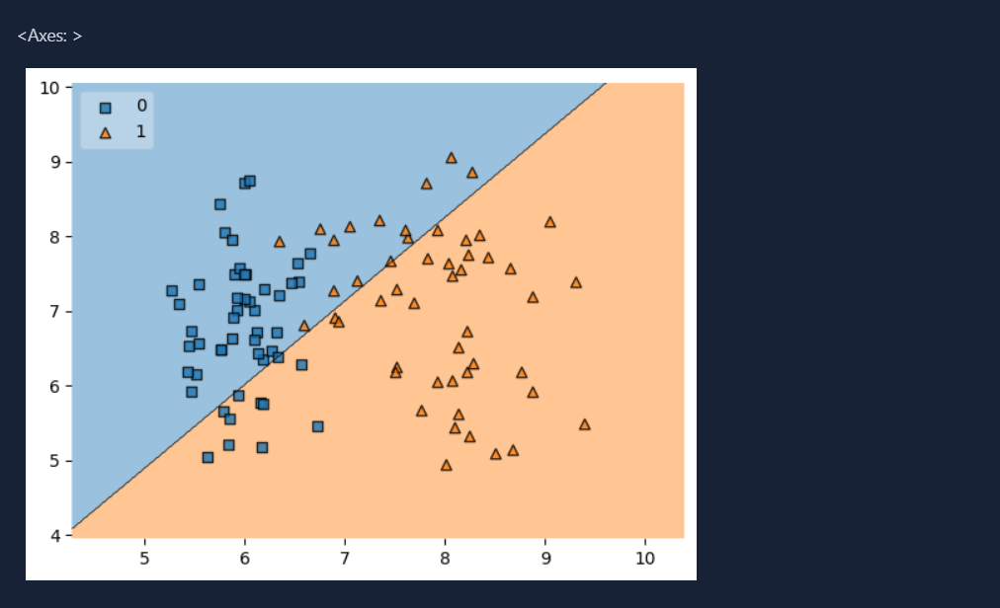

# Day 4

**Perceptron Training,** Today I learnt about perceptron training. First, I created a dataset for classification using sklearn and then developed perceptron model to train on those dataset.

#### Algorithm to train perceptron(trick):
- Step 1: train the built model with the dataset.
- Step 2: Select random datapoint from the dataset, if the actual value is 0 and predicted value is 1 then we should subtract that point with certain learning rate to old metric and update.
- Step 3: if the actual value is 1 and predicted value is 0 then we should add  that point with certain learning rate to old coefficient metric and update.
- Step 4: this step continues untill our coeff metric is stagnant.

- This is given by formula:
  
  New metric of eqn = old metric from eqn +learning_rate*(actual value- predicted_value)*datapoint

- Code Snippet:

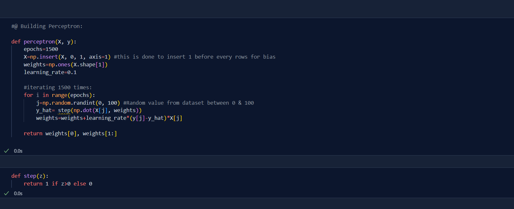
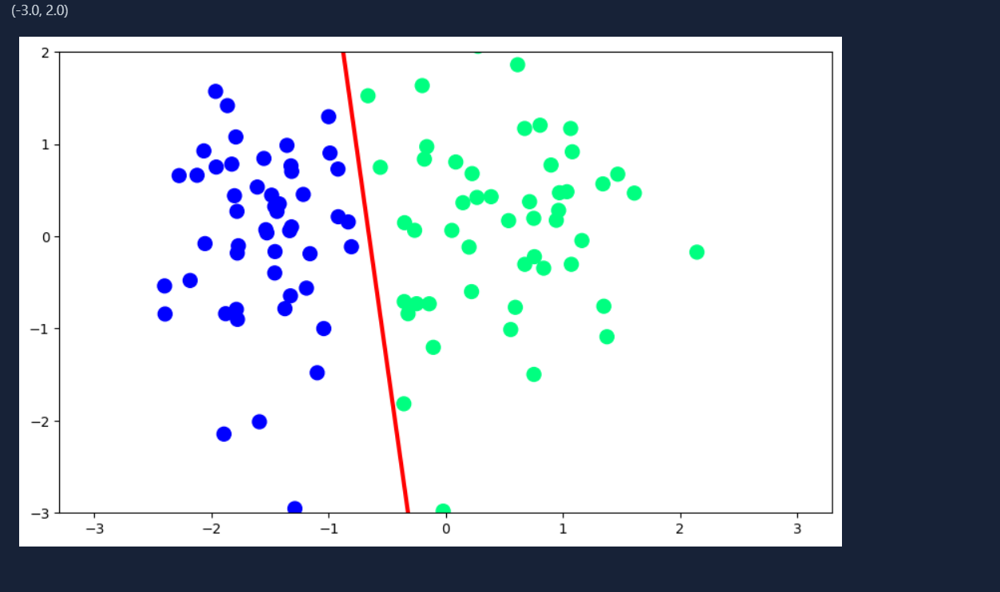

# Day 5
Yesterday, I learnt the trick to find the optimized line equation which will do deep learning classification. That trick might work must of the time but it doesn't guarantee the **convergence** and **Perfect seperation in line for classification**. Therefore, there is a need of **loss function**, which helps to find optimized weights and bias which will help in getting best separation line.
                                There are many loss function but we will use loss function similar to that of hinge loss function, which is 

- Loss Function = max(0, -Yi*f(Xi))  where Yi is the target value of each rows and F(Xi)=WiXi+b.

- Code Snippet:
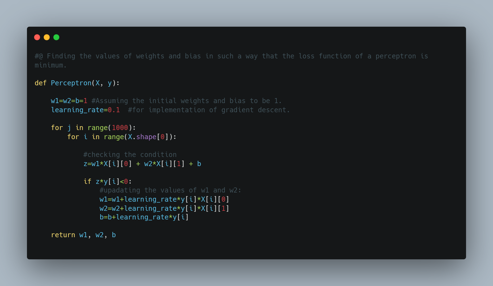

# Day 6
Today, I learnt about other loss function in perceptron. Perceptron is very flexible in nature. It can be used as linear regression, softmax regression, logistic regression and as perceptron itself depending upon the activation function used along with the loss function.Below is the table, I created to overview using various activation function and loss function:

- Table:

# Day 7
Dive diving into perceptron, it is in the notice that perceptron works on the linear model only. If given non-linear dataset to perceptron, how many epochs will it takes but it won't be able  to classify dataset due to which perceptron as a concept in deep learning couldn't grow further more.

- Demonstration:

[Watch the video](https://drive.google.com/file/d/1bjEwrqMVKu4_cXiYtlqe44gsCh1VsHX9/view?usp=drive_link)

# Day 8
Perceptron wasn't solely enough to use for prediction in deep learning due to which the concept of Multi-Layered Perceptron(MLP). Today, I understood the notation of MLP and revised the fundamental concept of perceptron. Understanding the notation helps to understand training of mlp later in learning.

- SnapShot:
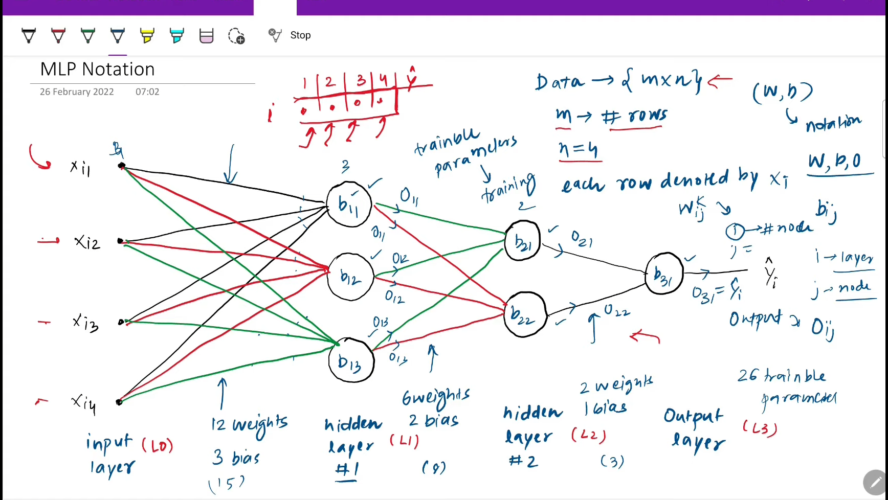

# Day 9
How MLP solves non linear decision boundary problems in complex data? Well, MLP does this by linear combination of different perceptrons and smoothening them.
What are the ways to improve performance in MLP?
- By adding nodes in hidden layer
- By adding nodes in input layer
- By adding nodes in output layer
- By adding hidden layers.

- Below is the snapshot of Tensorflow playground which depicts adding multiple hidden layers improves model performance of the model:

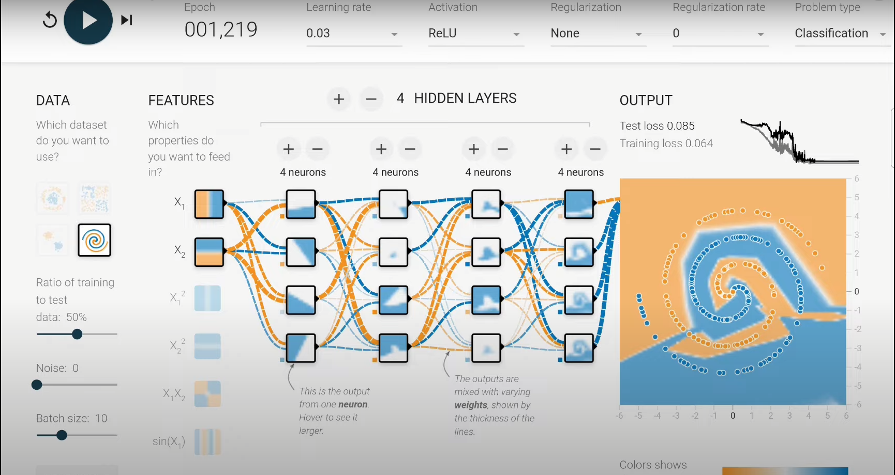

# Day 10
Today, I understood the concept of Forward Propagation in Neural network. It is very important to learn forward propagation in first place as it makes learning Back-Propagation easy.Forward Propagation is nothing but a method to feed data show that neural network can train itself and make prediction. We just have to feed data and all the other operations are handled by Linear algebra itself that's what the beauty of linear algebra. We shouldn't apply back propagation algorithm unless forward propagation is done.

- Below is the code snippet:
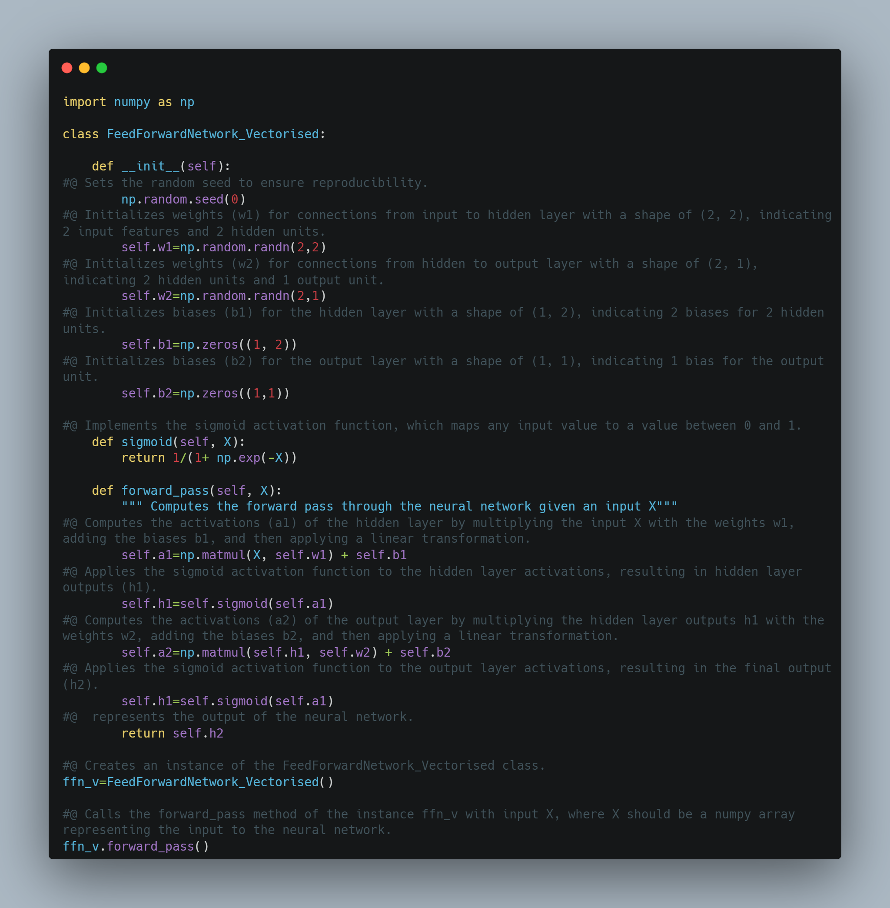

# Day 11
Today, I roughly trained ANN using keras and tensorflow where I learnt how prediction is made by neural networks.

- Below is the code snippet:
 
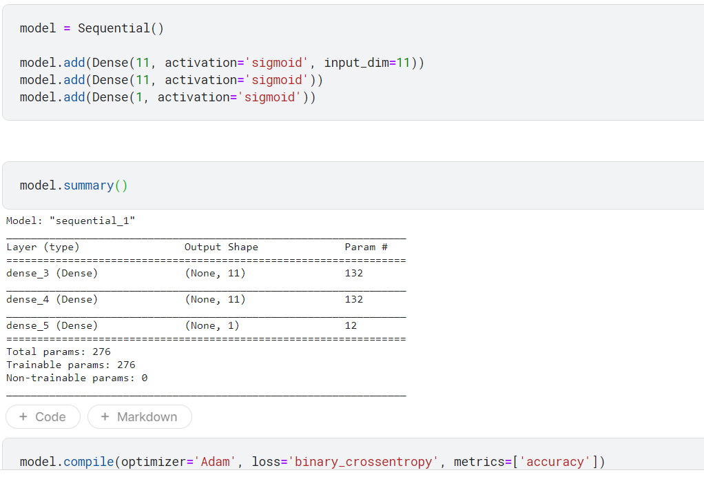

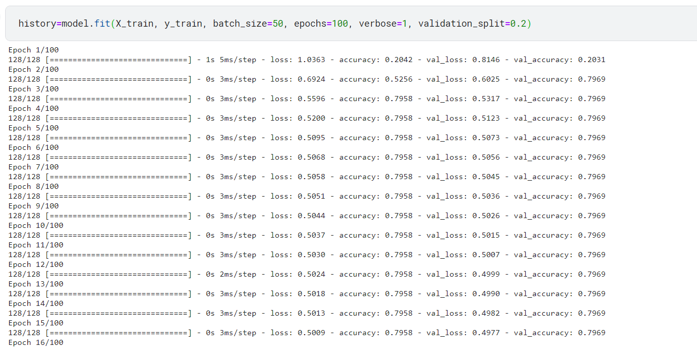

# Day 12
Today, I build the layers of neurons from scratch using python and saw how it does prediction which was all revision from forward propagation and saw how linear algebra work in deep learning.

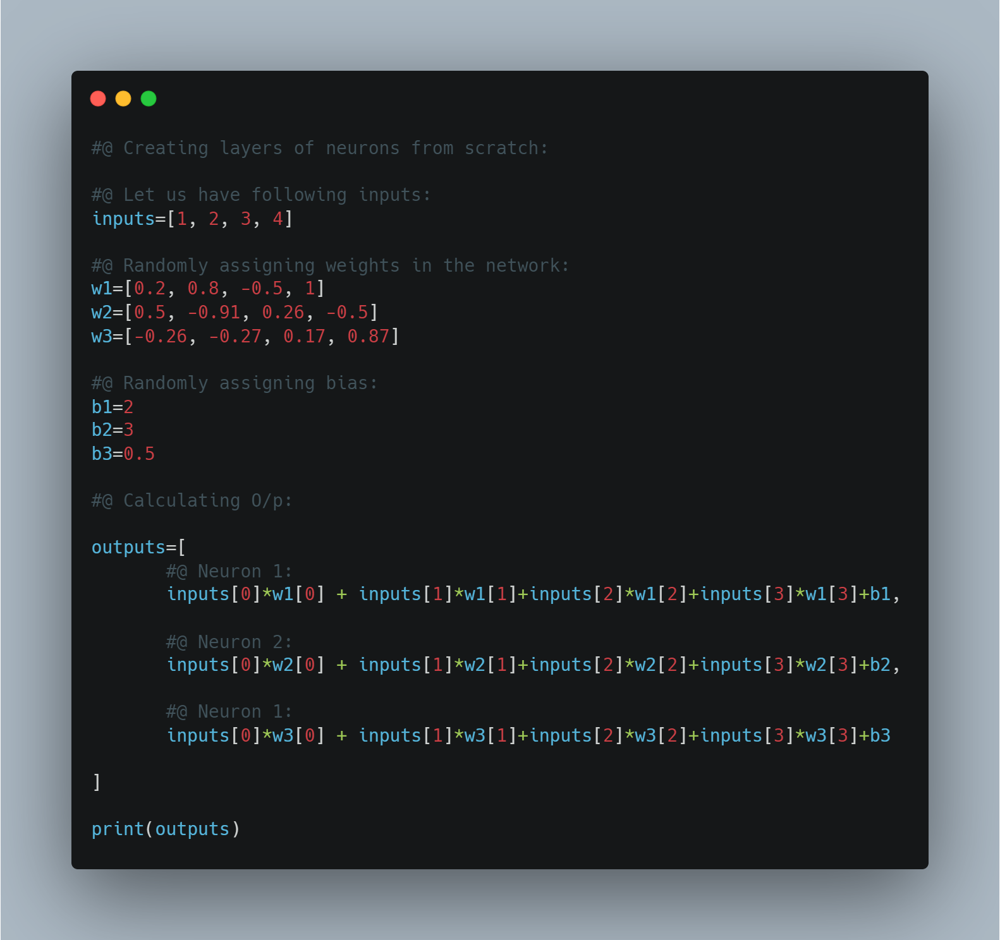

# Day 13
Today, I implemented code for dense layer from scratch and uderstood how forward propagation is done. First, I created a class named **Dense Layer** where I created simply two fucntions where one takes **no of inputs and no of neurons** and assign weights and biases with these inputs. Similarly, I created class for forward propagation which gives output using dot product(or say Matrix Multiplication) from calculated inputs, weights and biases and finally print out results.

- Below is the code snippet:

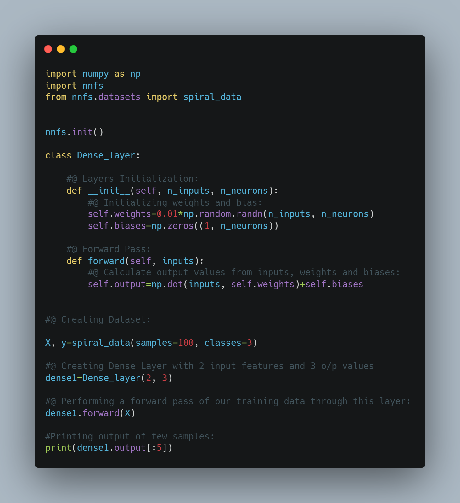

# Day 14
Implemented **RELU ACtivation Function** where ReLu stands for **Rectified Linear Unit**. It is as simple as other activation functions such as sigmoid, ect. The basic concept of RELU is it’s quite literally y=x, clipped at 0 from the negative side. If x is less than or equal to 0, then y is 0 — otherwise, y is equal to x. Also Saw their learning process from book **Neural Network From Scratch**.

-Below is the code implementation:

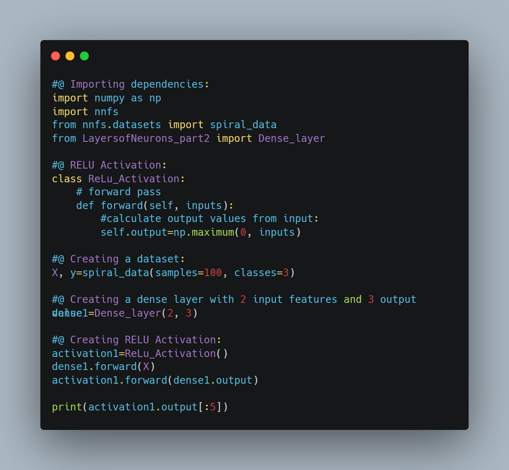

# Day 15
Today, I implemented **SOftmax Function**. The Softmax activation function addresses these limitations of ReLU Function by transforming the output into a probability distribution. 
 #### Properties of Softmax:
- **Normalization**: 
The outputs of the softmax function are probabilities that sum up to 1. This normalization provides a clear, interpretable measure of confidence for each class.
- **Bounded Outputs**: The output values are between 0 and 1, representing probabilities.
- **Contextual Output:** The probability for each class is calculated considering the scores of all classes, meaning each output is dependent on the others. This provides a comparative measure of confidence across all classes.

#### How Softmax Works in Classification:
When using softmax in the output layer of a neural network for classification:
- The network produces raw scores (logits) for each class.
- These logits are then transformed into probabilities using the softmax function.
- The class with the highest probability is considered the predicted class.

- Below is the code snippet:

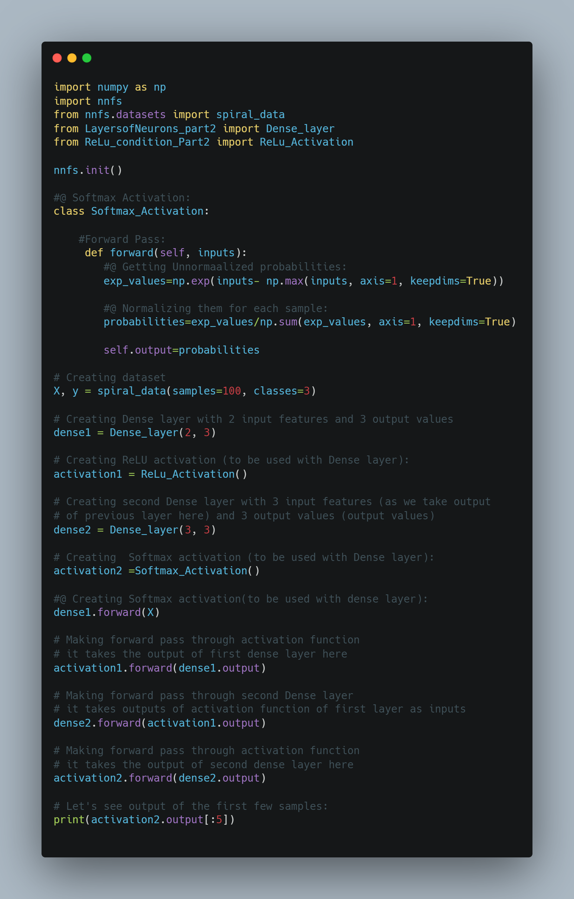

# Day 16
Today, I built the loss function for neural network from scratch. The loss function, also referred to as the cost function, is the algorithm that quantifies how wrong a model is.Loss is the measure of this metric. Since loss is the model’s error, we ideally want it to be 0. The model has a softmax activation function for the output layer, which means it’s
outputting a probability distribution. **Categorical cross-entropy** is explicitly used to compare a **“ground-truth” probability (y or “targets”)** and some predicted distribution **(y-hat or “predictions”)**, so it makes sense to use cross-entropy here. It is also one of the most commonly used loss functions with a softmax activation on the output layer.

- Below is the code snippet:

# Day 17
While loss is a useful metric for optimizing a model, the metric commonly used in practice along with loss is the **accuracy**, which describes how often the largest confidence is the correct class in terms of a fraction. Conveniently, we can reuse existing variable definitions to calculate the accuracy metric. We will use the argmax values from the softmax outputs and then compare these to the targets. This is as simple as doing (note that we slightly modified the softmax_outputs for the purpose of this example):

# Day 18
Today, Implmented Optimization for neural network. Now that the neural network is built, able to have data passed through it, and capable of calculating loss, the next step is to determine how to adjust the weights and biases to decrease the loss. Finding an intelligent way to adjust the neurons’ input’s weights and biases to minimize loss is the main difficulty of neural networks. The idea is instead of setting parameters with randomly-chosen values each iteration, apply a fraction of these values to parameters. With this, weights will be updated from what currently yields us the lowest loss instead of aimlessly randomly. If the adjustment decreases loss, we will make it the new point to adjust from. If loss instead increases due to the adjustment, then we will revert to the previous point. Using similar code from earlier, we will first change from randomly selecting weights and
biases to randomly adjusting them:

- Optimization:
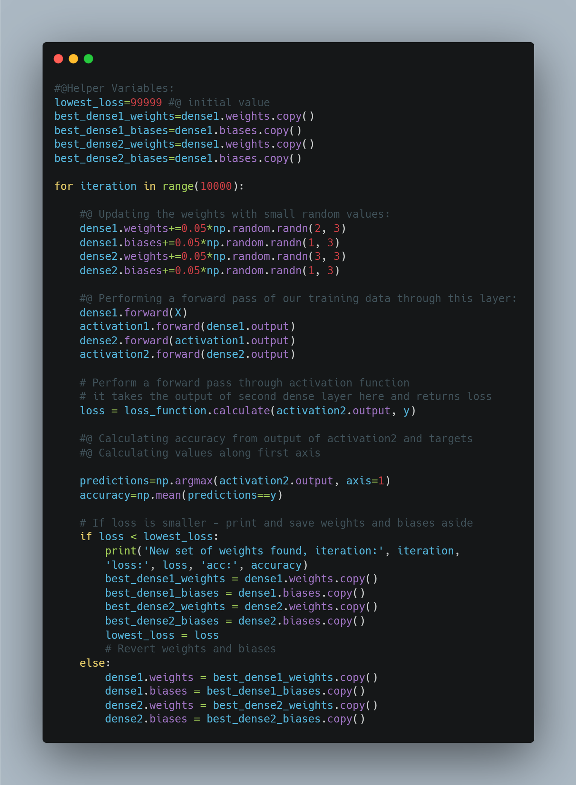

- Output:
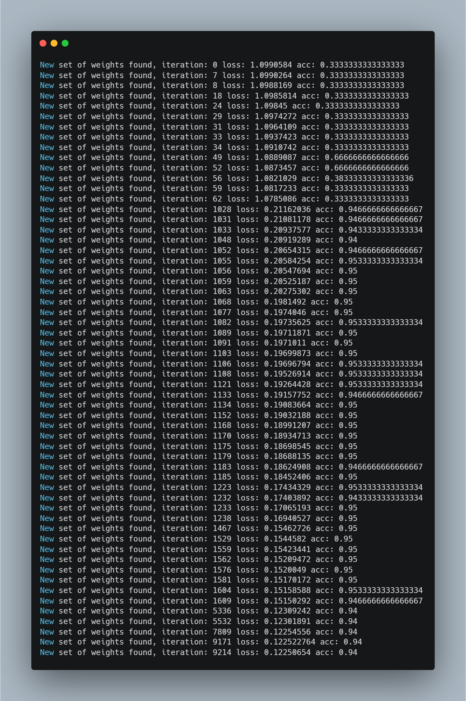

# Day 19
Today, I studied about Gradeint Descent. Gradient descent is an optimization algorithm which is commonly-used to train machine learning models and neural networks. It trains machine learning models by minimizing errors between predicted and actual results. Implemented gradient descent from scratch, First I have created function which has equation and then I built function for calculation of gredient descent using derivatives. After that using numpy, created random datapoints aligning with equation. After that I select one random data point which has to be descent and use loop to do so with learning rate and basic maths to make that data point global minima.

- Below is the code snippet:
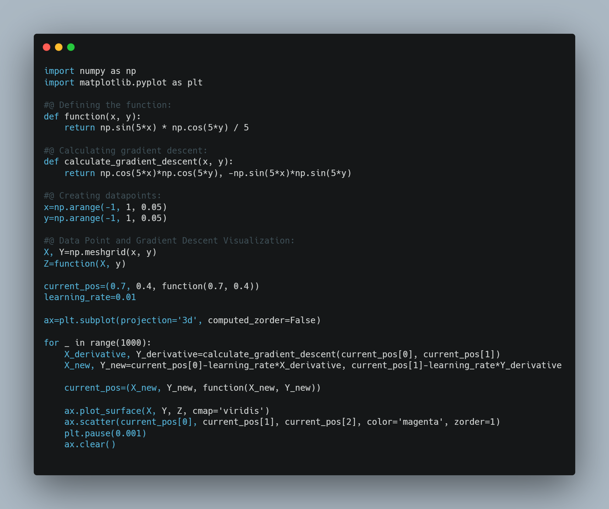

# Day 20
Derivative is very important in neural network, which is widely used in backpropagation in neural network. Backpropagation is an optimization technique which is done combining both forward propagation and gradient descent. First, we train our neural network and predict value using forward propagation and then calculate loss afterwhich gradient descent comes into play and updates our trainable parameter. Today, I just calculated partial derivative of neural network.

- Below is the code snippet:
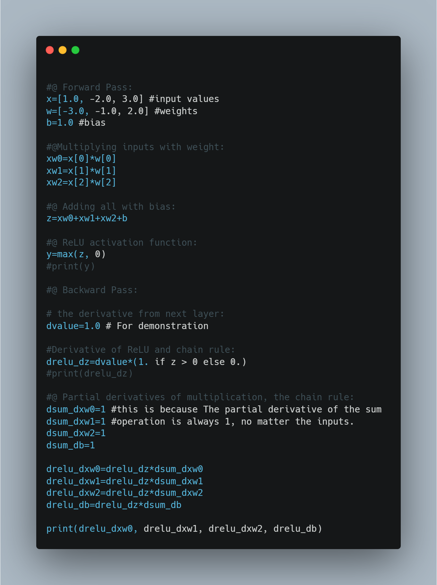

# Day 21
Completed backpropagation on single set of neuron and reduced the loss function. Now the main aim to pratice this under the deep neural network.

- Below is the snapshot:
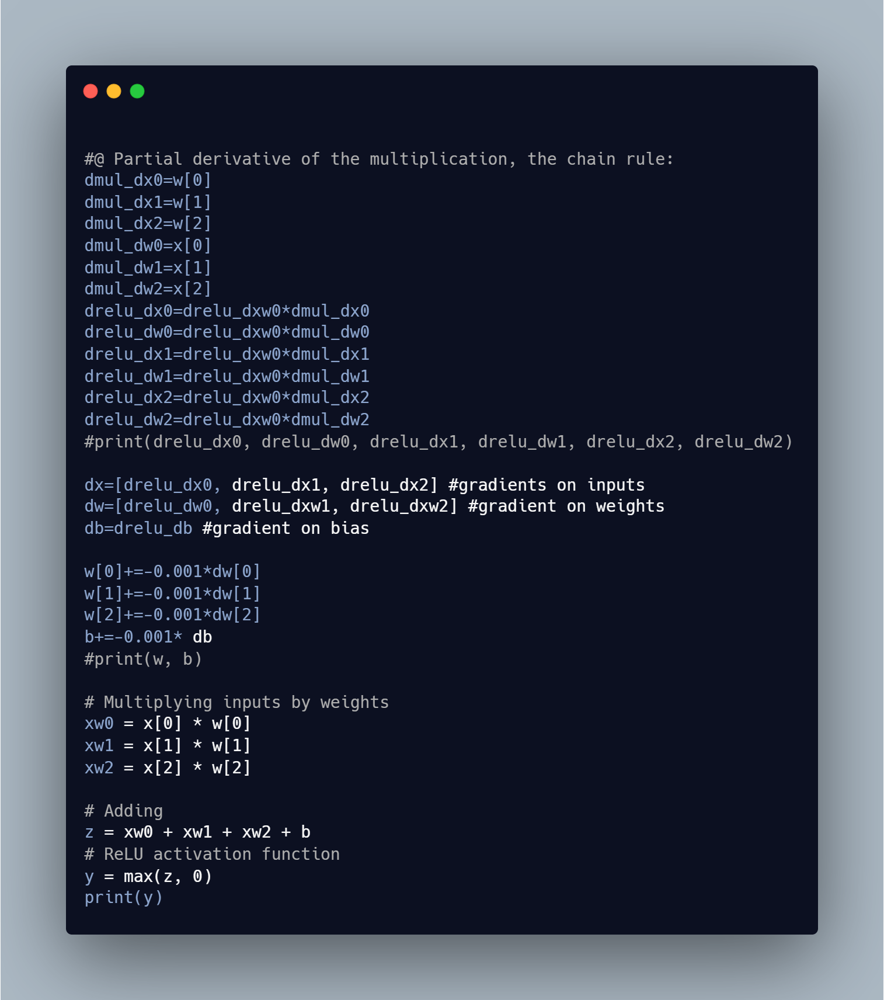

# Day 22
Today, I implemented backpropagation for **Dense Layer, ReLU Activation and SoftMax Activation.** 

#### Dense Layer Backward Pass:
- Created backward function which takes dvalues which is  Gradient of the loss with respect to the output of this layer (this is the gradient flowing back from the next layer). After that, computed the gradient of the loss with respect to the weight, biases and input of the layer by dot product of transposed(repsective) matrix with dvalues (for weights and inputs) and by summing up dvalues across the samples (rows).

#### Backward pass for ReLU Activation:
- Created backward function which takes dvalues which is  Gradient of the loss with respect to the output of this layer (this is the gradient flowing back from the next layer).after that, copied values to preserve the original dvalues. Setting the gradient to zero where the input to the ReLU was zero or negative, because ReLU outputs zero in those regions during the forward pass and thus does not contribute to the gradient.

#### Softmax Activation Backward Pass:
-  Computes gradients using the Jacobian matrix of the softmax function, iterating over each sample.

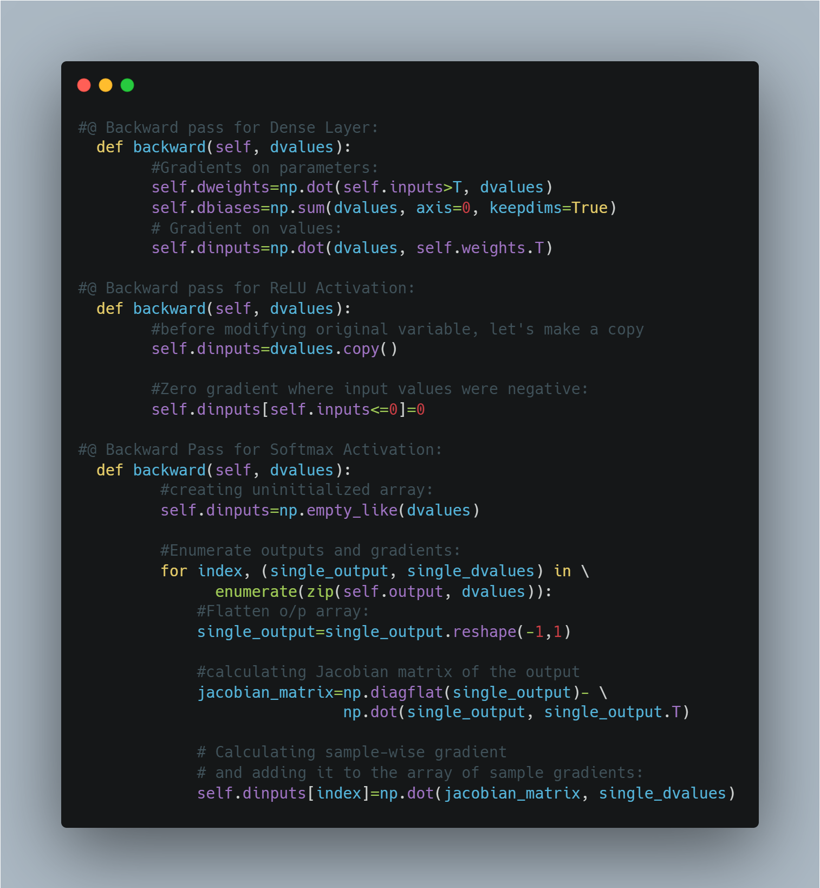

# Day 23
Created backward pass for **Common Loss and Categorical loss entropy**.
- **Backward Method:** Computed the gradient of the loss with respect to the input predictions, converting true labels to one-hot format if necessary, and normalizing the gradients.

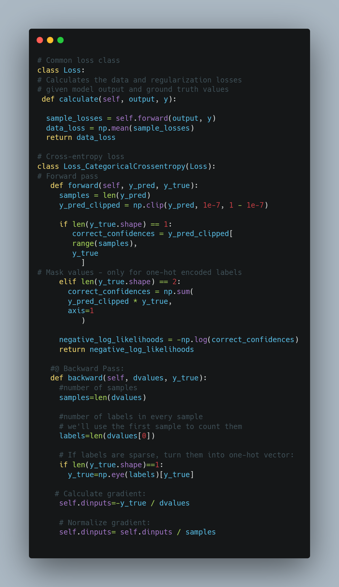

# Day 24
Today, I implemented code for both **Softmax and Loss Categorical Entropy** for both forward pass and backward pass. This class calculates the combined gradient of the loss and activation functions. Firstly, I did class initialization which will be called automatically when their objects are created.

#### Forward Pass
- Took input values and output values in the argument. afterthat fed input to softmax activation and got the result of prediction. Finally, returned loss by comparing with output values.

#### Backward Pass
- Took dvalues(the gradients of the loss with respect to the output of the softmax layer) and output values as argument. aftermath , if labels are one-hot encoded, turned them into discrete values because gradient calculation is based on class indices rather than one-hot vectors. Then copied dvalues to dinputs for safe modification. Finally, calculated gradient and normalized it.

- Below is the code snippet:
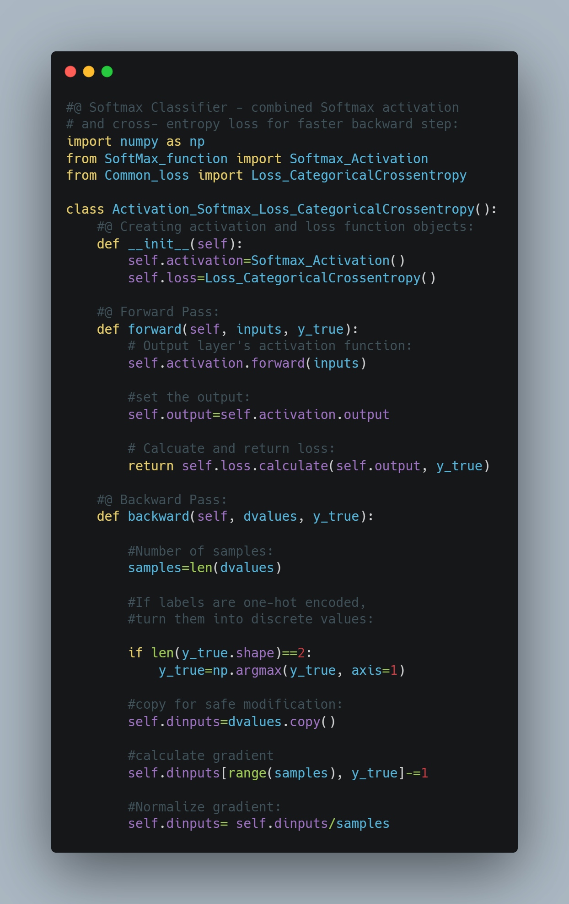

# Day 25
Today, I tested all the module that i have built over a period of time for training Neural network. I did Forward pass and Backpass and calculated loss and adjusted right weights and biases.At this point, thanks to gradients and backpropagation using the chain rule, we’re able to adjust the weights and biases with the goal of lowering loss, but we’d be doing it in a very rudimentaryway. This process of adjusting weights and biases using gradients to decrease loss is the job of the optimizer, which will study next. Here comes end for backpropagation.

- Below is the code snippet:

  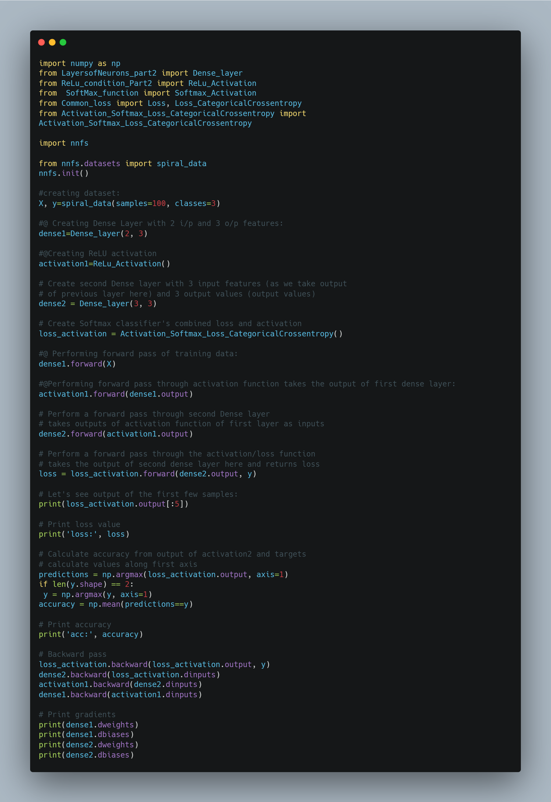

  # Day 26
Today, I performed **Stochastic Gradient Descent(SGD)** for neural network.In the case of Stochastic Gradient Descent, we choose a learning rate, such as 1.0. We then subtract the learning_rate · parameter_gradients from the actual parameter values. If our learning rate is 1, then we’re subtracting the exact amount of gradient from our parameters. We’re going to start with 1 to see the results, but we’ll be diving more into the learning rate shortly. Let’s create the SGD optimizer class code. The initialization method will take hyper-parameters, starting with the learning rate, for now, storing them in the class’ properties. The update_params method, given a layer object, performs the most basic optimization, the same way that we performed it in the previous chapter — it multiplies the gradients stored in the layers by the negated learning rate and adds the result to the layer’s parameters. It seems that, in the previous chapter, we performed SGD optimization without knowing it.

- Below is the code snippet:

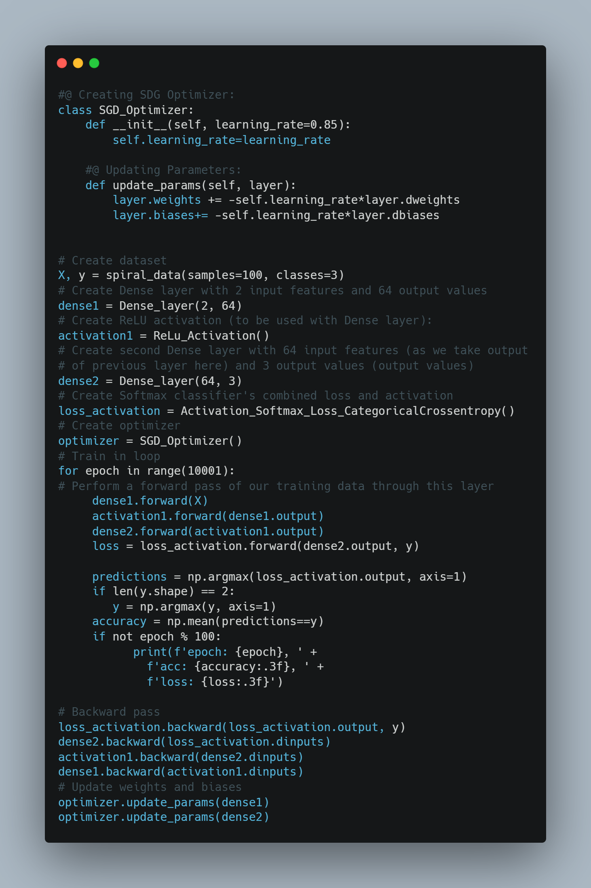

# Day 27
Today I implemented 2 concepts in SGD Optimizer i.e. **Learning Rate Decay and Learning rate with Momentum**.

#### Learning Rate Decay
The idea of a learning rate decay is to start with a large learning rate, say 1.0 in our case, and then decrease it during training. There are a few methods for doing this. One is to decrease the learning rate in response to the loss across epochs — for example, if the loss begins to level out/plateau or starts “jumping” over large deltas. You can either program this behavior-monitoring logically or simply track your loss over time and manually decrease the learning rate when you deem it appropriate. Another option, which we will implement, is to program a Decay Rate, which steadily decays the learning rate per batch or epoch.

#### Learning rate with Momentum
Momentum creates a rolling average of gradients over some number of updates and uses this average with the unique gradient at each step. Another way of understanding this is to imagine a ball going down a hill — even if it finds a small hole or hill, momentum will let it go straight through it towards a lower minimum — the bottom of this hill. This can help in cases where you’re stuck in some local minimum (a hole), bouncing back and forth. With momentum, a model is more likely to pass through local minimums, further decreases.

- Below is the code snippet:

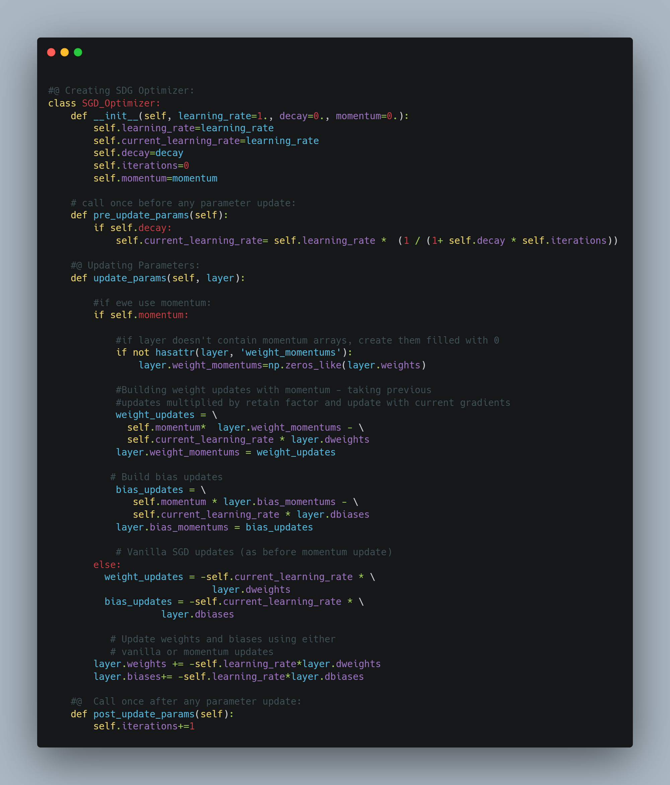

# Day 28
Adam, short for Adaptive Momentum, is currently the most widely-used optimizer and is built atop RMSProp, with the momentum concept from SGD added back in. This means that, instead
of applying current gradients, we’re going to apply momentums like in the SGD optimizer with momentum, then apply a per-weight adaptive learning rate with the cache as done in RMSProp. 
The Adam optimizer additionally adds a bias correction mechanism. Do not confuse this with the layer’s bias. The bias correction mechanism is applied to the cache and momentum, compensating for the initial zeroed values before they warm up with initial steps. To achieve this correction, both momentum and caches are divided by 1-betastep
. As step raises, betastep approaches 0 (a fraction to the power of a rising value decreases), solving this whole expression to a fraction during the first steps and approaching 1 as training progresses. For example, beta 1, a fraction of momentum to apply, defaults to 0.9.

# Day 29
Did Practical implementation of code for Forward pass regularization. Types of Regularization present in Machine learning are:

#### L1 Regularization(Lasso)
- **Penalty Calculation:** L1 regularization adds up the absolute values of all the weights and biases in the model. This sum is the penalty that gets added to the model's loss.
- **Linear Nature:** The penalty increases directly in proportion to the weights' values. If you double a weight, its penalty also doubles.

###### Impact on Weights:
- **Sparsity:** L1 regularization often leads to many weights being exactly zero. This means the model uses fewer features, which can help in feature selection.
- **Small Weights:** L1 can make small weights go to zero, making the model ignore small inputs and focus on larger ones.

#### L2 Regularization(Ridge)
- **Penalty Calculation:**  L2 regularization adds up the squares of all the weights and biases. This sum is the penalty that gets added to the model's loss.
- **Non-Linear Nature:** The penalty increases faster as the weights grow. If you double a weight, its penalty quadruples.

##### Impact on Weights:
- **Discourages Large Weights:** L2 regularization heavily penalizes large weights, preventing any single weight from becoming too large.
- **Allows Small Weights:** It doesn't significantly penalize small weights, so the model remains sensitive to small variations in input.

#### Combining L1 and L2 (Elastic Net)
- Balanced Approach: Often, both L1 and L2 regularization are used together in a method called Elastic Net. This combines the benefits of both, creating models that are both sparse and well-regularized.

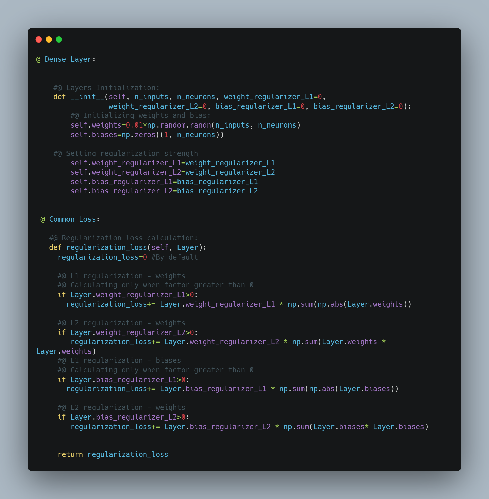

# Day 30 
Completed regularization for backward pass as well.

- L1 regularization’s derivative, on the other hand, requires more explanation. In the case of L1 regularization, we must calculate the derivative of the absolute value piecewise function, which effectively multiplies a value by -1 if it is less than 0; otherwise, it’s multiplied by 1.

- For L2, Lambda is a constant, so we can move it outside of the derivative term. We can remove the sum operator since we calculate the partial derivative with respect to the given
parameter only, and the sum of one element equals this element. So, we only need to calculate the derivative of w2, which we know is 2w. From the coding perspective, we will multiply all of the weights by 2λ. We’ll implement this with NumPy directly as it’s just a simple multiplicationoperation.

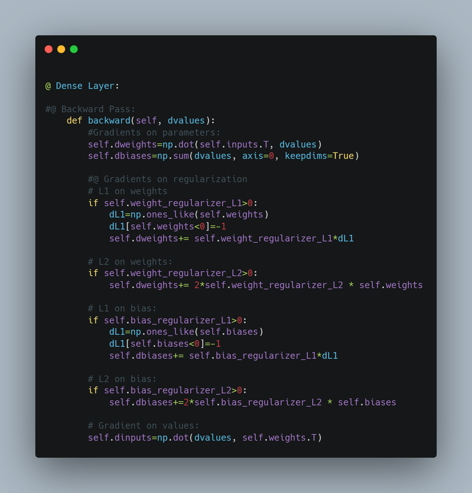

# Day 31
Another option for neural network regularization is adding a dropout layer. This type of layer disables some neurons, while the others pass through unchanged. The idea here
similarly to regularization, is to prevent a neural network from becoming too dependent on any neuron or for any neuron to be relied upon entirely in a specific instance (which can be common if a model overfits the training data).

While dropout helps a neural network generalize and is helpful for training, it’s not something we want to utilize when predicting. It’s not as simple as only omitting it because the magnitude of inputs to the next neurons can be dramatically different. If you have a dropout of 50%, for example, this would suggest that, on average, your inputs to the next layer neurons will be 50% smaller when summed, assuming they are fully-connected. What that means is that we used dropout during training, and, in this example, a random 50% of neurons output a value of 0 at each of the steps. Neurons in the next layer multiply inputs by weights, sum them, and receive values of 0 for half of their inputs. If we don’t use dropout during prediction, all neurons will output their values, and this state won’t match the state seen during training, since the sums will be statistically about twice as big. To handle this, during prediction, we might multiply all of the outputs by the dropout fraction, but that’d add another step for the forward pass, and there is a better way to achieve this. Instead, we want to scale the data back up after a dropout, during the training phase, to mimic the mean of the sum when all of the neurons output their values.

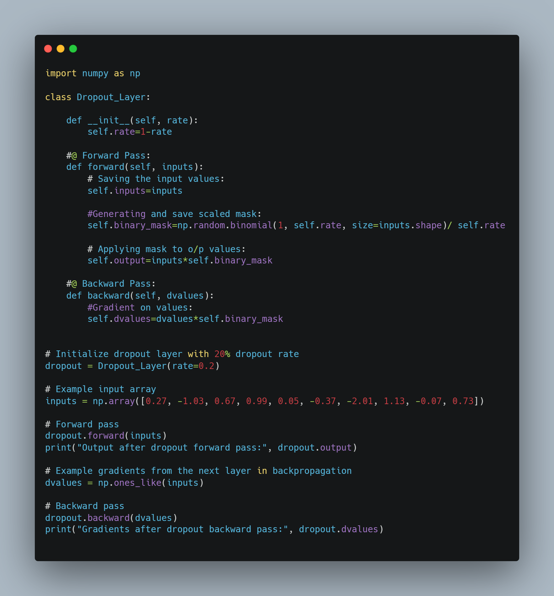

# Day 32
Today, I Revised the concept of Activation function, how Neural networks helps to solve the problem of non-linearity. Similarly, I revised the significance of Calculus(esp. Partial derivatives, chain rule, etc) in training neural nets. And finally, Watched MIT lecture on deep learning.

⚒ PS: Below is the Snapshot of how activation functions play a key role in handling non-linear data from the my current read "Deep Learning from Scratch"

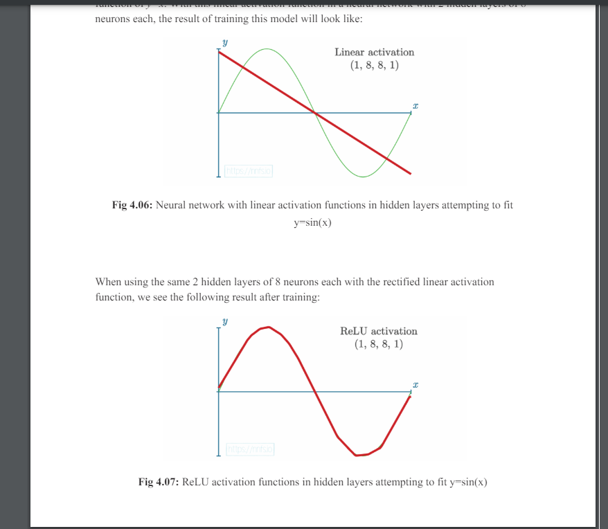

# Day 33
Today I implemented code for Binary Logistic Regression. Until now, we’ve used an output layer that is a probability distribution, where all of the values represent a confidence level of a given class being the correct class, and where these confidences sum to 1. We’re now going to cover an alternate output layer option, where each neuron separately represents two classes — 0 for one of the classes, and a 1 for the other. A model with this type of output layer is called binary logistic regression. This single neuron could represent two classes like cat vs. dog, but it could also represent cat vs. not cat or any combination of 2 classes, and you could have many of these. For example, a model may have two binary output neurons. One of these neurons could be distinguishing between person/not person, and the other neuron could be deciding between indoors/outdoors. Binary logistic regression is a regressor type of algorithm, which will differ as we’ll use a sigmoid activation function for the output layer rather than softmax, and binary cross-entropy rather than categorical cross-entropy for calculating loss.

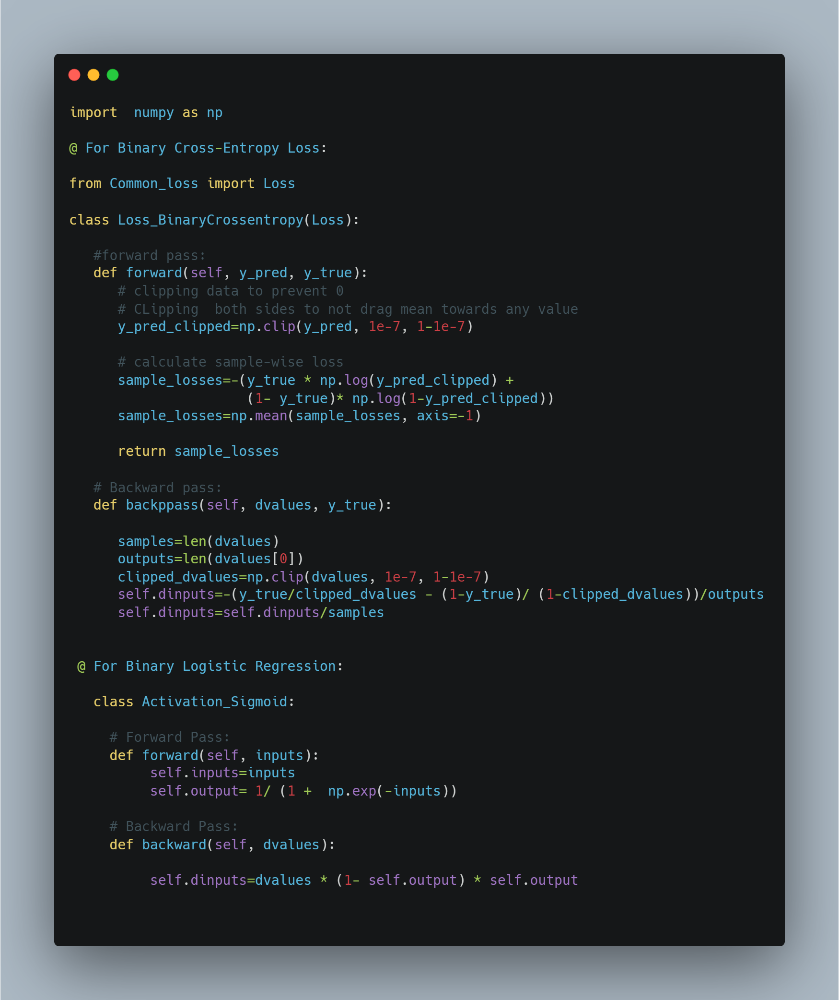

# Day 34
Today, I implemented python code for regression task in neural network. I did three things today:

- Created Linear Activation function which passes input to the output: y=x. For the backward pass, we already know the derivative of f(x)=x is 1. so did same with gradients. We
do this only for completeness and clarity to see the activation function of the output layer in the
model definition code

- Created **Mean Squared Error** for calculating loss in regression analysis you square the difference between the predicted and true values of single outputs (as the model can have multiple regression outputs) and average those squared values. The idea here is to penalize more harshly the further away we get from the intended target.

- Created **Mean Absolute Error** that take the absolute difference between the predicted and true values in a single output and average those absolute values.This function, used as a loss, penalizes the error linearly.

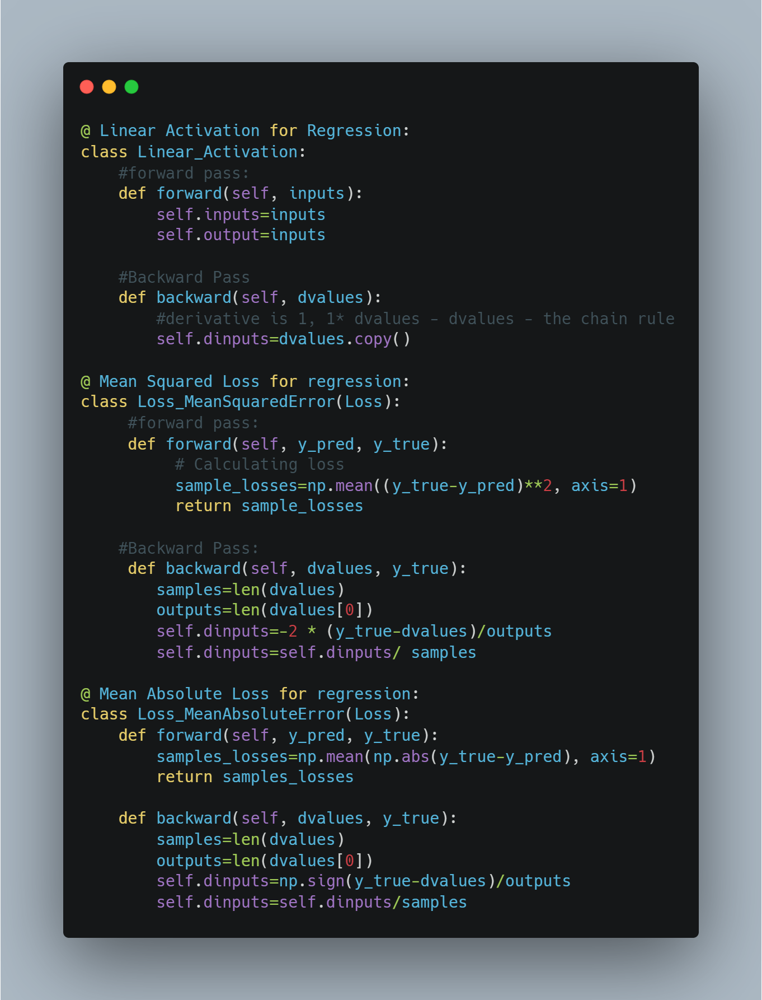

# Day 35
Learnt about confusion matrix. **Confusion Matrix** is a matrix the summarize the performance of ML model on a set of test data.There are Four categories in confusion matrix, they are:

- **True Positive:** When the actual value is true and predicted value is also true.
- **True Negative:** when the actual value is false and predicted value is false.
- **False Positive:** when the predicted value is true but the actual value is false.
- **False Negative:** when the predicted value is false but the actual value is true.

##### Following metrics are calculated based on Confusion matrix data:
- **Accuracy:** It is used to measure performance of model.
       
           Accuracy=(TP+TN)/(TP+TN+FP+FN)

- **Recall:** It measures the effectiveness of a classification model in identifying all relevant instances from a dataset.
​
           
           Recall= TP/(TP+FN)

- **Precision:** It is a measure of how accurate a model’s positive predictions are.

             Precision= TP/(TP+FP)

- **F1-Score:** It is used to evaluate the overall performance of a classification model. 

 
         F1-Score= (2*Precision*Recall)/(Precision+Recall)

​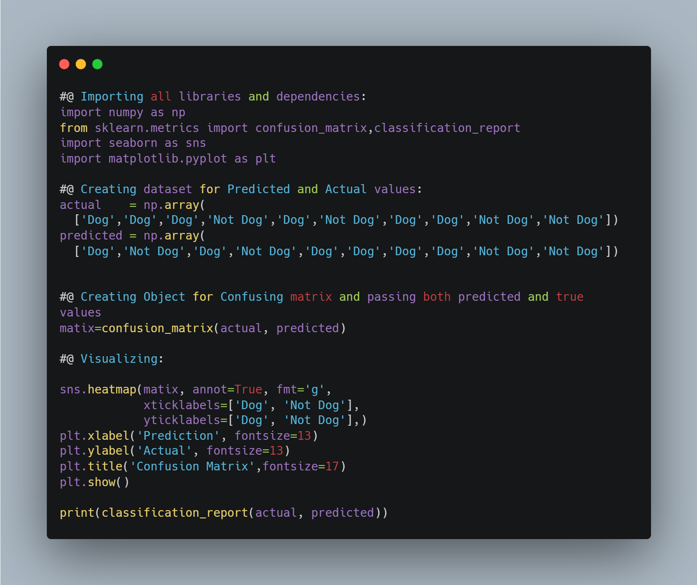

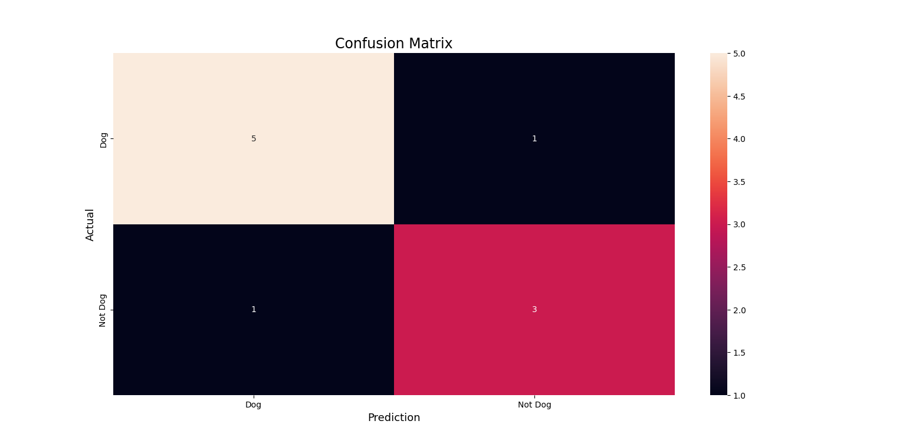
 
# Day 36
Today, I Implemented code for object modeling which helps to do things like save and load this object to use for future prediction tasks. Created **Model** class which has any array that contains the layers and set function for Loss and optimizer. Similarly, the main part of the code here is function **Finalize** which creates an input layer and sets next and prev references for each layer contained within the self.layers list of a model object. We wanted to create the Layer_Input class to set the prev property of the first hidden layer in a loop since we are going to call all of the layers in a uniform way. The next layer for the final layer will be the loss, which we already have created.

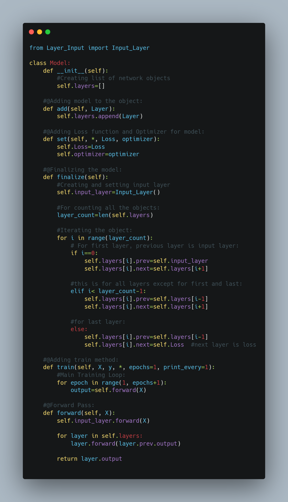

# Day 37
Continued for Object modeling where I implemented code for Backpropagation and calcualting loss and accuracy. First, I checked trainable parameter i.e weights in our case in class model. Similarly, I added remember trainable layer function in common loss class due to which we can iterate over the trainable layers to compute regularization loss for the entire model, rather than one layer at a time. Furthermore, I created appropriate prediction function in all activation function class.

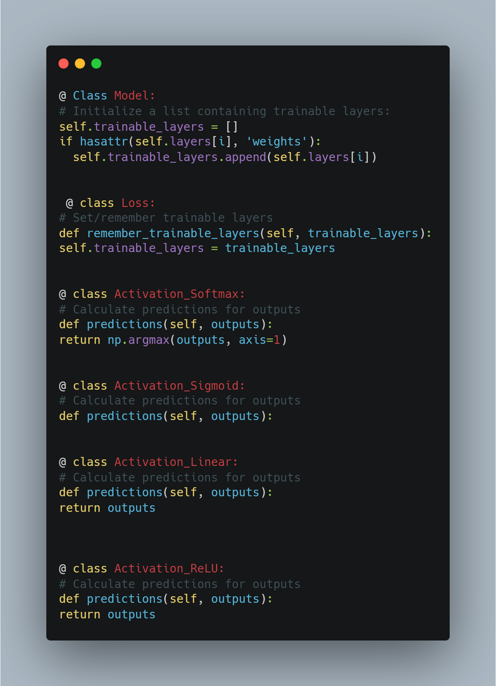

# Day 38
Today, I created accuracy class for forward pass in neural network. First, we’ll write a common Accuracy class containing (for now) just a single method, calculate, returning an accuracy calculated from comparison results. We’ve already added a call to the self.compare method that does not exist yet, but we’ll create it soon in other classes that will inherit from this Accuracy class. For now, it’s enough to know that it will return a list of True and False values, indicating if a prediction matches the ground-truth value. Next, we calculate the mean value (which treats True as 1 and False as 0) and return it as an accuracy.
​
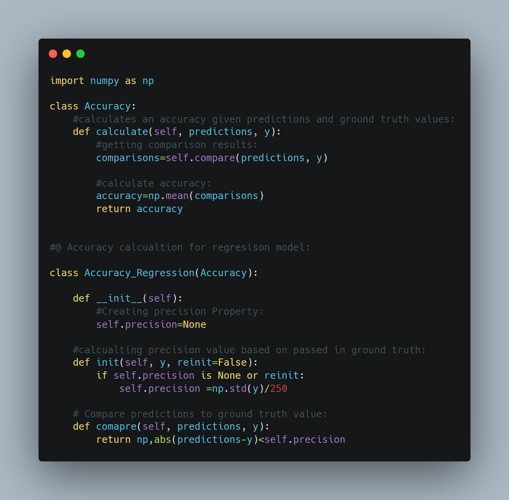

# Day 39:
Started reading The First Paper of Neural Network, "A LOGICAL CALCULUS OF THE IDEAS IMMANENT IN NERVOUS ACTIVITY". Read 3 page only but got some meaning insights. Some of which are:
 
📌All or None Law: 
Researcher have started with basic assumptions that a neuron either fires completely or does not fire at all with respect to the inputs.

📌Logical Representation of Neural Activity: 
This can be done using propositional logic as said before by "All or None Law" and the interactions between neurons are represented using logical connectives like AND, OR, NOT, etc.

📌Complexity with circuits(Nets with circles):
Not to be confused with backpropagation(if you know they are different things, I was confused at first sight). Recursive functions should be used to capture the temporal dependencies and feedback loops involved in neural signaling.

📌Introduction to Facilitation, Extinction and Learning:
- Facilitation: temporary increase in responsiveness to stimuli, 
- Extinction: temporary decrease in responsiveness, 
- Learning: permanent changes in responsiveness.

📌Formal Equivalence and Predictive Power
Despite the simplifications inherent in using propositional logic to model neural activity, McCulloch and Pitts argue for the utility of formal equivalence. This means that their logical framework allows predictions about neural behavior that are consistent with experimental observations, even though the framework does not directly explain the underlying biological mechanisms.

- First page of Paper:
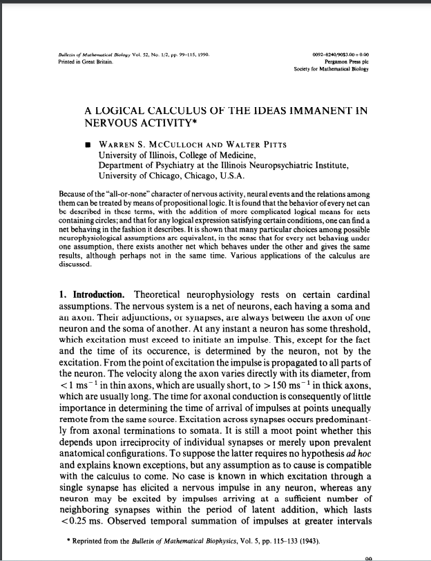

# Day 40:
Completed Implementing Object Modeling. Worked on Backpropagation and accuracy calculation. Added code for validation data during training. Similarly, Along with validation, Implemented Concept of Dropout to inform the layers if we are using during the training and let them “decide” on calculation to include. and finally, Separated Softmax  activation and Categorical Cross-Entropy loss objects, and handle just for the backward pass.

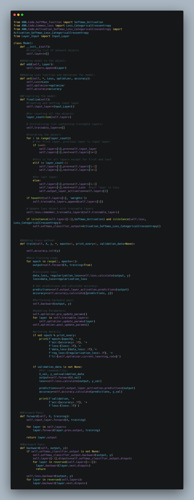

# Day 41:
- Started Project on Fashion MNIST since this would be my first project on ANN using the code that I have written in past days. This dataset has a collection of 60,000 training samples and 10,000 testing samples of 28x28 images of 10 various clothing items like shoes, boots, shirts, bags, and more. we have prepared and are hosting a preprocessed dataset consisting of .png images instead. It is usually wise to use lossless compression for images since lossy compression, like JPEG, affects images by changing their data. These images are also grouped by labels and separated into training and testing groups. The samples are the images of articles of clothing, and the labels are the classifications.

- Today, I did Data retrieval using python. After the implementation of code, we now have a directory called fashion_mnist_images, containing test and train directories and the data license. Inside of both the test and train directories, we have ten subdirectories, numbered 0 through 9. These numbers are classifications that correspond to the images within. For example, if we open directory 0, we can see these are images of shirts with either short sleeves or no sleeves at all.

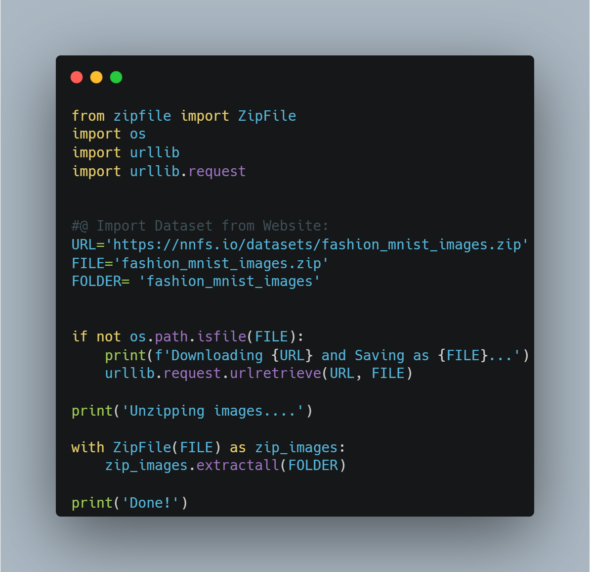

# Day 42:
Today, I implemented the data preprocessing(i,e scaling) and built basic function for the data loading which will be beneficial in upcoming future task. Similarly, Neural networks tend to work best with data in the range of either 0 to 1 or -1 to 1. Here, the image data are within the range 0 to 255. We have a decision to make with how to scale these data. Usually, this process will be some experimentation and trial and error. 

- For example, we could scale images to be between the range of -1 and 1 by taking each pixel value, subtracting half the maximum of all pixel values (i.e., 255/2 = 127.5), then dividing by this same half to produce a range bounded by -1 and 1. 

- Used OpenCV Library which is widely used for Convolution Neural Network. and revised some concept related to Artificial Neural Network.

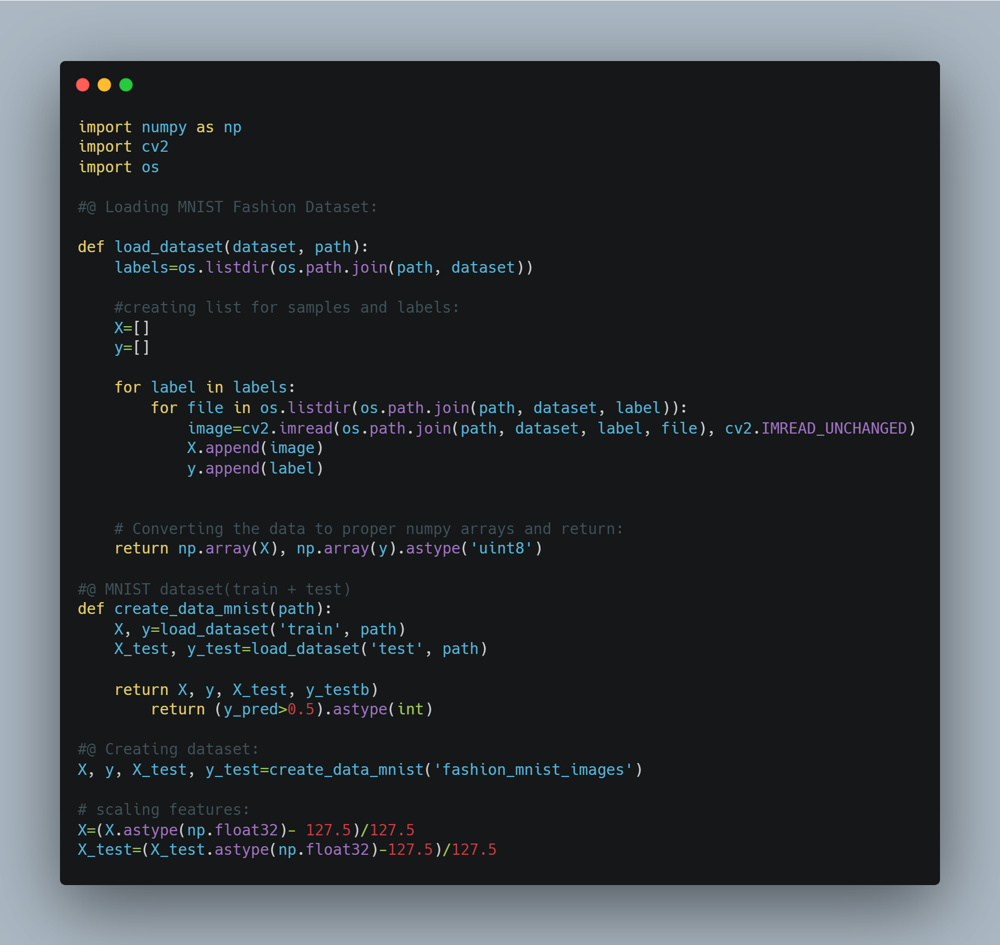

# Day 43:
Continued working on project where today I created code implementation for Dropout layer in my neural network. Remember Dropout layer from previous implementation? Yes, it's the same. This concept plays vital role in regularization of neural nets. The main task here is to use dropout for training purpose only but not during predictions and the main issue that arises here is how to maintain same predictibility with training and predictions? This is done by scaling where **Binomial Distribution** is used which ensure that the expected sum of the outputs remains the same as the sum of the inputs.It prevents overfitting. Applying Dropout forces the network to learn how to make accurate predictions with only a random part of neurons remaining. Things to Remember about Dropout Layer:

- Neurons Dropout means **Disabling neurons i.e it will always throw 0 o/p irrespective of inputs** not removing neurons from network.
- Training time is as same with or without dropout layer.

###### Github Link for Project: https://github.com/prijall/ANN-Fashion-Mnist-Project

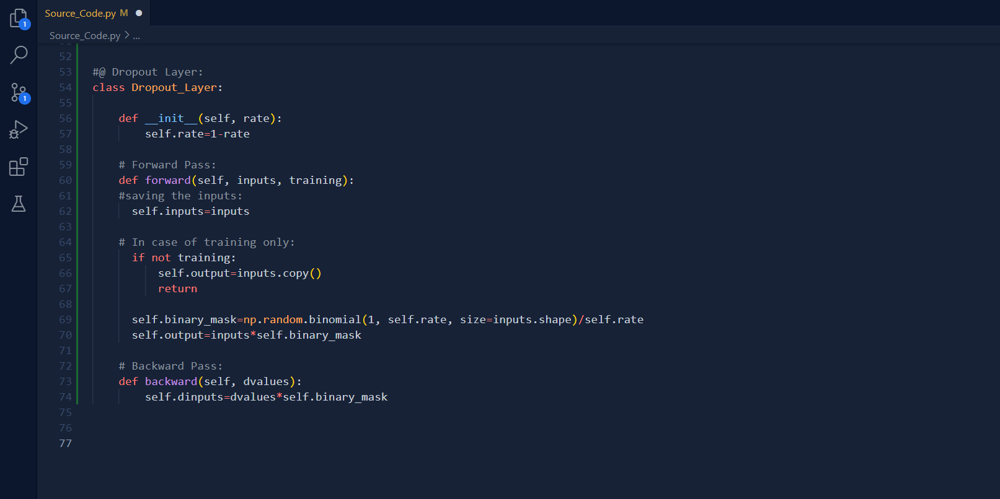

# Day 44:
Created Activation functions for neural net of the project. Added Several functions which will be used for various purpose:

- **ReLU Activation:** To fire 0 ouput when the inputs are 0 or below and the same output as input when input is greater than 0.

- **softmax Activation:**
it is used for multi-class classification. It does probabilistic interpretation, output scaling and gradient calculation.

- **Sigmoid Activation:**
It is used for binary classification tasks where the output needs to represent a probability of belonging to one class

- **Linear Activation:**
 It is commonly used in the output layer of regression tasks, where the network directly predicts continuous values without any activation function.

- **Input layer:**
It  is essentially a pass-through layer that directly passes its input to its output. This can be useful in the context of neural networks where you might want to keep the input data accessible in a structured way.

###### Github Link for Project: https://github.com/prijall/ANN-Fashion-Mnist-Project

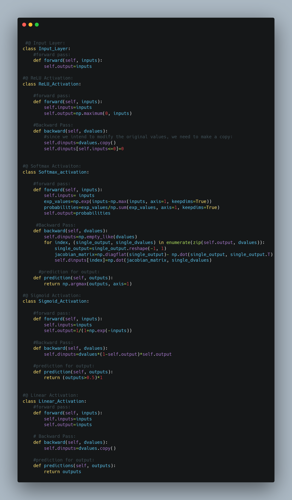

# Day 45 
Today, added loss function for both primary loss(data loss) and regularization. It includes methods to calculate the regularization loss for the model's layers, store trainable layers, compute the loss for individual batches, and calculate the accumulated loss over multiple batches in an epoch. The calculate method computes the mean data loss for a batch and optionally adds regularization loss. The calculate_accumulated method computes the average loss over all batches processed so far, providing a stable measure of the model's performance. The new_pass method resets the accumulated loss and count for a new epoch. Accumulated loss is important for stable and accurate performance monitoring, guiding optimization, and understanding the impact of regularization over an entire epoch.

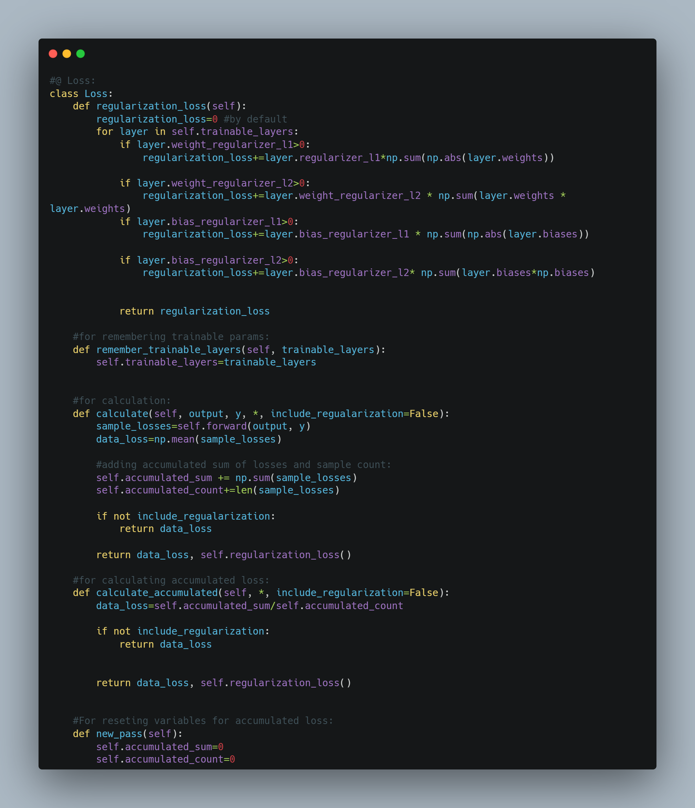

# Day 46 
Added accuracy model for my project. This is one of the important parameter in the development and testing of a project which helps to understand the performance of our model so that we can make it better with time. As it is clear that the neural nets that I am developing is capable to work on both categorical and numerical data so I created accuracy for both categorical and regression task. Having the concept of Confusion matrix helps a lot in knowing about accuracy, precision,etc.

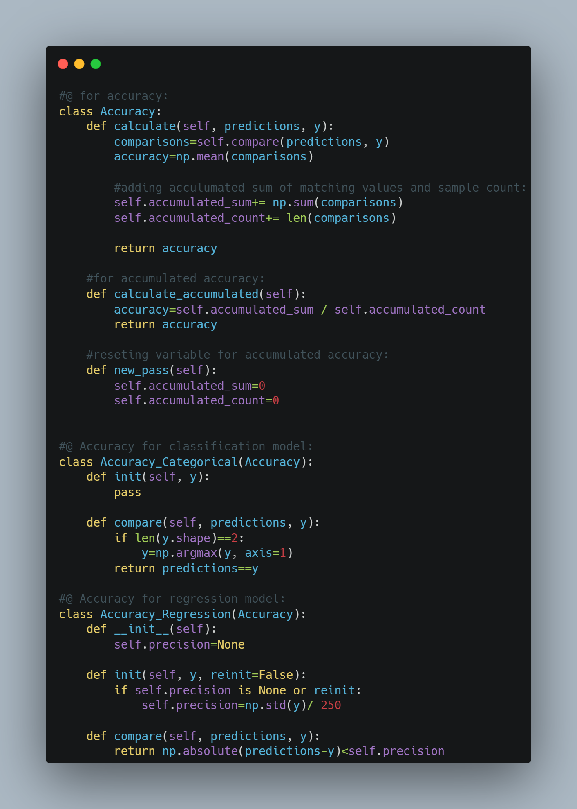

# Day 47
Added Model class for the project and added variosu different loss functions.

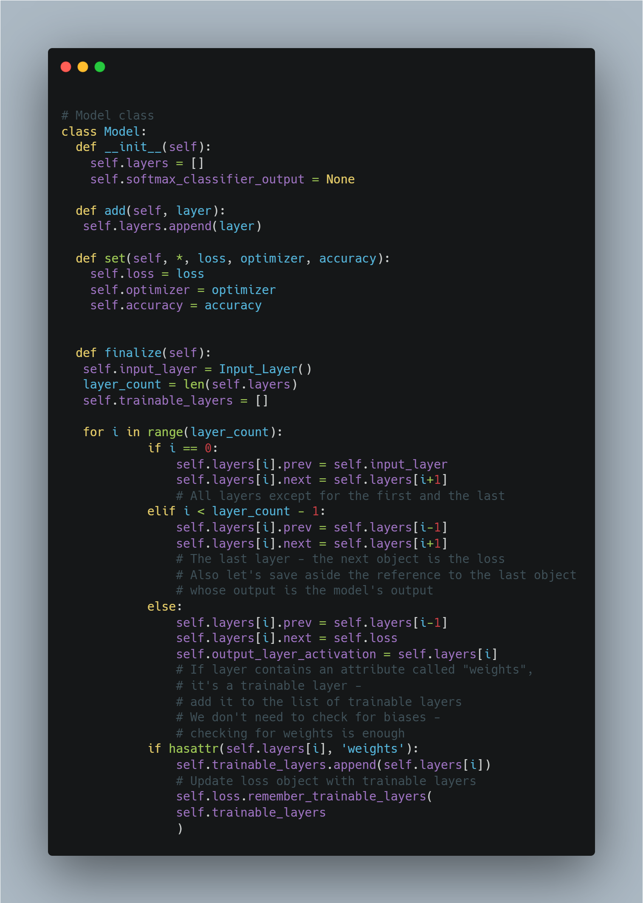

# Day 48
Today, I worked on project where, I created  functions for accessing dataset and splitiing them for train-test purpose after which I test my source code but I got loaded with too many errors. The most part of my time went int0 debugging the error which was daunting yet got chance to learn more!!!

- Code snippet:

# Day 49
spent time debuggging the code that I have implemented from scratch. Most of them are solve but my model is not trainin well due to which my loss is not updating and learning rate decaying is not working fine. I need to fix things asap.

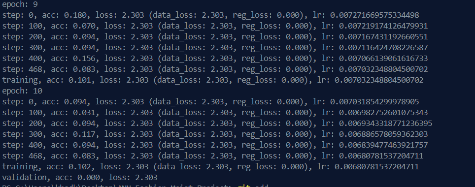

# Day 50
Added Model Evaluation which is one of the important aspect in deep learning projects. We generally, divide datasets into training and testing set whereas we have no data for validation. In this model, I have created validation dataset from test batch, which should be fine as of now to evaluate the performance of our model.

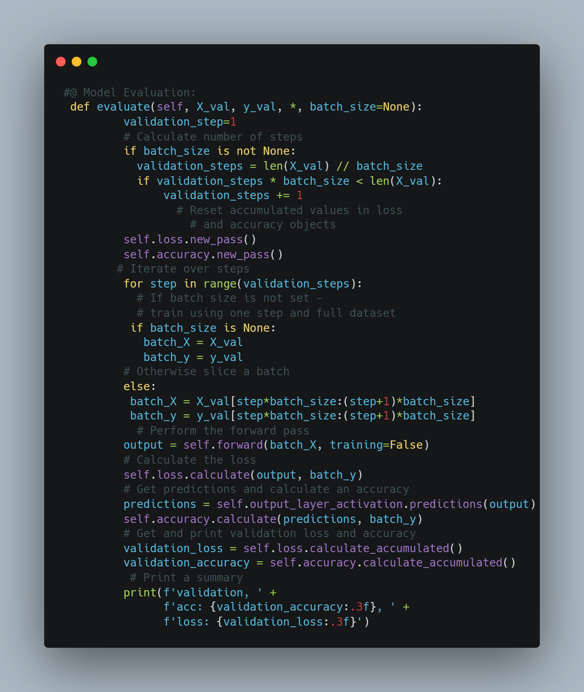

# Day 51:
Added code for Parameter Retreiving so that we can take closer look into the model parameter to see if we have dead or exploding neurons. Similary, added code for setting parameter which will iterate over the trainable layer and returns a new iterable with pairwise combinations of all the iterable passed in params. finally, amended code in object modeling so that we dont need optimizer as trained parameters are passed into model and we dont have to train.

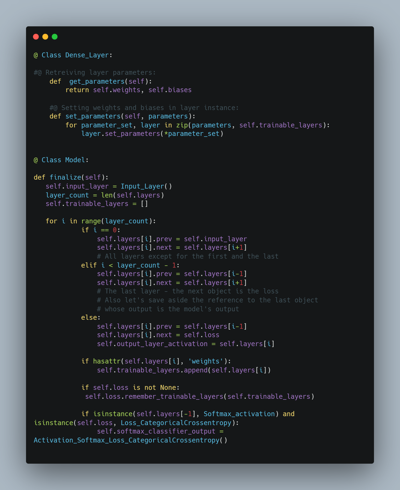

# Day 52
Today I was thinking of the data size for Neural nets to train well and it is quite massive. But then I quickly remembered the concept that I learnt during my ML learning days, which was PCA(Principal Component Analysis). It is a dimension reduction techniques in machine learning with preserving the originality of the data.

### How PCA does Dimension Reduction?
PCA aims to find the directions of maximum variance in high-dimensional data and projects it onto a new subspace with equal or fewer dimensions than the original one. It is truly a boon to 'Curse of Dimensionality'.

**You can find Code Implementation here:** https://github.com/prijall/MachineLearning/blob/main/Code/PCAFromScratch.py

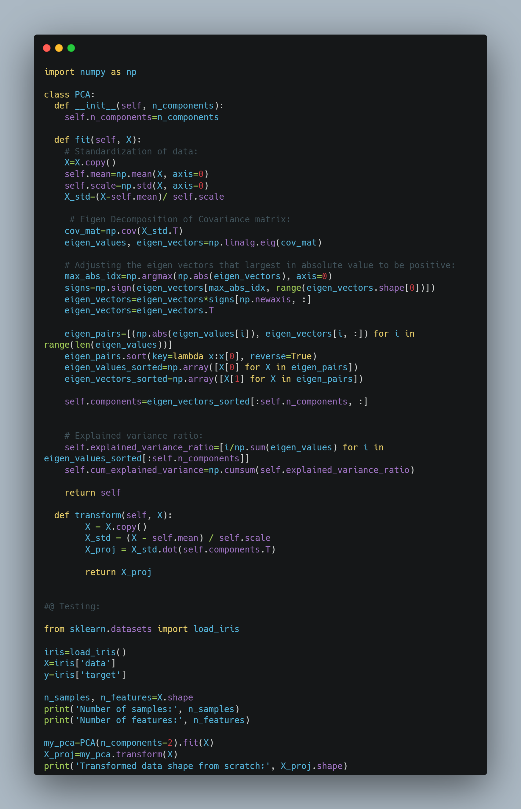

# Day 53

Completed Model Building of my project using ANN. For now I have only built a model and checked the accuracy but i will be deploying it later upon learning MLOPS in detail.

.png)

# Day 54
From today, I will be revising all the concept of Neural Network but from the Legend **Andrej Karpathy**. I am building a Micrograd model taught by Andrej which is a tiny scalar-valued auto-gradient engine and a neural net library on top of it with PyTorch-like API. This is a very basic model to help learn the forward pass and backpropagation of nueral network.

- Today, I implemented the python code to create a class that takes values and helps in performance of mathematical operations and visualize the forwards pass using multiplication and addition.

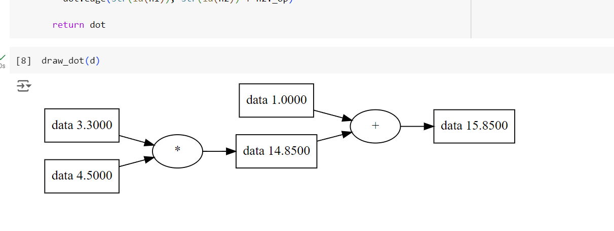

# Day 55
Learnt the implementation of Backpropagation and importance of gradient in the optimization using python. The Value of gradient is calcuted manually using the formula for derivative. And then the value was adjusted for better optimization.

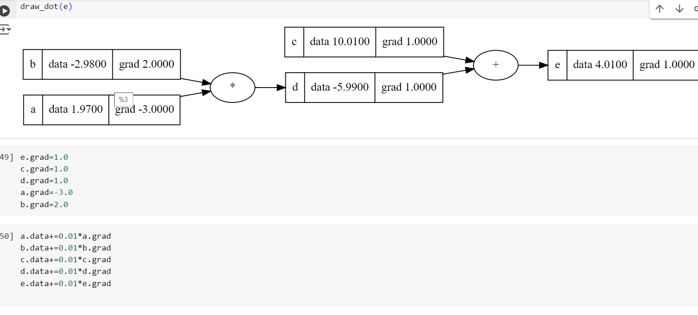

# Day 56
For the first time, I implemented Pytorch for the first time. It is a Machine learning library used to built model especially for neural networks. It works using tensors.What actually are tensors? They are the building blocks of machine learning. Their job is to represent the data in numerical way. They are basically n-dimensional array.
     Today, I did basic implementation of forward pass and backward using pytorch. Here, in pytorch, we have explicitly declare the requirement of calculating gradient which is very necessary for backward pass.

- Basic pytorch implementation:
     
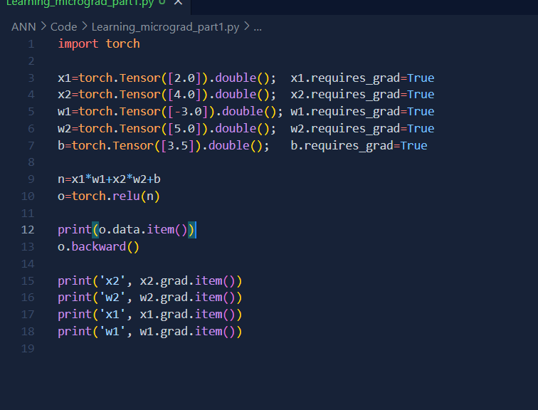

# Day 57
Continued reading paper **A LOGICAL CALCULUS OF THE IDEAS IMMANENT IN
NERVOUS ACTIVITY**. Today, I learnt about two theorems used by author to support their statement.

#### Theorem 1: Every net of order 0 can be solved in terrms of temporal propositional expression
- This theorem states that any simple neural network can be completely described using logical statements about what happens and when it happens.
- net of order of 0 means that signals in neuron travel in only one direction. It is basically neurons without loops.
- What are temporal propositional expression? They are the logical statement that describe events over time. Eg, If this happens, then that will be happen next.

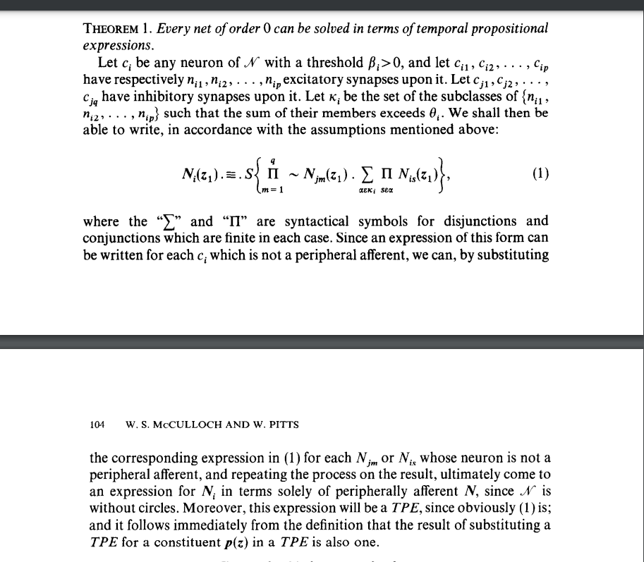

#### Theorem 2: Every Temporal Propositional Expression (TPE) can be realized by a net of order zero.

- Theorem 2 tells us that any logical statement about events over time can be represented using a simple neural network without loops. This means we can design networks to perform specific logical functions and be confident that even complex temporal logic can be realized with these basic building blocks.

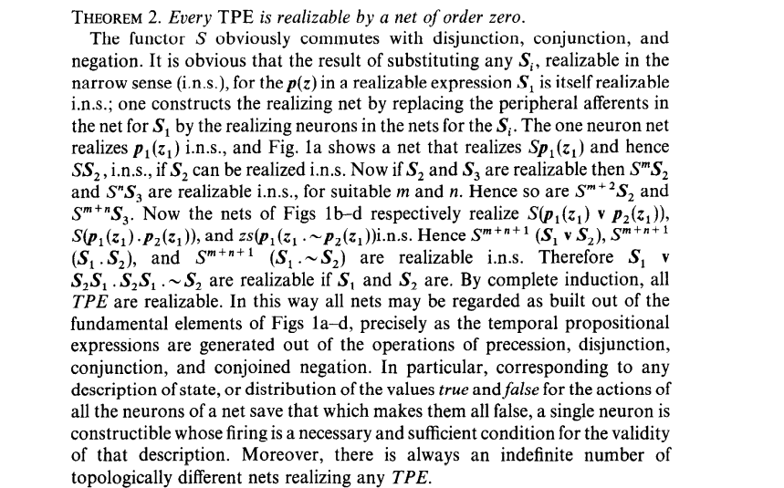

# Day 58
Continued learning paper where I studied theorem 3 which states, **"Let there be a complex sentence S, built up in any manner out of elementary sentences of the form p(z- zz) where zz is any numeral, by any of the propositional connections: negation, disjunction, conjunction, implication, and equivalence. Then S, is a TPE and only ifit isfalse when its constituent p(zl - zz) are all assumed false-i.e. replaced by false sentences-or that the last line in its truth-table contains an ‘F-or there is no term in its Hilbert disjunctive normal form composed exclusively of negated terms."**

- This means a complex logical sentence can be represented as a TPE if it becomes false when its simplest components are false. This ensures the logical structure of the sentence can be realized by a neural network, which operates under the same principles of propositional logic.

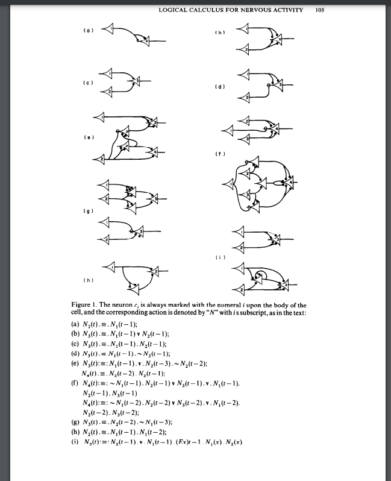

# Day 59 

**Theorem 4: Relative and Absolute Inhibition**
**Statement: Relative and absolute inhibition are equivalent in the extended sense.**

##### Explanation:

- Relative Inhibition: When an inhibitory synapse fires, it does not completely prevent the firing of a neuron but increases its threshold, meaning a greater number of excitatory synapses must fire concurrently to trigger it. The increase in the threshold is assumed to be unity for each inhibitory synapse.
Absolute Inhibition: When an inhibitory synapse fires, it completely prevents the neuron from firing at that time.

- Equivalence Proof:

Relative to Absolute Inhibition:
Consider a neuron 𝑐<subscript>i</subscript> with a certain number of inhibitory synapses. If each inhibitory synapse increases the threshold by 1, this can be modeled by having an equivalent net where each inhibitory synapse is replaced by a corresponding increase in the threshold of the neuron.
For any given neuron, create a net that realizes the relative inhibition by ensuring the neuron only fires when its increased threshold due to inhibitory synapses is met by a sufficient number of excitatory inputs.

Absolute to Relative Inhibition:
Replace each absolute inhibitory synapse with multiple inhibitory synapses in the relative inhibition model. This ensures that the neuron only fires when the number of excitatory inputs exceeds the combined inhibitory effects.
In both cases, the behavior of the neuron under relative inhibition can be replicated by a network using absolute inhibition and vice versa, establishing their equivalence in the extended sense.

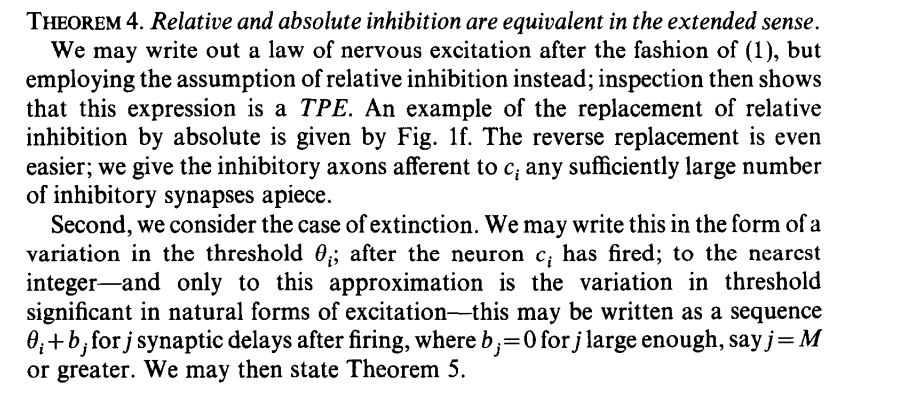

# Day 60
Continued learning for MicroGrad, where I learnt about basic pytorch operations.
 #### Matrix multiplication (is all you need)
One of the most common operations in machine learning and deep learning algorithms (like neural networks) is matrix multiplication.The main two rules for matrix multiplication to remember are:

- The inner dimensions must match:
(3, 2) @ (3, 2) won't work
(2, 3) @ (3, 2) will work
(3, 2) @ (2, 3) will work

- The resulting matrix has the shape of the outer dimensions:
(2, 3) @ (3, 2) -> (2, 2)
(3, 2) @ (2, 3) -> (3, 3)

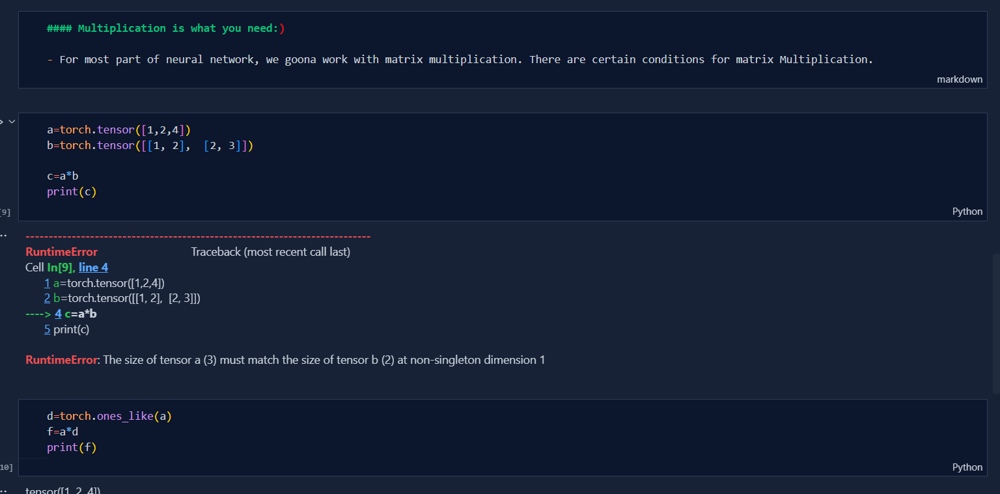

# Day 61

Today I use Pytorch to built Neural network. Similarly, got to know about **Compute Unified Device Architecture(CUDA)**. It allows developers to access the raw computing power of CUDA GPUs to process data faster than with traditional CPUs. CUDA Nvidia can achieve higher parallelism and efficiency than general-purpose CPU code using parallel processes and fine-grained streams.Just tried creating tensors on GPU.

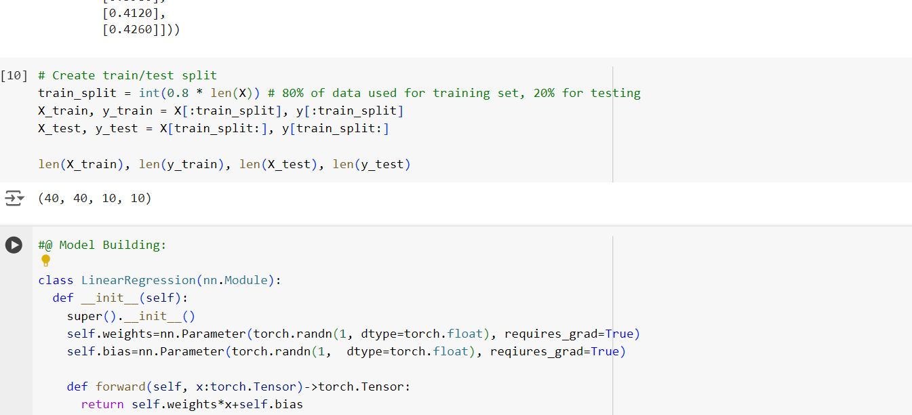

# Day 62
Explored pytorch for Neural network. Today, I implemented code for object creation of model built last time and did preliminary prediction.

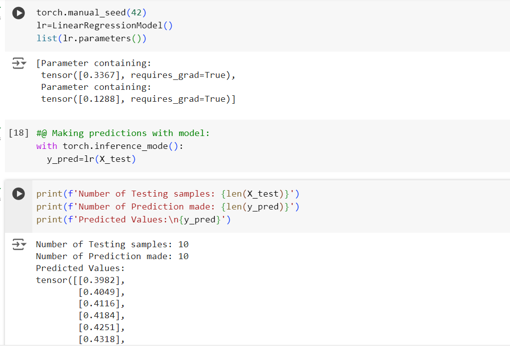

# Day 63
- Completed reading paper on **'Learning Representations by Backpropagating Errors'**, where in conclusion  the write talk about the most obvious drawback of the learning procedure is that the error-surface may contain local minima so that gradient descent is not guaranteed to find a global minimum. However, their experience with many tasks shows that the network very rarely gets stuck in poor local minima that are significantly worse than
the global minimum.

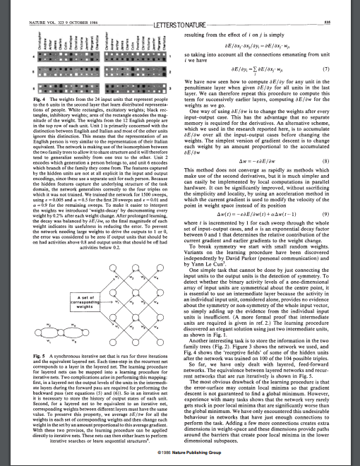

- Secondly, I practised the basic of pytorch and understood the difference between pytorch and numpy for mathematical operations by basic code implementations.

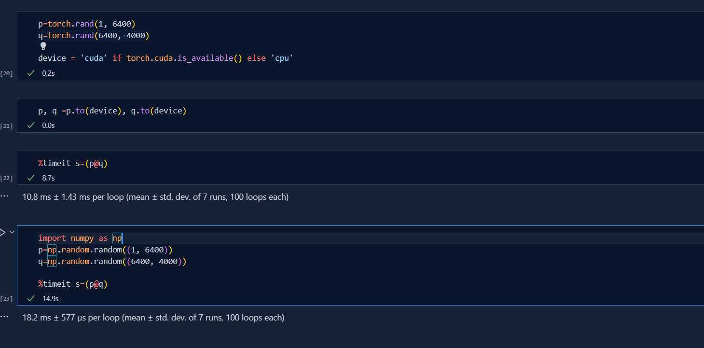

# Day 64
- Started reading paper of Convolution Neural Network on **'Neocognitron: A Self-organizing Neural Network Model for a Mechanism of Pattern Recognition Unaffected by Shift in Position'**. This Paper is believed to be the first paper of CNN. Today, I just read the abstract of this paper and here is  what i understood:
- This paper is inspired from the human eye and brain functioning exactly how CNN works i.e when our eyes see same objects for multiple times, our brain immediately recognozes it. Similar to that, we train our model with same object, it will recognise it irrespective of it's position. There are talks about the **C-cell and S-cell** of human eye.

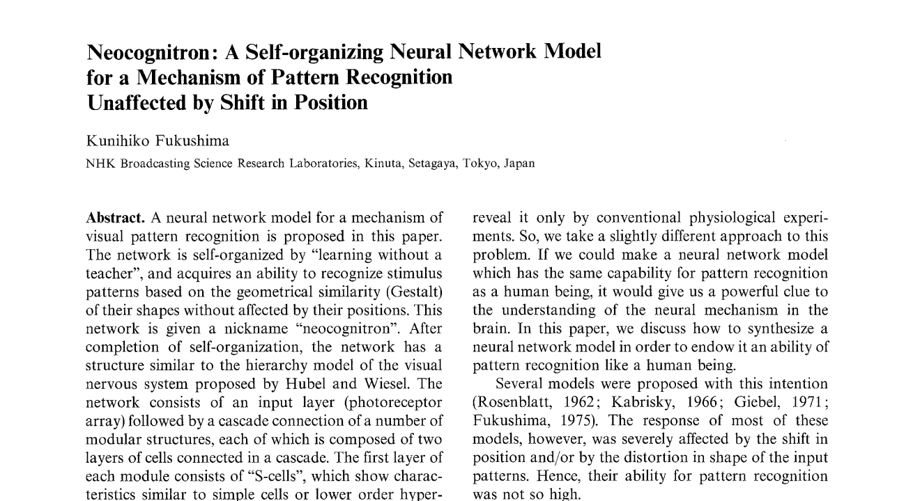

- Built Neural network using pytorch and calculate loss using pytorch built-in functions. I did this in google collab since i don't have enough gpu.

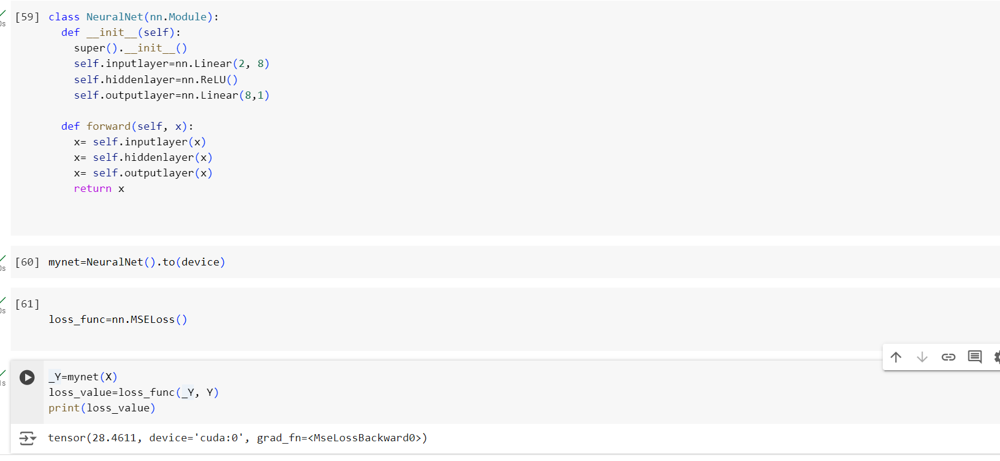

# Day 65
Added Optimizer and optimized loss value using pytorch. Following steps I took for optimization:

- Flushing previous epoch's gradients
- Computed loss 
- then Backpropagation
- updated weights moved into list 
- Visualization of optimization

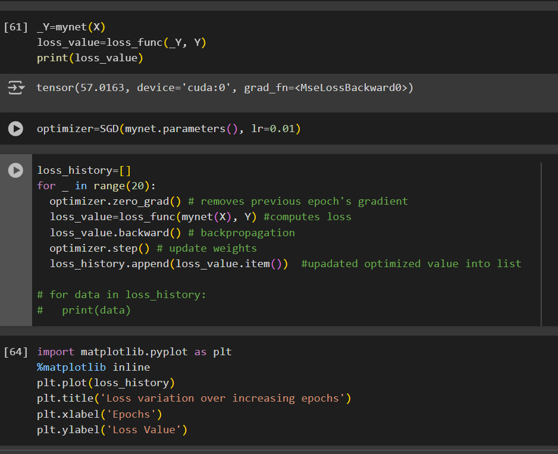

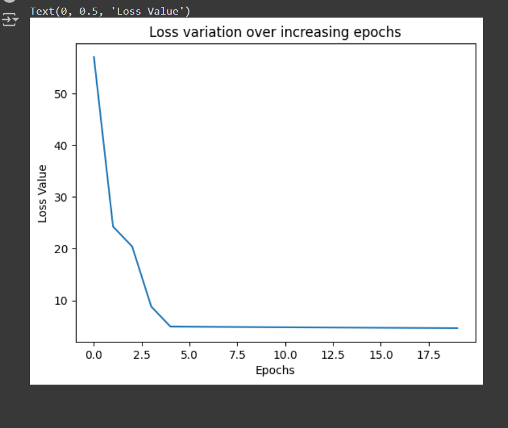

# Day 66

Finally started Convolutional Neural Network(CNN) which is widely used Neural Network for Image Datasets. ANNs aren't used for Image datasets because they aren't invariant to small translations i.e they rely heavily on the position of features within the image which is why CNN is used and it solves the problems of traditional approaches. There are lots components of CNN, Among them I studied about **Filters**.

- **Filters:** It is a matrix of weights that are initialized randomly at the start and convolved with matrix of the original image and this process is called **Convolution**. The values(weights) in filter get optimized during backpropagation.

- The result of the Convolution will be always;
      for orginal image (m, m) and filter of (n,n), the convolution will be (m-n+1) x (m-n+1).

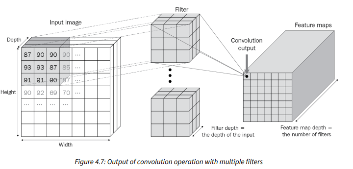

# Day 67

Learnt few more concepts today, where i studied about following things:

#### Strides
- In simple words, Stride is the steps to convolved filter in Input image matrix. By default each filter strides across the image -(1 row and 1 column). This can be tuned according to our need. The main reasons required to use strides are: **High Level Feature Capturing** and **Computational power(not really important now tho:)**
- The feature mapping after with stride is (((m-n)/s)+1) where s is the no of strides. 

#### Padding
- when convolving the matrix the left most elements and right most element are not involved as many times i.e edges are mostly ignored due to which padding is done. **It is the process of adding the layers to the matrix outside in all four sides to make the efficient use of edge element. Generally, Zeros are used in padding therefore called Zero Padding in literature.

#### Pooling
- It is very important concept in CNN. **It is the process of down sampling feature mapping.** It is generally done after convolution. Generally, three params are passed to setup the pooling: **Size, Stride and type.** There are various types of pooling, they are; MaxPooling, AvgPooling, SumPooling, etc.

##### Advantages:
- Reduced feature mapping size.
- Translation Invariance.
- Enhanced Feature(In case of Max Pooling)
- No need for training.

##### Disadvantages:
- During Image Segmentation
- Loss of lots of information

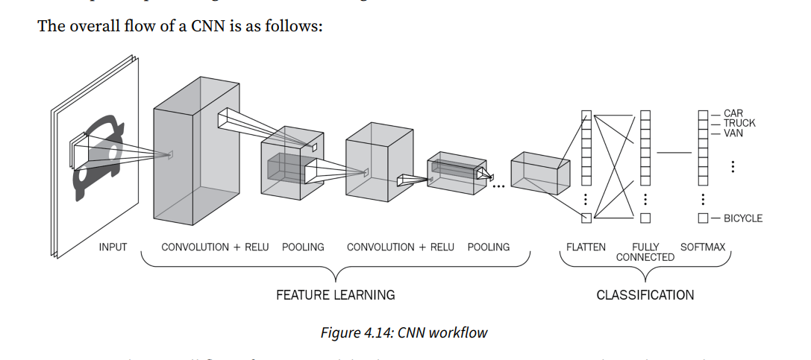

# Day 68
Implemented the CNN for the first time using pytorch. Implemented all the concepts that I have learnt from past 2 days. It is just a practise for testing and strengthening my concepts.

- Snapshot of today's work:

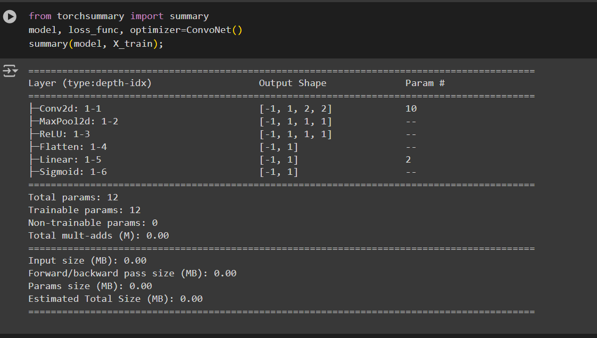

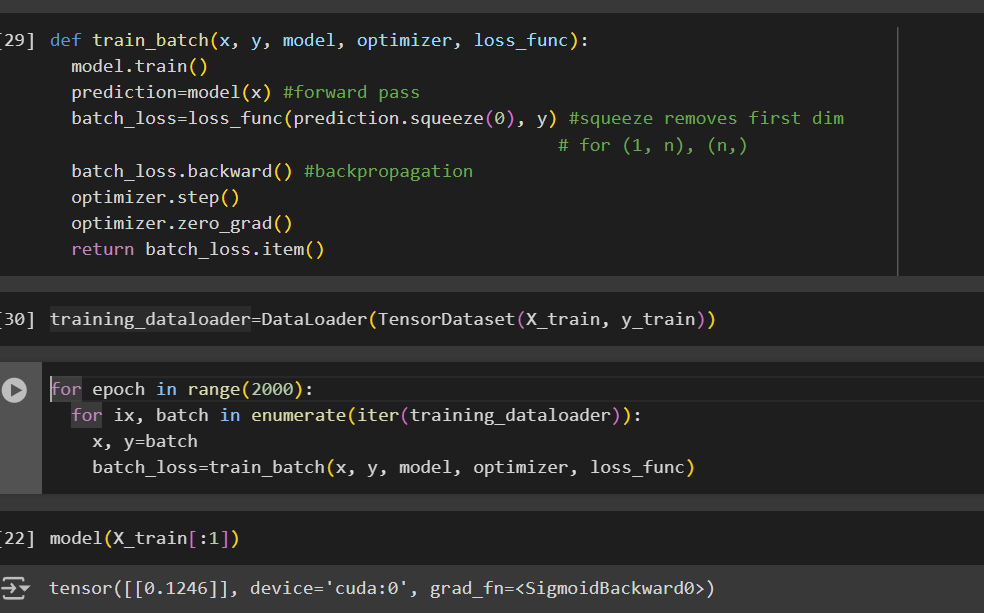

# Day 69
Trained FMNIST Dataset on CNN and Checked for training and Validation Loss and Accuracy using pytorch. It was bit diffcult to understand the behind working of the model with getting error more but did it anyway successfully untill training.

- Model Snapshot:
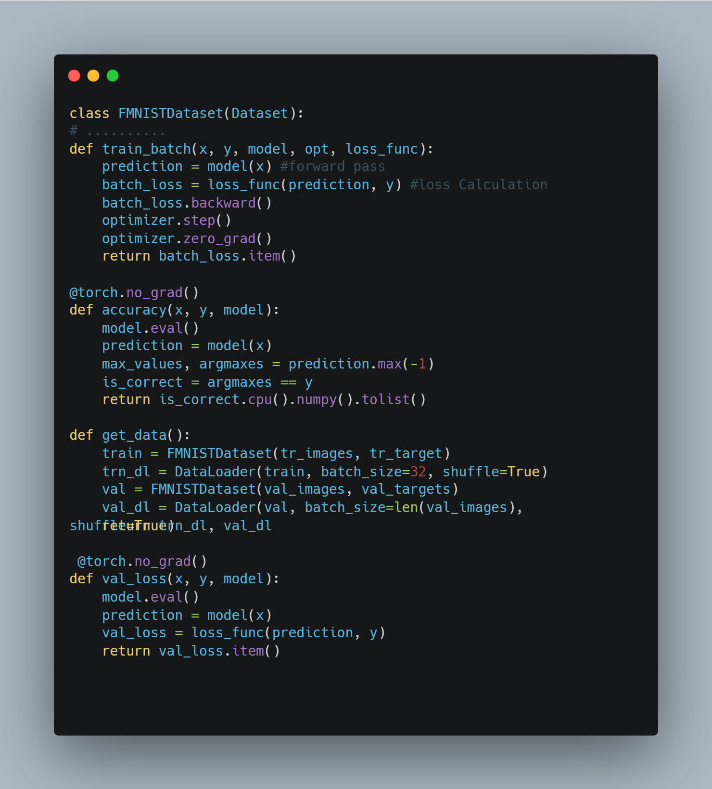

- Training Snapshot:
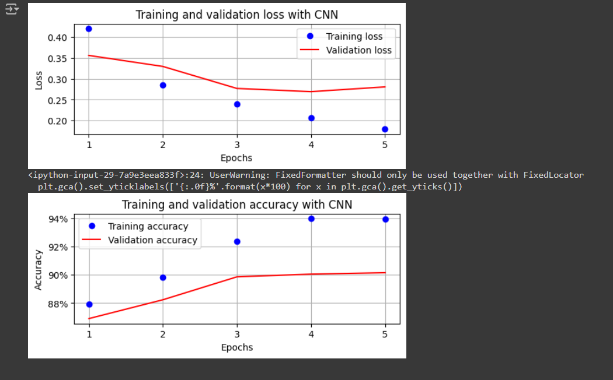

# Day 70
After Learning all the necessary concpets, today, I decided to train my Convolution Neural Network on real data which is of Cats and dogs. This data is directly imported from kaggle to the code base using Kaggle Token. Similary, I Found it very difficult to do preprocessing for RBG data. I just fetched the data and preprocessed the image for training. Will be training it tomorrow:)

- Data Preprocessing:
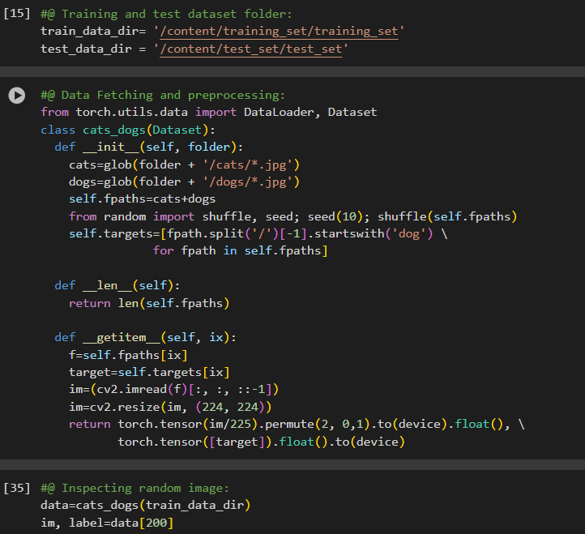

- image result:
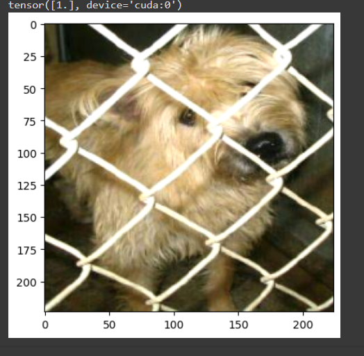

# Day 71
Trained the model for cat and Dog classification. Similarly, calculated loss and accuracy for both training set and validation set. The intereting thing in today's learning, i trained data in batch of size 32 and calcaluted the loss and accuracy over the batch samples. Got decent accuracy and got to know that training data in batches is mostly beneficial over trainig at once in many ways.

- Model training code:

- accuracy over epoch:

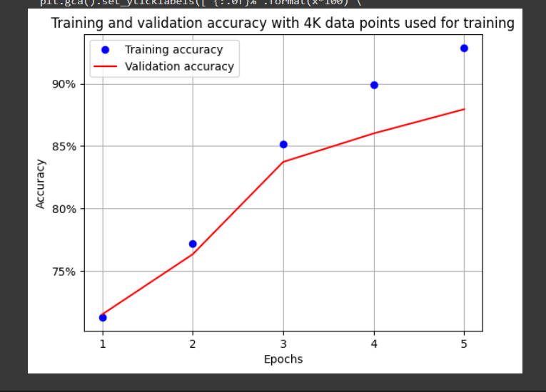

# Day 72
Studied about **Transfer learning** and **VGG16 Architecture**

##### Transfer Learning
Transfer learning is a technique where knowledge gained from one task is leveraged to solve another similar task. Imagine a model that is trained on millions of images that span thousands of object classes (not just cats and dogs). The various filters (kernels) of the model would activate for a wide variety of shapes, colors, and textures within the images. Those filters can then be reused to learn features on a new set of images. Post learning the features, they can be connected to a hidden layer prior to the final classification layer for customizing on the new data.

##### VGG16 Architecture
VGG stands for **Visual Geometry Group**, which is based out of the University of Oxford. 16 stands for the number of layers in the model. The VGG16 model is trained to classify objects in the ImageNet competition and stood as the runner-up architecture in 2014. The reason we are studying this architecture instead of the winning architecture (GoogleNet) is because of its simplicity and its broader use by the vision community for several other tasks.

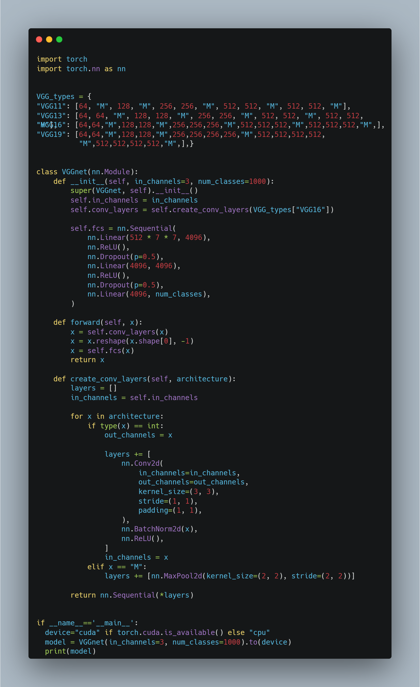

# Day 73
Data Preprocessed for Implementing VGG architecture on Cats and Dogs datasets. The main difference between the cats_dogs class in this section and in previous one is the normalize function that we are applying using the Normalize function from the transforms module. 
                     When leveraging pretrained models, it is mandatory to resize, permute, and then normalize images (as appropriate for that pretrained model), where the images
are first scaled to a value between 0 and 1 across the 3 channels and then normalized to a mean of [0.485, 0.456, 0.406] and a standard deviation of [0.229, 0.224, 0.225] across the RGB channels.

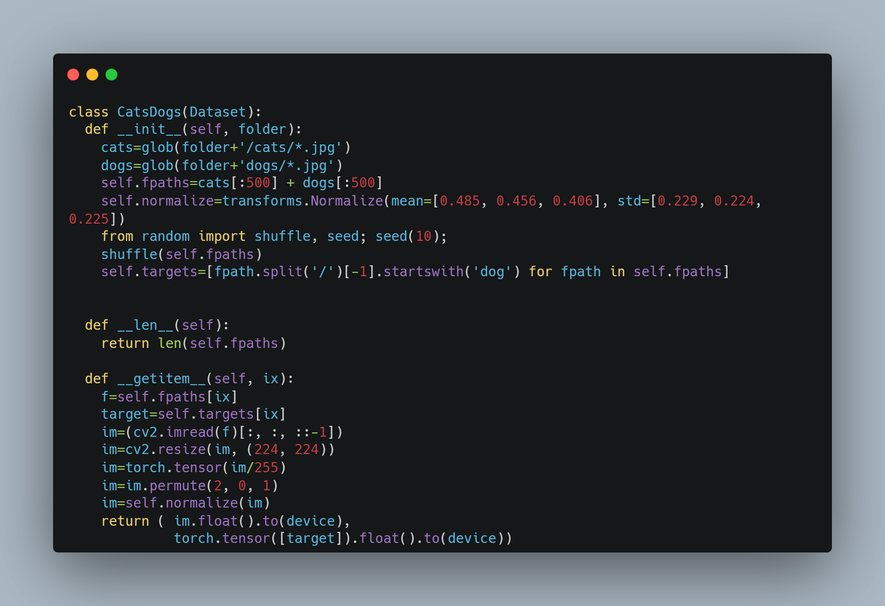

# Day 74 
Completed Implementing VGG on Cats and Dogs Dataset. Achieved an accuracy for training set with respect to valid set about 97% which is very good than the previous one implemented without any pretrained model. Similarly, the time taken by google collab to train the batches of size 32 was approx 10-15 min in without pre-trained model whereas for pretrained model it was about 2 min for 5 epochs.

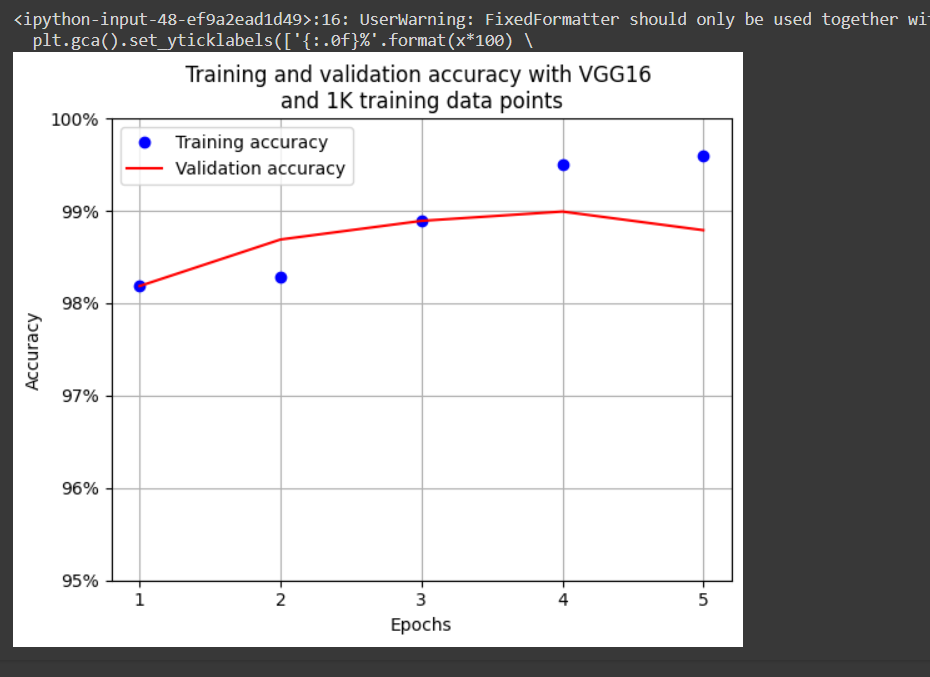

# Day 75
Learned the Basic intuition behind "ResNet" Architecture. These are introduced to solve the problems of the VGGNET Architecture, which is while increasing layer numbers from 16 to 19, we claim the accuracy from 97% to 98% which seem small but promising. But kept  on increasing causes decrease in accuracy.

###### The two major problems in VGGNET solved by ResNET are:

- While the network goes deep, it eventually forget what the original image was

- The problem of Vanishing Gradient, the gradient at the layers near to input becomes almost zeros.

These are solved by Resnet, will learn how it works tom:)

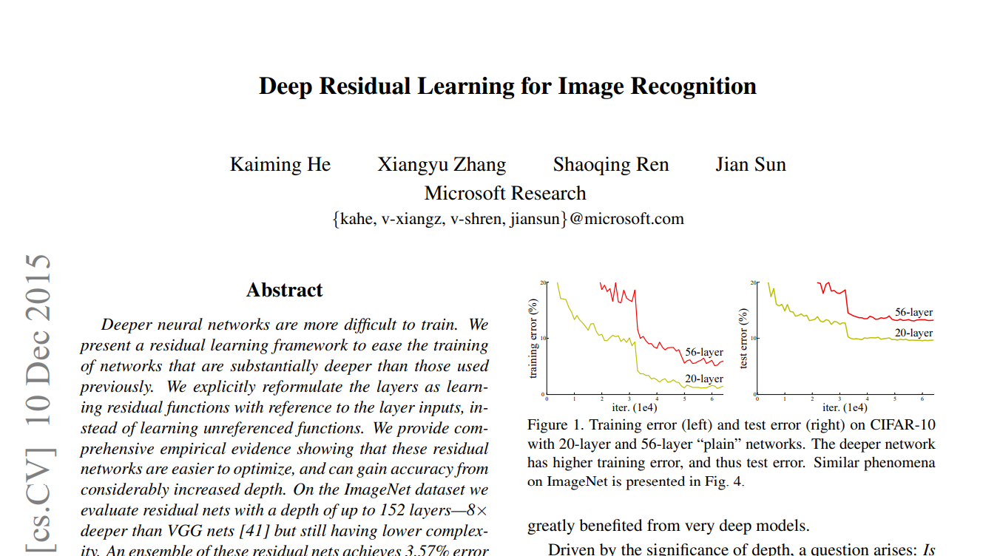

# Day 76
Learnt more on Resnet Architecture and its working. It is called ResNet(Residual Network) because instead of calculating the desired result and adding identity value to it i.e H(z) =F(z) + z, it calculates first gradient and then adds the identity value which is effective in computation as the value of differnce between target and prediction is easier to calculate than calculating entire requried function and adding identity value i.e  F(z) =H(z)-z and then adding F(z) + z. This is called identity mapping.

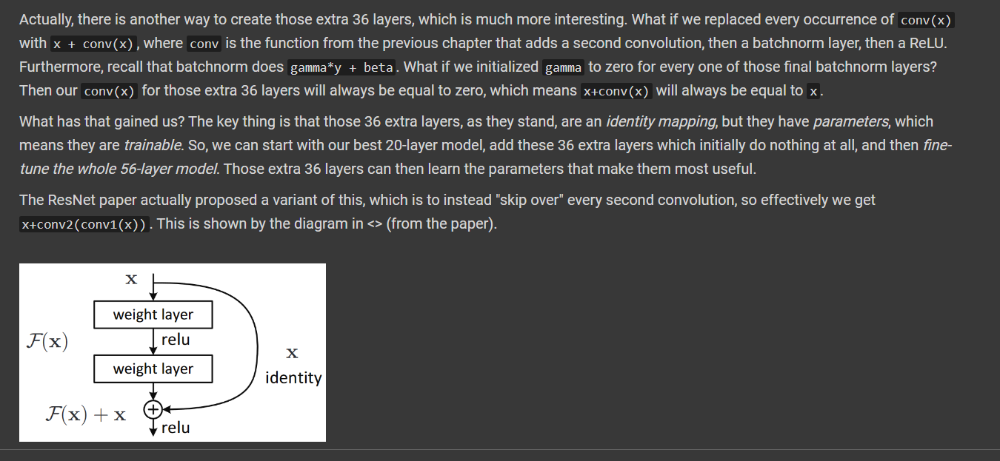

# Day 77
Implemented the ResNet Architecture and spent time reading and understanding paper.

- ResNet Paper SS:

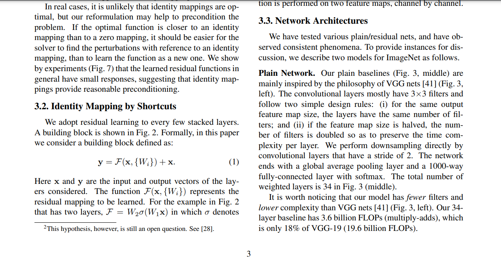

- Implementation:

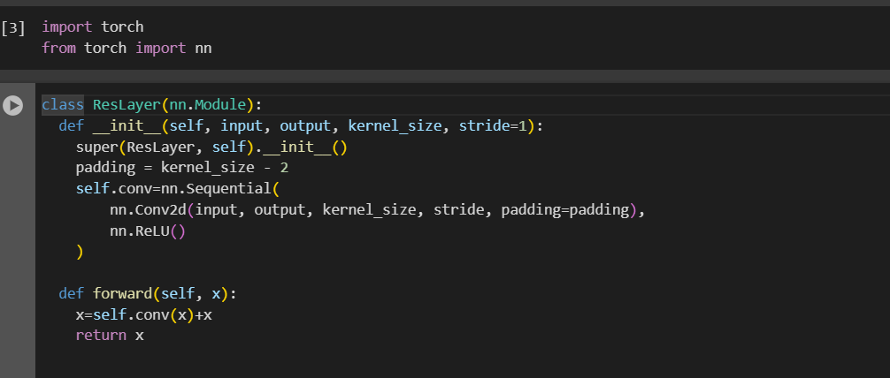

# Day 78
Built model for classification of Cats and Dogs Image data using ResNet18 Architecture. Today, developed model where at first freeze the architecture's model for the finetuning with disabling weights. Then used AdaptiveAvgPool with output_size=(1, 1) for the binary classification as the model has been train for multiclassification and finally created Fully connected layers and calculated loss with optiimizer(Adam).

- Code for model Building:

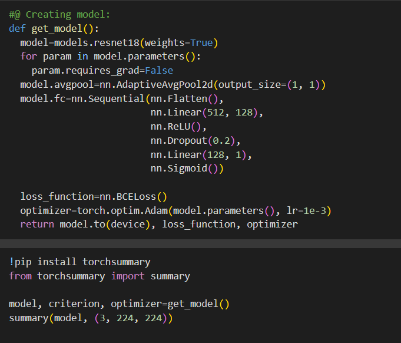

- Architecture lookalike:

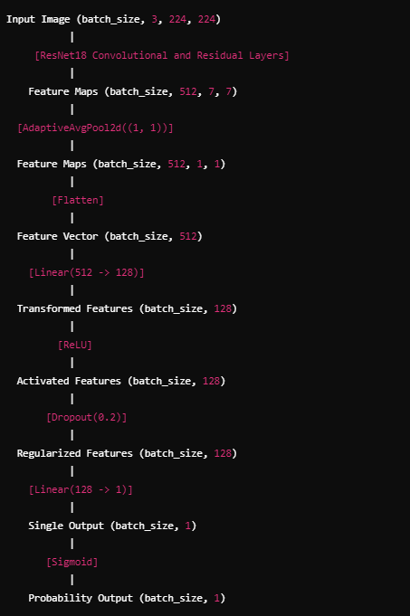

# Day 79
Updated the model with training model, accuracy and Dataset Loader which I have been doing for quite few times now. Implementing this helps to find the difference between building model from scratch and using pre- trained model.

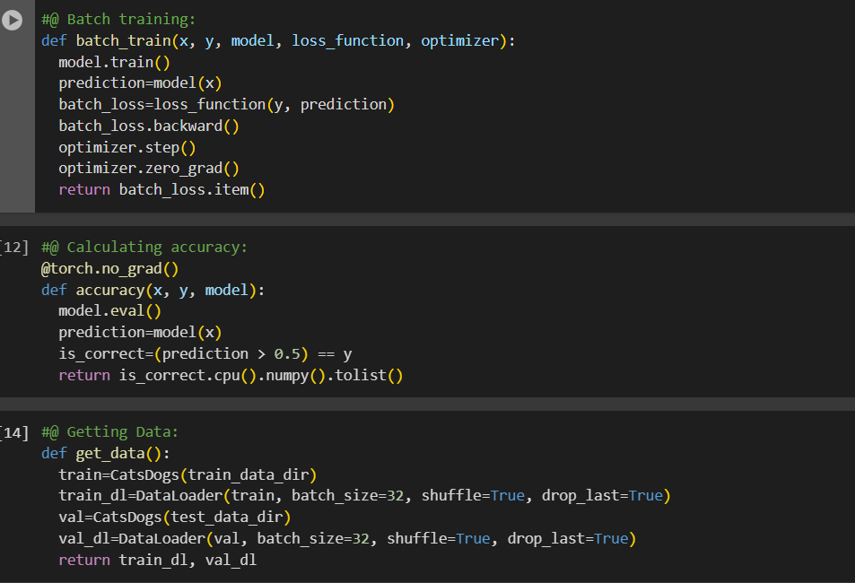

# Day 80 

Started Facial keypoints Detection on pre-trained models. They are used especially for **Multi-Regression** and **Multi-task Learning**.

##### Points to remember for Facial Detection

- Adjustment of images to standard image size
- Resize the image to a shape of 224 x 224 x 3
- Normalization
- Use of Sigmoid layer at the end to fetch data

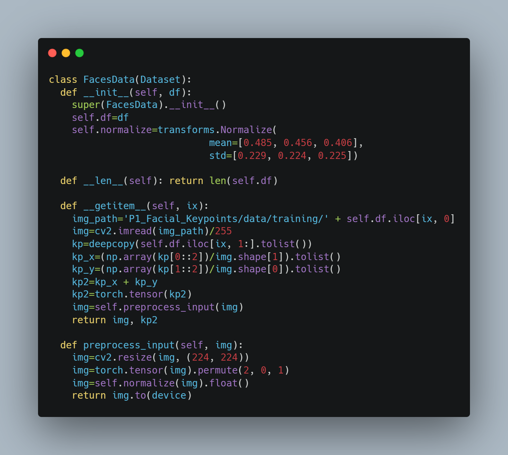

# Day 81
Training Neural Nets can be bit daunting, completed training model for detection of facial keypoints using VGG16 Architecture. I should have trained on more epochs for accurate detection but due to low GPU it was taking a lot time so I intentionally reduced no of epochs.

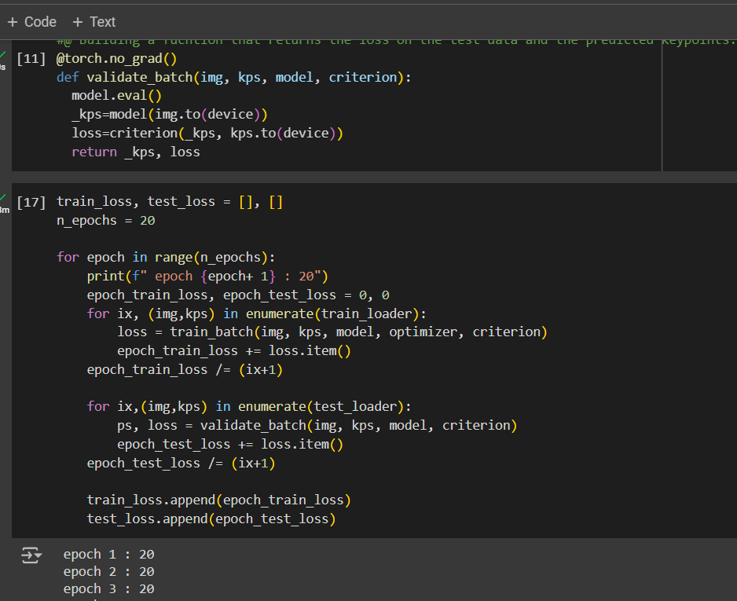

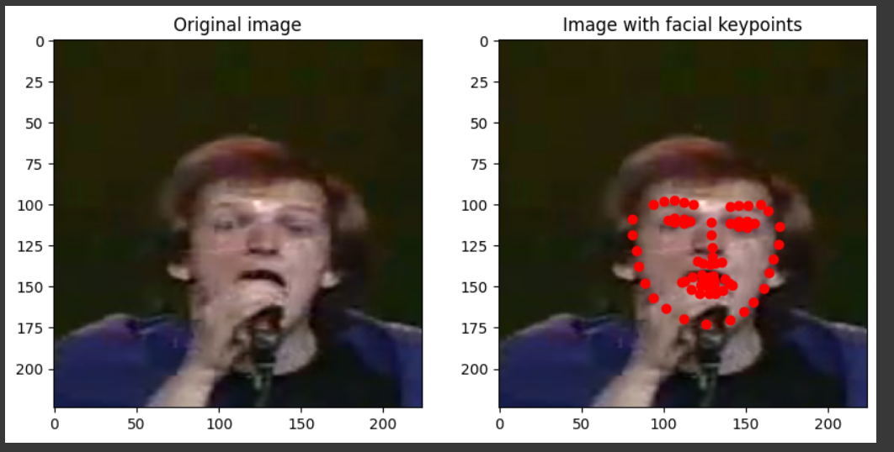

# Day 82

Leveraged a pretrained model that can detect the 2D and 3D keypoints present in the face. Did keypoints detection in 2D and Converted it into 3d.

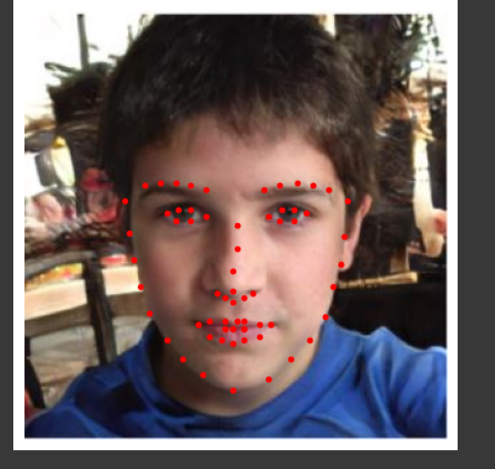

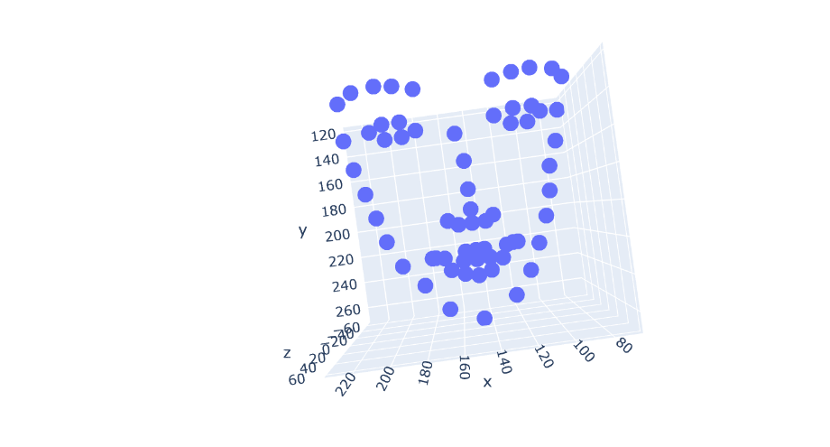

# Day 83

**Multi-task learning** is a branch of research where a single/few inputs are used to predict several different but ultimately connected outputs. For example, in a self-driving car, the model needs to identify obstacles, plan routes, and give the right amount of throttle/brake and steering, to name but a few.It needs to do all of these in a split second by considering the same set of inputs (which would come from several sensors). Furthermore, multi-task learning helps in learning domain-specific features that can be cross-leveraged across different tasks, potentially within the same domain.

- Built functions which takes dataset normalize it and returns age and gender as we are working on age estimation and gender classification. Similary, created **Collate Function** which scales the age so that value lies between 0 and 1, convert gender into float as it awas converted into boolean expression before in **__getitem()__** function and finally convert image, age and gender intp torch object and return.

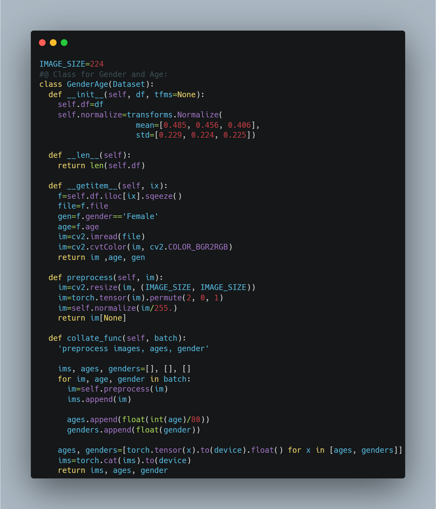

# Day 84
Completed Multi-task learning on Gender-Age Dataset. AS usually, built function for model, training batch and validation. Training Model was the toughest part today, I took 1 hour to train the model but give pretty decent accuracy. Loved each part of learning today, still doubt on some portions but hopefully will get to work on those. 

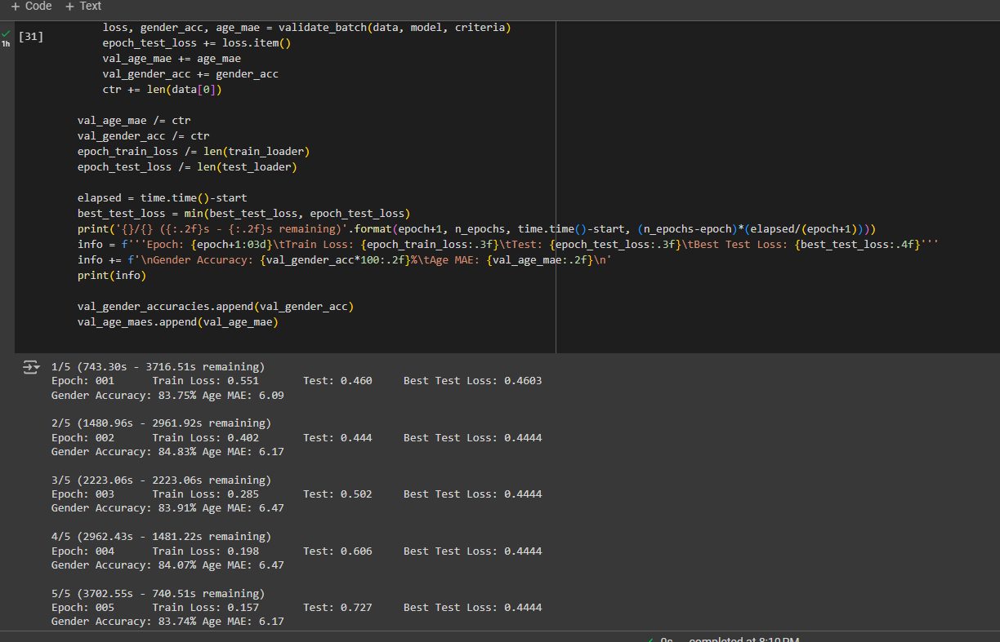

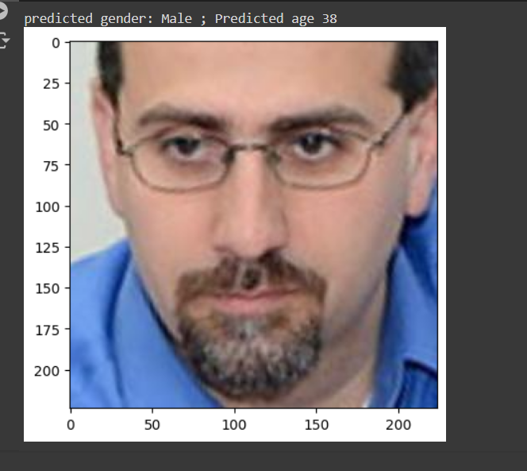

# Day 85
Ever Wonder **why CNN model predicts what it predicts?**. For most part in Neural Nets, we believe the model is quite black box i.e we dont know what's happening internally but not anymore, the paper **"Grad-CAM: Visual Explanations from Deep Networks via Gradient-based Localization"** explains how it does. It's main principle is **'Interpretability Matters.'**

##### Main points to remmber:
 - If a certain pixel is important, then the CNN will have a large activation at those pixels.
 - If a certain convolutional channel is important with respect to the required class, the gradients at that channel will be very large.

 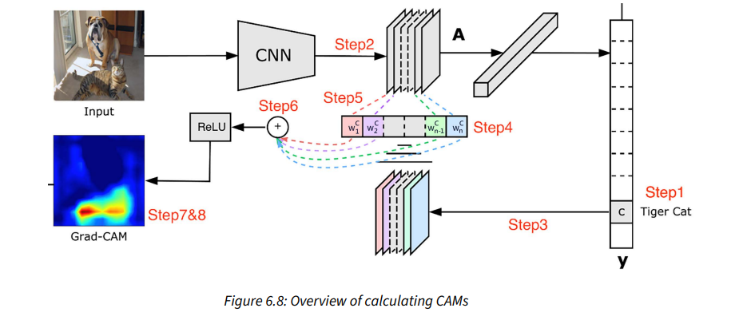

 - Did Data Processing for CAM Implementation:

 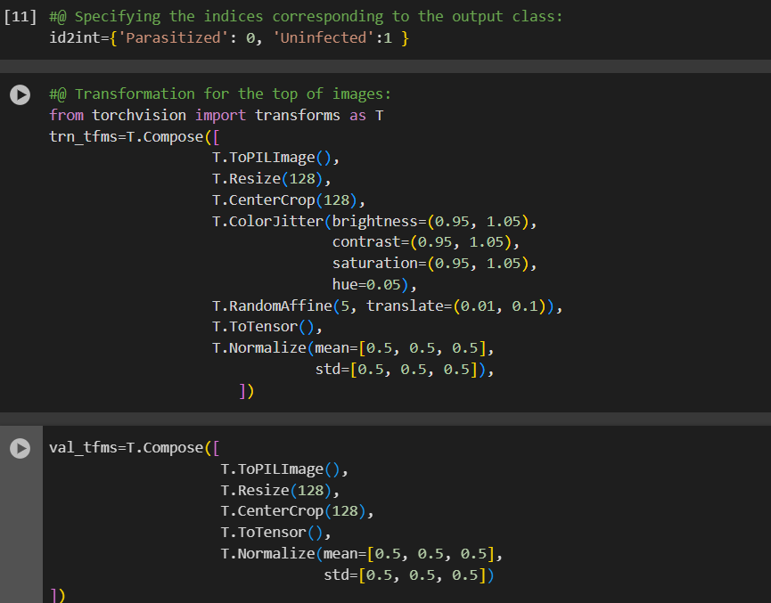

 # Day 86:

 Revisefd the concepts of image classifications on Age & Gender, where my most of the concpets got cleared. Similary, While learning about CAM, i got to understand the practical aspects to take care during model implementation:

 - **Imbalance Dataset:**
 for the classification of rare data, there would the no more training data which is why the result might not be better. Confusion matrix helps depicts the possibilties.

 - **Difference between training and validation data:**
 we should have the clear picture of why is model overfitting and underfitting and how to resolve them both. There may be maybe reasons including that of difference in resolutions, less numbers of training data, etc

 - Similarly, some other points include size of the objects, OpenCV Utilities, image sizes to train on GPUs, no of Convolution and pooling layers.

  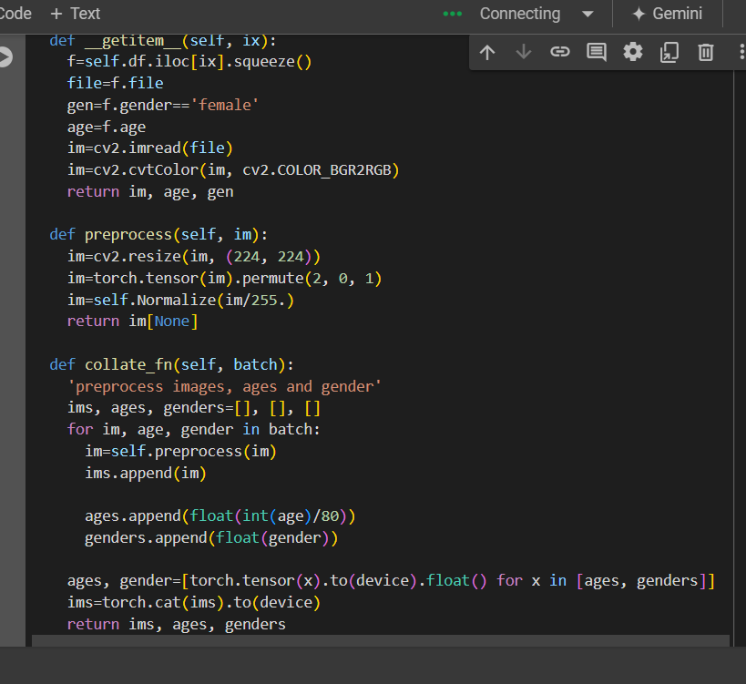

  # Day 87 
  Started the basic of object detection. When there are multiple images in a frame and we have to classify one then it will be very difficult for the image classification to detect the object due to its position. This is where object detection shines.Some various cases levaraging object detection includes the following examples; Security, Autonomous cars, Image Searching, automotives, etc.
    Today, I learnt about the Bounding Box Ground truth working using **ybat** which helps to find the cordinates of the images of desired classes.

  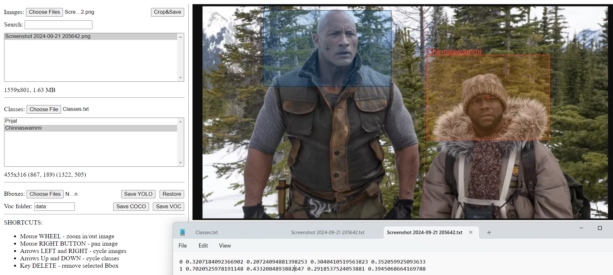

# Day 88
Learnt about **Region Proposal & IOU**.

- **Region Proposal:**
is a technique that helps identify islands of regions where the pixels are similar to one another. Generating a region proposal comes in handy for object detection where we must identify the locations of objects present in an image. Additionally, given that a region proposal generates a proposal for a region, it aids in object localization where the task is to identify a bounding box that fits exactly around an object.

- **IOU**
The word intersection within the term intersection over union refers to measuring how much the predicted and actual bounding boxes overlap, while union refers to measuring the overall space possible for overlap. IoU is the ratio of the overlapping region between the two bounding boxes over the combined region of both bounding boxes.

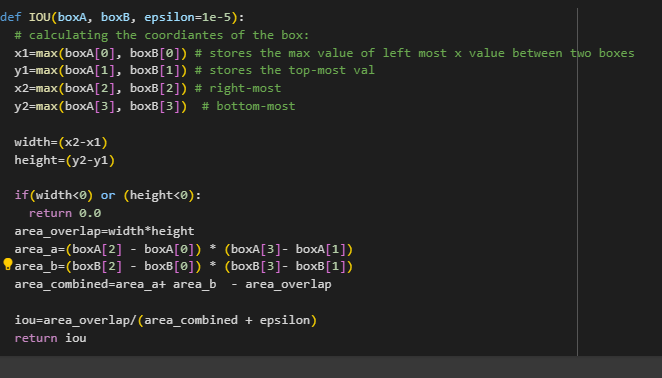

# Day 89
Super excited to learn and implement **Advance Object Detection techniques and algorithm**. Today, I studied the basics of **Region based CNN, popularly known as R-CNN**. The more advanced version is known as **Fast R-CNN**. These techniques works on two disjoint network i.e one to identify the regions that likely contains an object and the other to make the bounding box where the object is identified. The major drawback is there are many forward propagation. But the modern detection algorithm focuses on training single neural network and have the capacity to detect all objects in one forward pass.
          Read Paper, **"Faster R-CNN: Towards Real-Time Object Detection with Region Proposal Networks"** for more details.

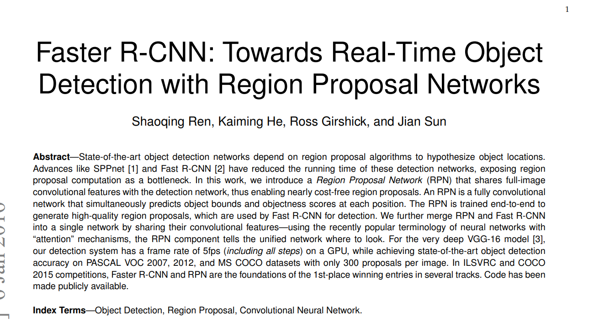

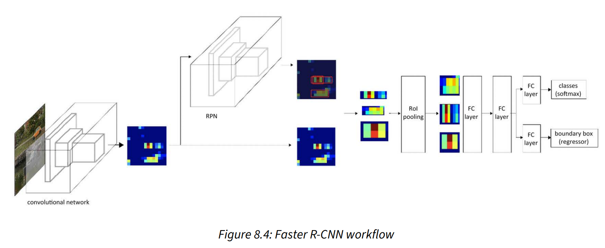

# Day 90
Implemented Faster R-CNN on custom dataset. Did data fetching from kaggle using API and created a class that takes dataset calculates length, gets item while doing all kinds of necessary preprocessing.

# Day 91
Started Reading Paper for **You Only Look Once(YOLO) Architecture** for object detection. Things I learnt for the from two different segments are:

##### Abstract
- Paper talks about the working algorithm for object detection. It frames object detection as regression problem to spatially separated bounding boxes and associated class probabilities rather than previous object detection algorithm. Similar, it compares with other art-of-state-detection algorithm and the main drawback is points is that it makes more localization error but less false positive error on background.

_Day1.jpg)

##### Introduction
- Yolo's working outlines is a single CNN  predicts multiples bounding boxes and class probabilities of those boxes and directly optimizes performance and detection through through model confidence. 
- The input image is resize to 448 x 448.
- It reasons globally which is why is better than other algo as see the entire image during training  and encodes context information and their apperances.

_Day1.jpg)

###### Also built batch training and validation for Faster RCNN model implementation.

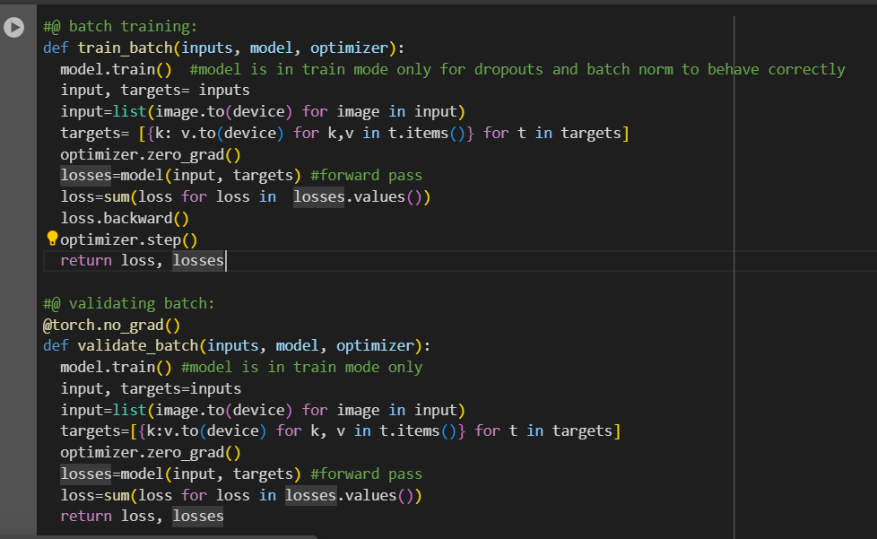

# Day 92
 
 Learnt the **Unified Detection** in Yolo algorithm.

#### Key Points that I learnt:
- single Neural Network is used for model traininfg where the algorithm divides the images in grid and calculates the bounding boxes, their confidence score and class probabilities.
- Confidence is defined as **Prediction of object times IOU with respect to truth and predection**. If there is no objects in grid then the confidence score must be zeros.
- For calculation of class probabilities, conditional probabilities is used i.e Pr(Class(i)/Object).
- The predictions are encoded as an S x S x (B * 5 + C) tensor where S x S is the no of grid in width and height resp, B is Bounding Box and C is class probabilities.

_Day2.jpeg)

_Day2.jpeg)

# Day 93

Continued Reading Network architecture and Model Training for Yolo architecture. Need to implement all these concepts asap.

##### Network Architecture
- THere 24 CNN layers and 2 fully connected layers in our network. Yolo architecture is inspired by GooLeNet architecture(Yet to be studied;). The main important implementation here is the use of 1x1 features space reduction layers. MaxPooling is done after completion of each set of convolution in network.

_Day3.jpg)

##### Training
- Pretain on ImageNet dataset. 20-CNN layers used followed by AvgPooling and connected layers.
- Use of Darknet framework for all training and inference.(Yet to explore)
- Adding 4 layers and fully connected layer with randomly initialized weights.
- Normalize bounding box width and height by the image width and height.
- Use of Coord and noobj for model stability.
- Predicts multiple bounding boxes per grid cell and predicts the Box having highest IOU.
- Loss function penalizes classification error only if obj is present and bounding box error only of predictor is **responsible** for ground truth box.
- Random Scaling and translation of upto 20% of orginal image. 

_Day3.jpg)

# Day 94
While going through the paper, I came to Know about the interesting concept called **Non Max Suppression** which is used to select the accurate bounding box from multiple bounding boxes from the grid. The NMS takes two factor in considerations, they are:

- The objectiveness score of the bounding box
- IOU of the bounding boxes

- Before NMS:

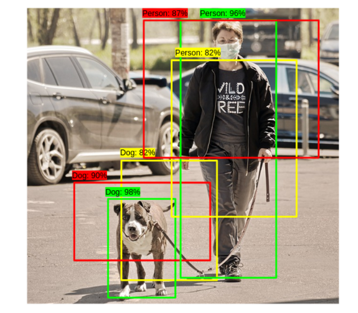

- AFter NMS:

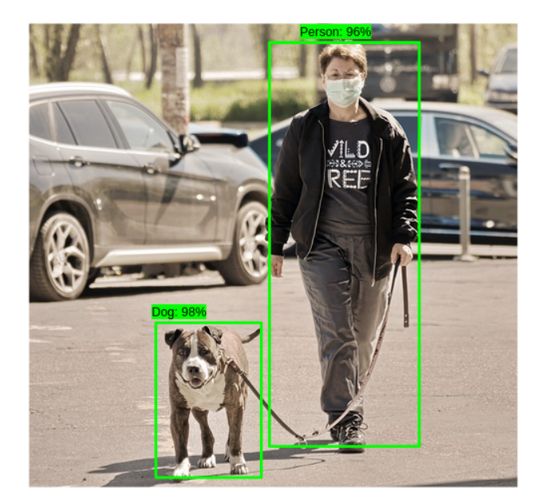

Similarly, Studied about the drawbacks of YoLo, which are:
- model struggles with the small objects in an image
- Struggles to generalize to objects in new aspect ratio
- Loss function treats errors the same in small bounding boxes vs large bounding boxes
- Main source of error is incorrect Localization

# Day 95
Tested Darknet for Yolo Detection. **DarkNet** is an open source neural network in C. It is written in C and Cuda.It is used mainly for object detection and have different architectures. eg feature extractor.

- PS: Worked on my personal project, got no more time to study DL.

- Installing Darknet:

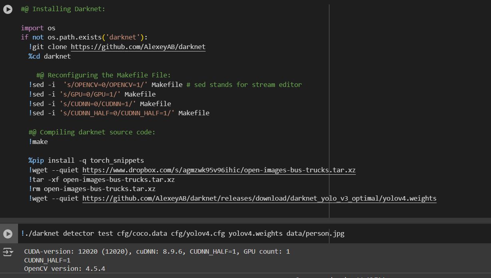

- Testing:

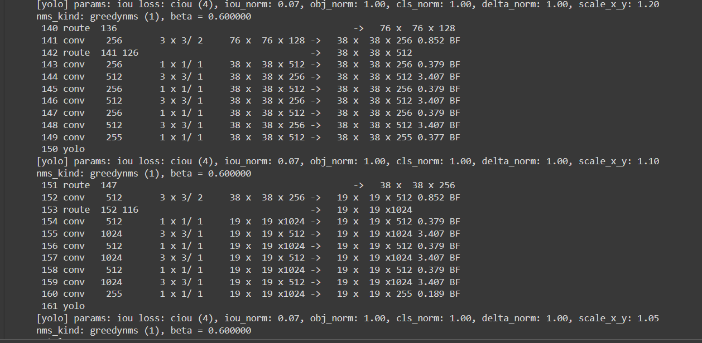

# Day 96 
Faced trouble while training YoloV4 algorithm on **Truck-buses** images. Did basic stuff like downloading, extraction and reconfiguring Makefile for conversion of information into text files directly. It took more then 1 hr and 30 mins to train the images and suddenly google collab disconnected runtime which pissed me off and stoped right then there so to continue tomorrow.

.png)

- Revised the concept of learning rate from ANN portion, **Learning Rate** is a optimizer parameter which helps to optimizer the values of the gradient to minimize the loss function. After the gradients are calculated, we take the negative fraction of gradient and repeat this in loop. Similarly, while we may find the right direction towards the global manima, our optimizer may fail to reach the exact point this is where Momentum shines. In other word, it is called inertia.

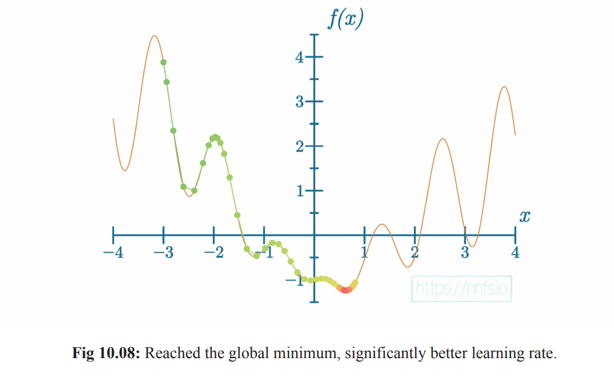

# Day 97
Tested accessing Android Phone Camera using OpenCV which will be useful for implementing Object detection task. Tried building attendance system with face_recognition but failed due to page installation issues nevermind will try later:(. Other than worked on Personal Project.

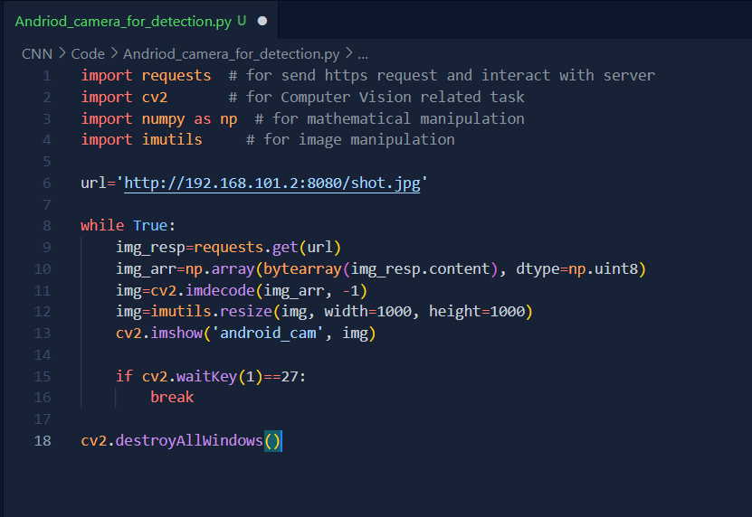

# Day 98
Started MLOps for deployment of ML/DL projects. Today, I learnt about MLOps introduction. Documentation of MLOps can be found at: https://github.com/prijall/MLOps/blob/main/README.md.

# Day 99
Learnt about **Deployment in MLOps**.  Documentation of MLOps can be found at: https://github.com/prijall/MLOps/blob/main/README.md.

# Day 100
Studied Monitoring on MLOps which was theory, felt bored but did it anyway.  Documentation of MLOps can be found at: https://github.com/prijall/MLOps/blob/main/README.md. Worked on my personal projects and read some articles on Concept drifting and data drifting. 

# Day 101
Revised the concept of CNN Implementation from Scratch and implemented using pytorch. Read few articles on pytorch for Deep learning. **Geoffrey Hinton** won Nobel prize in Physics 
for his discovery that enabled ML using artificial neural networks. A teacher who I look upto when it comes to machine learning and deep learning. Read few articles about his work which
are really inspiring.

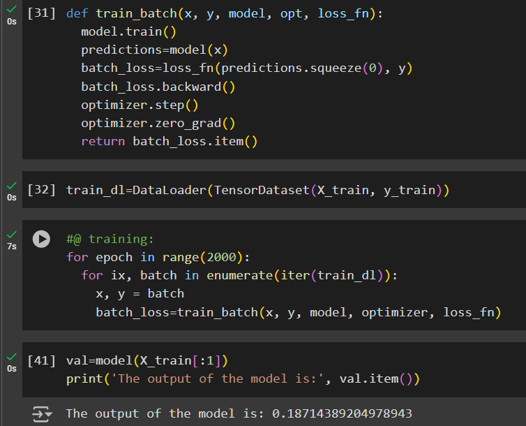

# Day 102
Learnt about another object detection technique called **Single-Shot Detector(SSD)**. It has few changes than Yolo architecture. This technique uses **VGG Archtectture** for feature extraction. First of all **Visual Geometry Group(VGG)** is used to for feature extraction and mapping then we use 6 convolution layer for objection layer and finally detect the object.
  Overview of how it works. Instead of using anchor boxes, it uses default boxes for the input images that have specific set of scale and aspect ratios. We will levarage all of the last few layers to make class and bounding box predictions rather than gradually convolving and pooling which we did in yolo. Finally, we chose one default box with higher IOU. Mostly, IOU over 50% are only considered. Similarly, image should have ground truth bounding boxes prior to convolution. More about Mathematical intuition tomorrow.

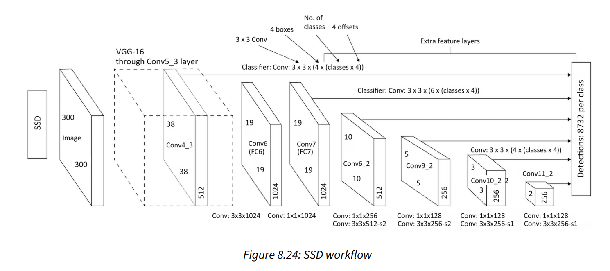

# Day 103
Learnt about the different scales and aspect ratios of default boxes. The SnapShot shows the working of default boxes in SSD. ALso, got thorough information about component in SSD Code also called SSD300 which has predominantly three sub-modules called 

- VGGBase, which returns 2 features vectors of dimensions (N, 512, 38, 38) and (N, 1024, 19, 19).
- AuxiliaryConvolutions, which returns more feature maps of dimensions  (N, 512, 10, 10), (N, 256, 5, 5), (N, 256, 3, 3), and (N, 256, 1, 1)
- Finally, the first output from VGGBase and these four feature maps are sent to PredictionConvolutions, which returns 8,732 anchor boxes, as we discussed previously.

- Mutlibox loss is loss function used in SSD which is sum of Localization loss(for bounding box regression) and confidence loss(for object detection).

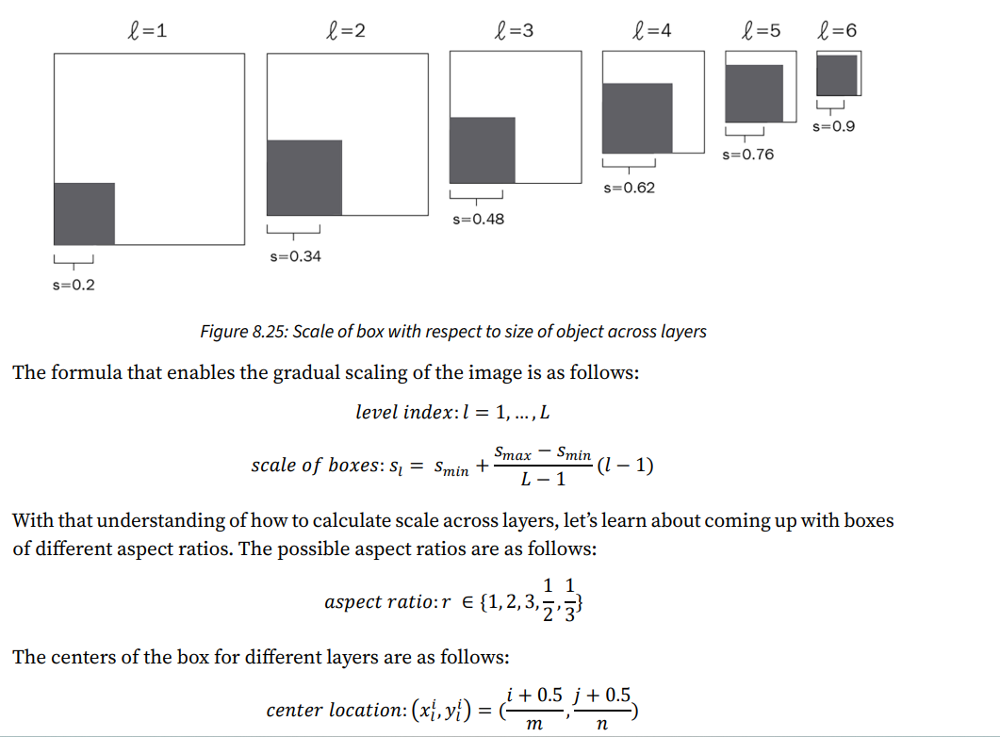

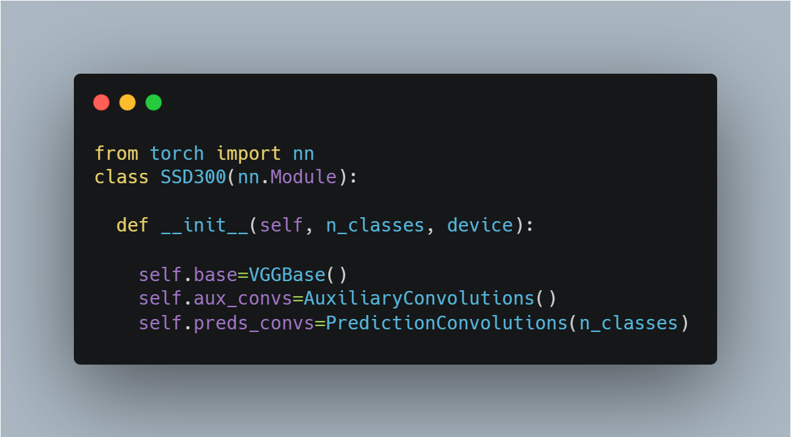

# Day 104

Did Data proprocessing for SSD Implementation which looks more or less similar to that of YOLO implemntation or all i did before but if you look clearly there are changes in function. For the first part normalization is done and then code for denormalization just for visualization purpose. As implemented before, this time also permutation should be done as pytorch expects (Channel, Height, Width). Resizing Image to 300 x 300 pixels. Similarly, COnversion of Image to RGB format is very is necessary. Bilinear Interpolation is used for resizing.
 Labels are extracted and associated with the bounding boxes. This is a critical step in preparing the dataset for training or inference.

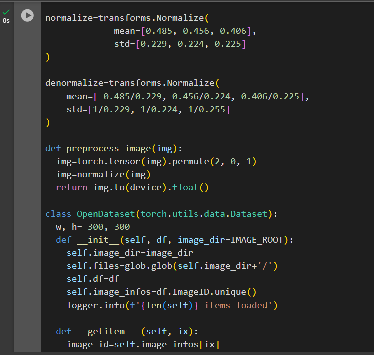

# Day 105
trained Custom Dataset using SSD300. Used different training code for both training set and validation set.

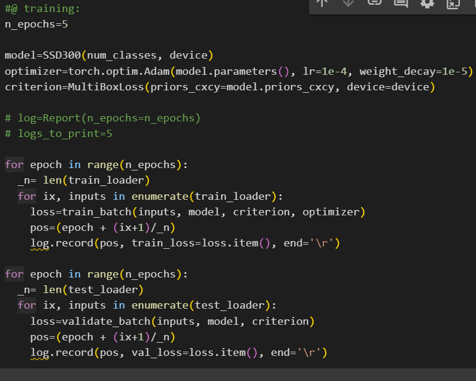

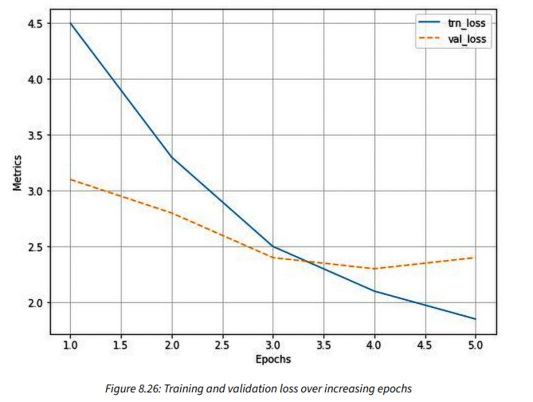

# Day 106
Completed Training SSD300 Architecture. Did with looking upto pdf but still have some sort of confusion but hopefully will clear it tomorrow. SSD mightnot be very handful for large scale production as the computational power is very high and the concept of default boxes for large production seems very unpleasing for me atleast:) as said due to requirement of less reponse time and low computation. 

- SSD training:

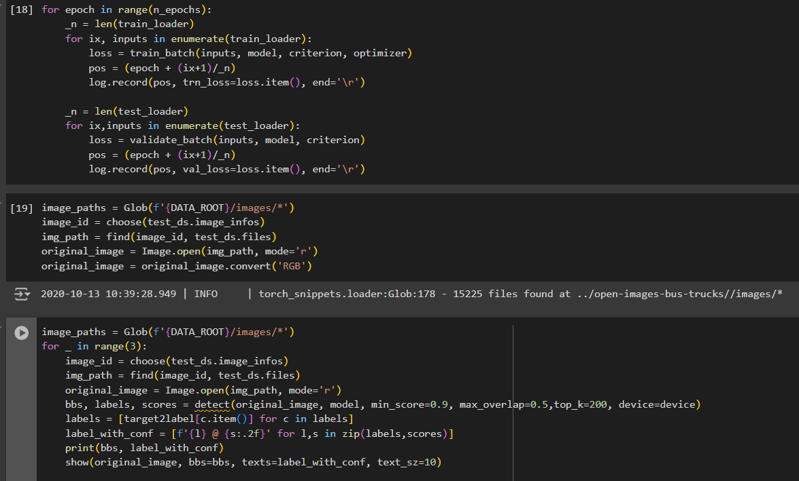

- SSD Result:

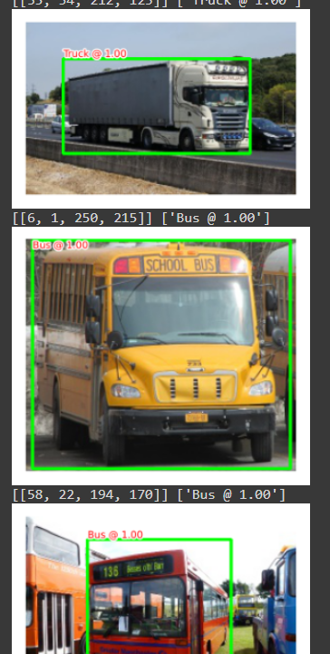

# Day 107
Learnt about memoryless property in exponential distribution. For context, Exponential distribution of random variable is used to predict the ocuurance of the 
next event. For example, How long does it take to prepare a food. The exponential distribution shows memoryless property as it is independent of the past event.
The best example can be understood with Geometry of the property. 
                      When the new light bulb is compared to used bulb upto x hours then we tend to believe that the used bulb is likely to burn out fast than the new
                      one but it doesn't happen according to exponential properties. The probabilities of running both bulbs additional t hrs is same always as old bulb is 
                      independent of its past event i.e it doesn't matter how hrs it had burnt before.

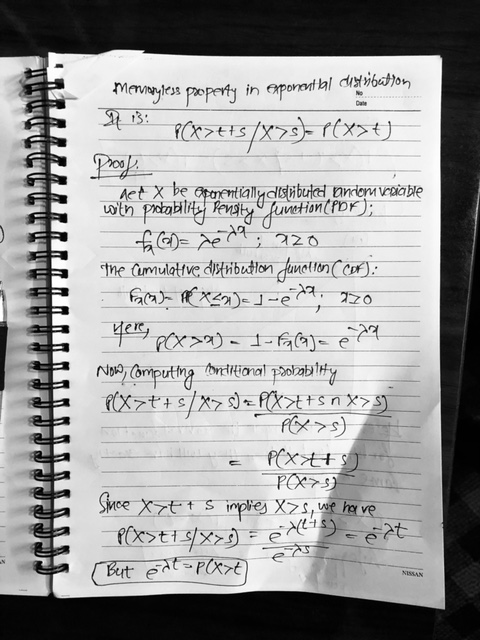

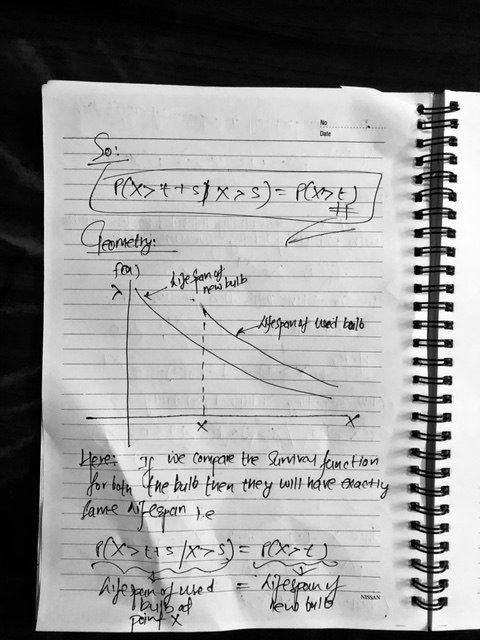

# Day 108 
Learnt about **model Training for MLOps**.  Documentation of MLOps can be found at: https://github.com/prijall/MLOps/blob/main/README.md.

# Day 109
Learnt about **MLflow and its implementation**.  Documentation of MLOps can be found at: https://github.com/prijall/MLOps/blob/main/README.md.

# Day 110
Learnt about **Model tracking and Management**.  Documentation of MLOps can be found at: https://github.com/prijall/MLOps/blob/main/README.md.

# Day 111
Did Paper implementation of YOLO. today, built model for training yolov1 architecture using paper reference where i create 6  main Convulation layers where there are total 24 CNN sub-modules. Read Paper thoroughly once in order to retain information as i have read paper properly upto model training.

Paper-Link: https://arxiv.org/pdf/1506.02640

- YOLO architecture:

_Day3.jpg)

- Implementation:

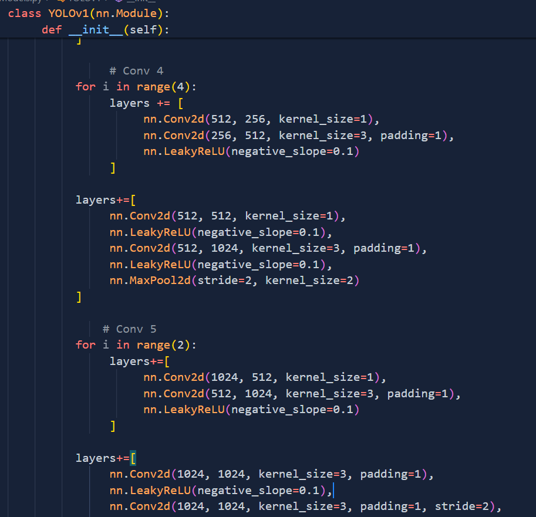

# Day 112
Prepared Data for Yolo implementation. Setup Configuration in separate file called **Config** which helps to make basic changes faster and helps to maintain configuration easy. Similarly, Did data augmentation where I did scaling and translation while rotation remais same. Wrote code for adjusting hue and saturation as part of augmentation. Then, did normalization and create grid format for object detection.

Similarly, Studied little on proofs in mathematics.

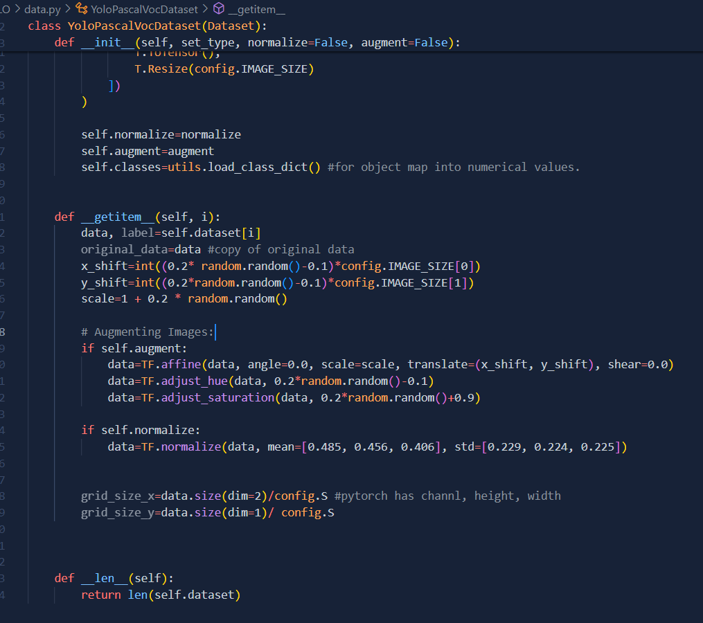

# Day 113
Augmented Bounding box for object detection. Yesterday, i have created grid cell for image on which today i design code system for bounding boxes in each cells. For training, bounding boxes need to be augmented so that we can catch the objects in the specific grid. It includes finding the center of the bounding boxes, min_x, min_y, max_x, max_y, etc. Another task to assign the classes to the bounding boxes using one hot encoding where instead of using one numeric value, i used binary vector.

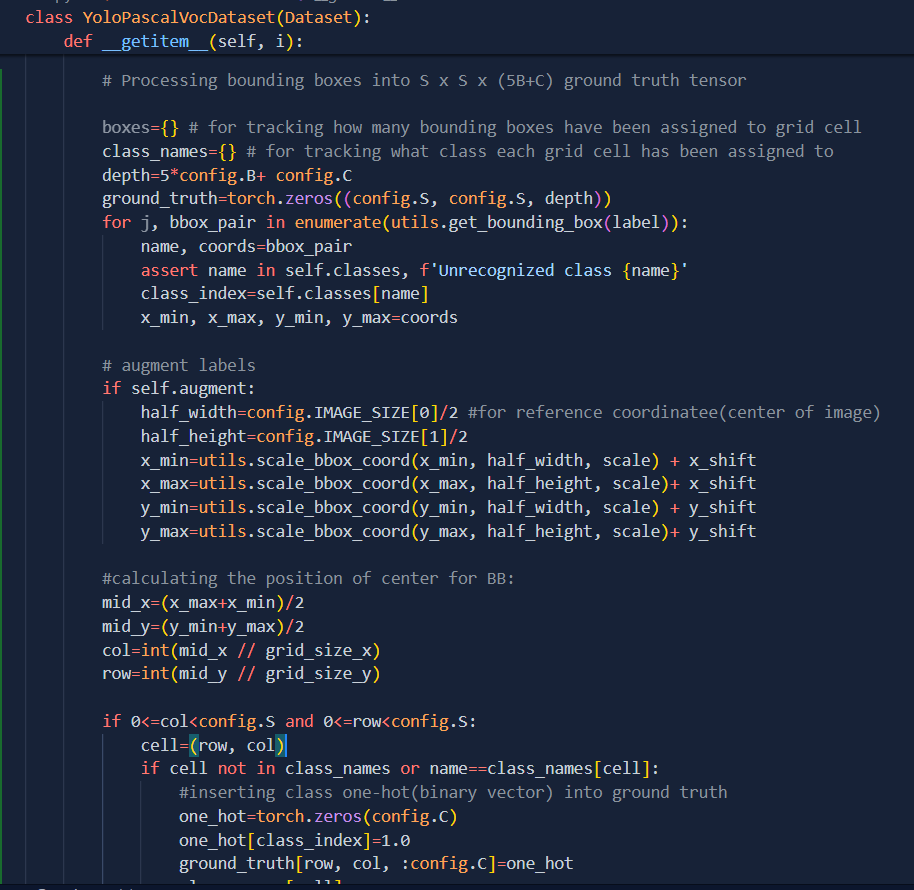

# Day 114
Started creating loss function for training optimization for YOLOv1 architecture. Spent sometime making helper function on utils where it helps to get IOU and box attributes. Today, did implementation for loss optimization, the loss function combines various components, such as coordinate loss for localization, confidence loss for object detection, and penalties for incorrect/no object predictions. Similarly, created responsible: The model needs to assign responsibility for detecting the object to the bounding box with the highest IoU.

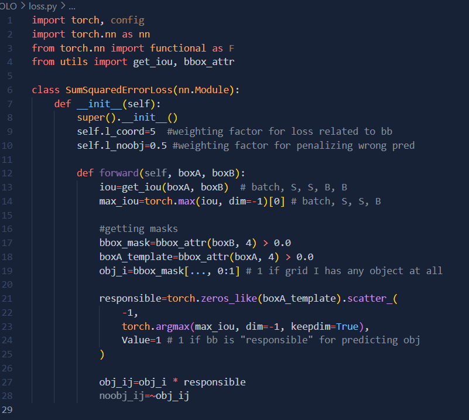