 

| Books & Resources                                                | Completion Status |
|------------------------------------------------------------------|-------------------|
| [Deep Learning Playlist @CampusX](https://www.youtube.com/playlist?list=PLKnIA16_RmvYuZauWaPlRTC54KxSNLtNn) | 🏊                 |
| [ MIT Deep Learning Playlist](https://www.youtube.com/playlist?list=PLtBw6njQRU-rwp5__7C0oIVt26ZgjG9NI) | 🏊                 |

  # Day 1

  Deep Learning is the subset of Artificial Learning and Machine learning which is inspired by human brain and works on the concept of **Representational Learning**. That means, We don't have to do feature engineering like we do in machine learning, all we have to do is feed the proper and big data to deep learning algorithms and it will have layers which will automatically detect the features and then predicts.This is also the main difference between Machine Learning and Deep Learning.
  
  ### Key Difference Between Deep Learning and Machine Learning
 - **Data Dependecies:** Deep Learning need large data for prediction whereas minimal data can be used in machine learning.
 - **Hardware Dependencies:** Deep Learning is very slow with cpu only, hence need gpus with good memory whereas machine learning models can be train only on cpu.
 - **Training Time:** The training time for deep learning algorithm is very huge whereas ml model needs less training time.
 - **Feature Selection:** It is automatically done ny algo itself whereas feature engineering is manually done by humans in ml.
 - **Interpretability:** DL works in black box software engineering concpet so everything is hidden whereas in ml we know how we got that specific result.

 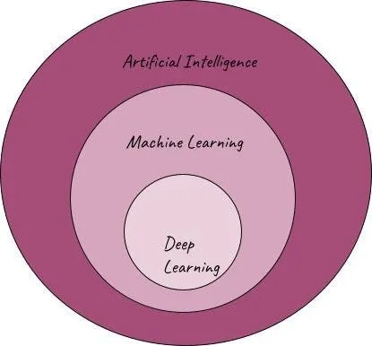

 # Day 2
 
 In Deep Learning, the word deep means multiple hidden layers. Learning about the history of deep learning is very amazing. Deep Diving into the topic, today i learned about the certain types of neural network, they are; **Artificial Neural Network(ANN), Convoluational Neural Network(CNN), Recurrent Neural Network(RNN), etc.** All these have diiferent fucntionalities according to different use-cases. Multiple hidden neural network is later termed as **Deep Learning.**
 
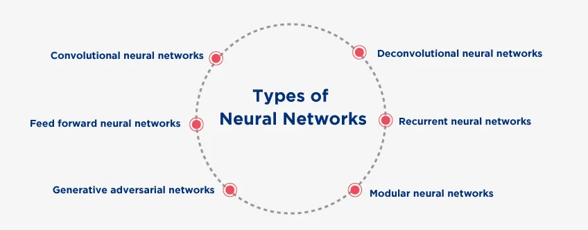

# Day 3

**Perceptron** is the basic unit of whole neural network. It is weakly inspired by Nerurons from human nervous system. Today, I understood the basics of perceptron and its geometric intuition. Perceptron works similar to that of machine learning models where data inputs are given and the preceptron will do prediction based on it's training with dataset. Perceptron works with more of linear sort of data and failes to maintain good accuracy on non linear data. 

- Basic Pictoral Representation of Perceptron:
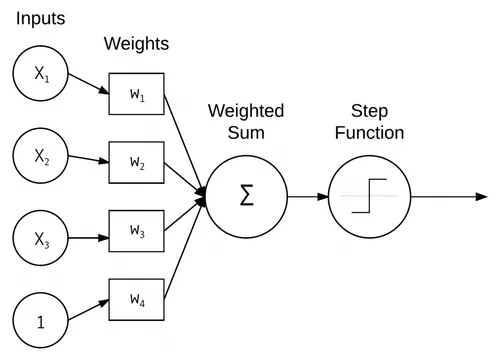

- Data for perceptron:
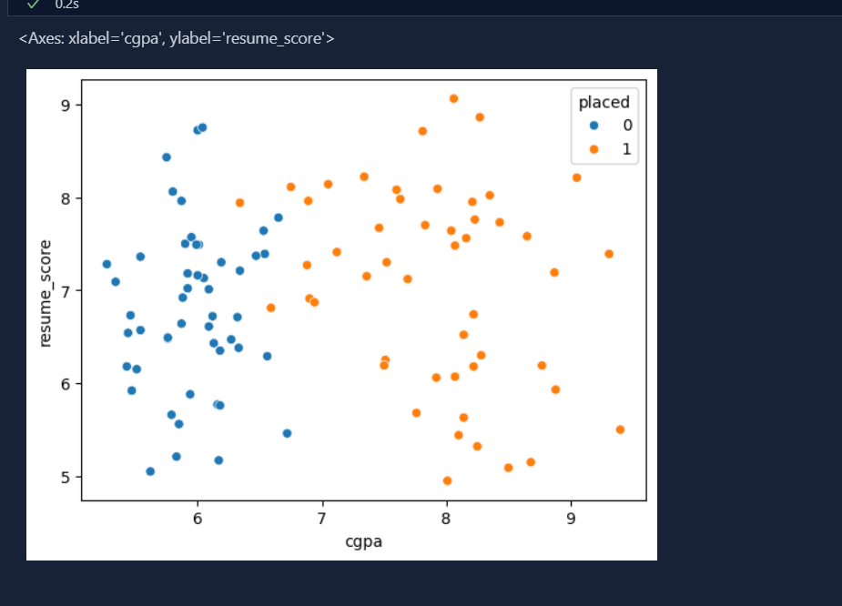

- classified Data using perceptron:
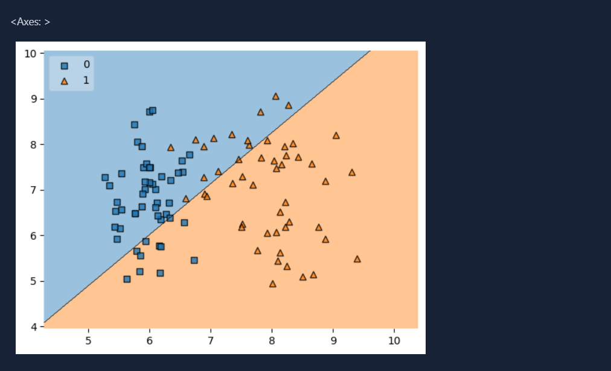

# Day 4

**Perceptron Training,** Today I learnt about perceptron training. First, I created a dataset for classification using sklearn and then developed perceptron model to train on those dataset.

#### Algorithm to train perceptron(trick):
- Step 1: train the built model with the dataset.
- Step 2: Select random datapoint from the dataset, if the actual value is 0 and predicted value is 1 then we should subtract that point with certain learning rate to old metric and update.
- Step 3: if the actual value is 1 and predicted value is 0 then we should add  that point with certain learning rate to old coefficient metric and update.
- Step 4: this step continues untill our coeff metric is stagnant.

- This is given by formula:
  
  New metric of eqn = old metric from eqn +learning_rate*(actual value- predicted_value)*datapoint

- Code Snippet:

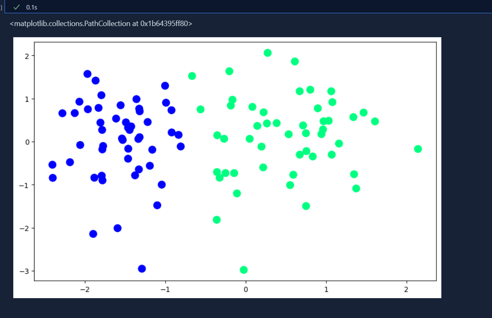
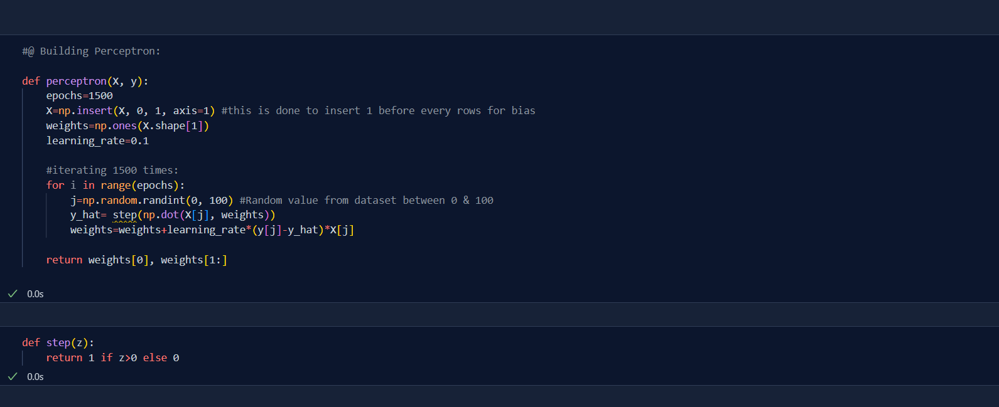
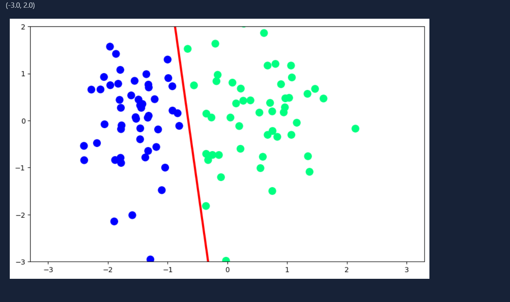

# Day 5
Yesterday, I learnt the trick to find the optimized line equation which will do deep learning classification. That trick might work must of the time but it doesn't guarantee the **convergence** and **Perfect seperation in line for classification**. Therefore, there is a need of **loss function**, which helps to find optimized weights and bias which will help in getting best separation line.
                                There are many loss function but we will use loss function similar to that of hinge loss function, which is 

- Loss Function = max(0, -Yi*f(Xi))  where Yi is the target value of each rows and F(Xi)=WiXi+b.

- Code Snippet:
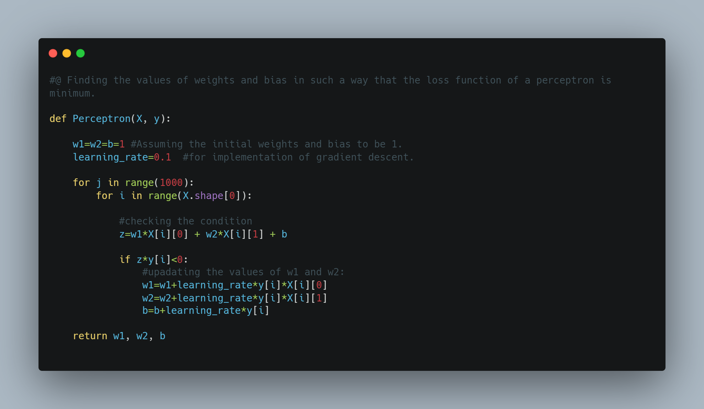

# Day 6
Today, I learnt about other loss function in perceptron. Perceptron is very flexible in nature. It can be used as linear regression, softmax regression, logistic regression and as perceptron itself depending upon the activation function used along with the loss function.Below is the table, I created to overview using various activation function and loss function:

- Table:

# Day 7
Dive diving into perceptron, it is in the notice that perceptron works on the linear model only. If given non-linear dataset to perceptron, how many epochs will it takes but it won't be able  to classify dataset due to which perceptron as a concept in deep learning couldn't grow further more.

- Demonstration:

[Watch the video](https://drive.google.com/file/d/1bjEwrqMVKu4_cXiYtlqe44gsCh1VsHX9/view?usp=drive_link)

# Day 8
Perceptron wasn't solely enough to use for prediction in deep learning due to which the concept of Multi-Layered Perceptron(MLP). Today, I understood the notation of MLP and revised the fundamental concept of perceptron. Understanding the notation helps to understand training of mlp later in learning.

- SnapShot:
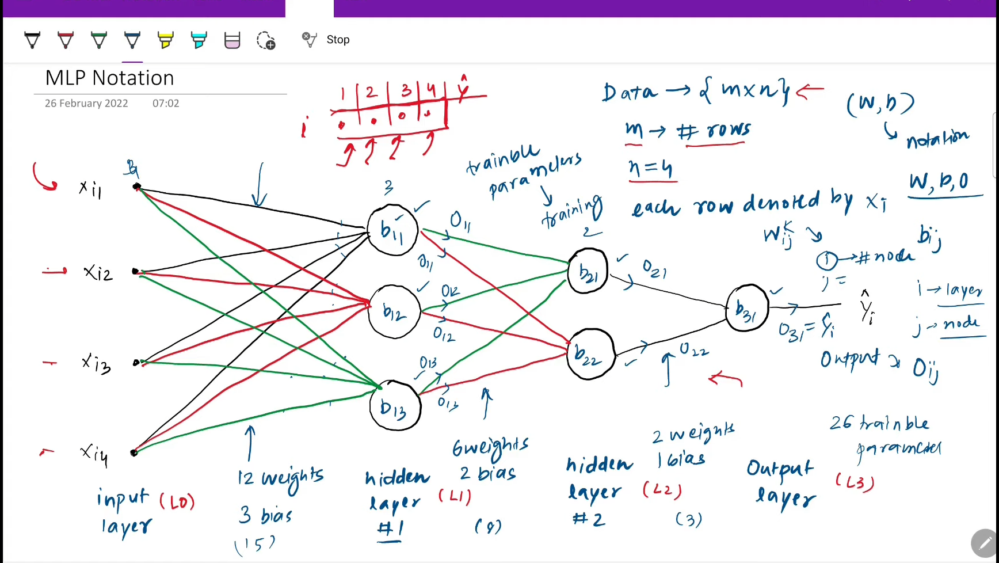

# Day 9
How MLP solves non linear decision boundary problems in complex data? Well, MLP does this by linear combination of different perceptrons and smoothening them.
What are the ways to improve performance in MLP?
- By adding nodes in hidden layer
- By adding nodes in input layer
- By adding nodes in output layer
- By adding hidden layers.

- Below is the snapshot of Tensorflow playground which depicts adding multiple hidden layers improves model performance of the model:

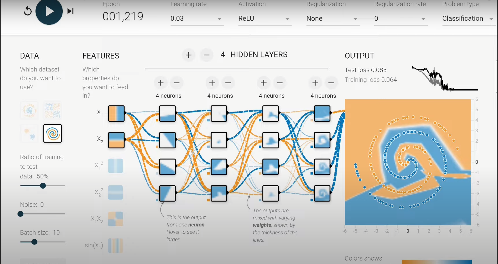

# Day 10
Today, I understood the concept of Forward Propagation in Neural network. It is very important to learn forward propagation in first place as it makes learning Back-Propagation easy.Forward Propagation is nothing but a method to feed data show that neural network can train itself and make prediction. We just have to feed data and all the other operations are handled by Linear algebra itself that's what the beauty of linear algebra. We shouldn't apply back propagation algorithm unless forward propagation is done.

- Below is the code snippet:
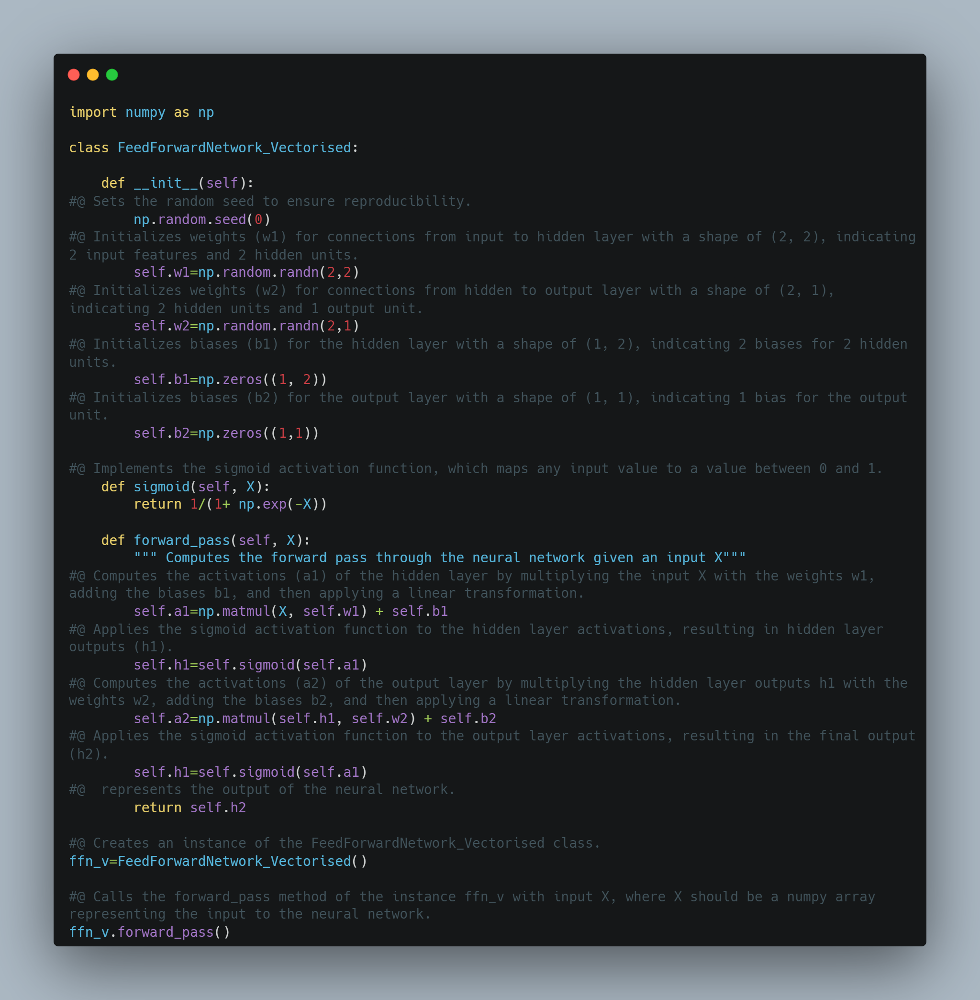

# Day 11
Today, I roughly trained ANN using keras and tensorflow where I learnt how prediction is made by neural networks.

- Below is the code snippet:
 
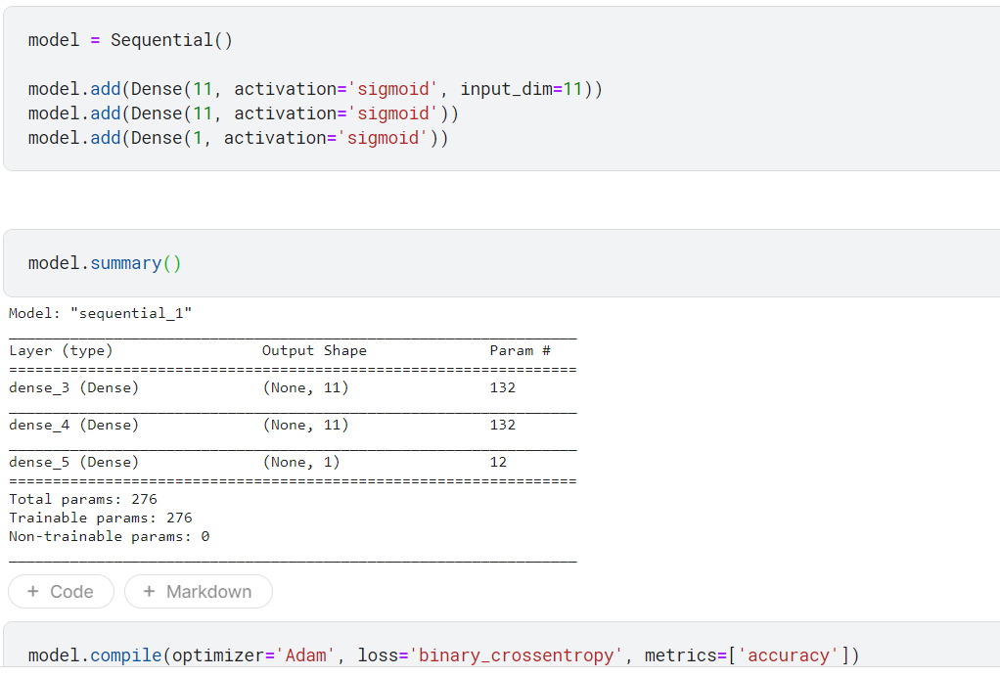

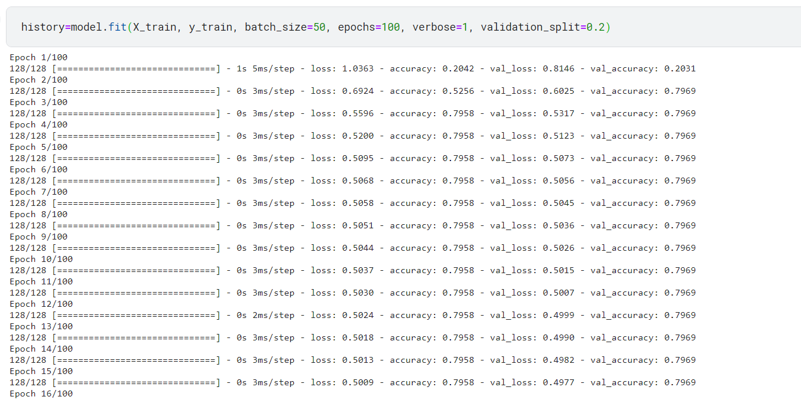

# Day 12
Today, I build the layers of neurons from scratch using python and saw how it does prediction which was all revision from forward propagation and saw how linear algebra work in deep learning.

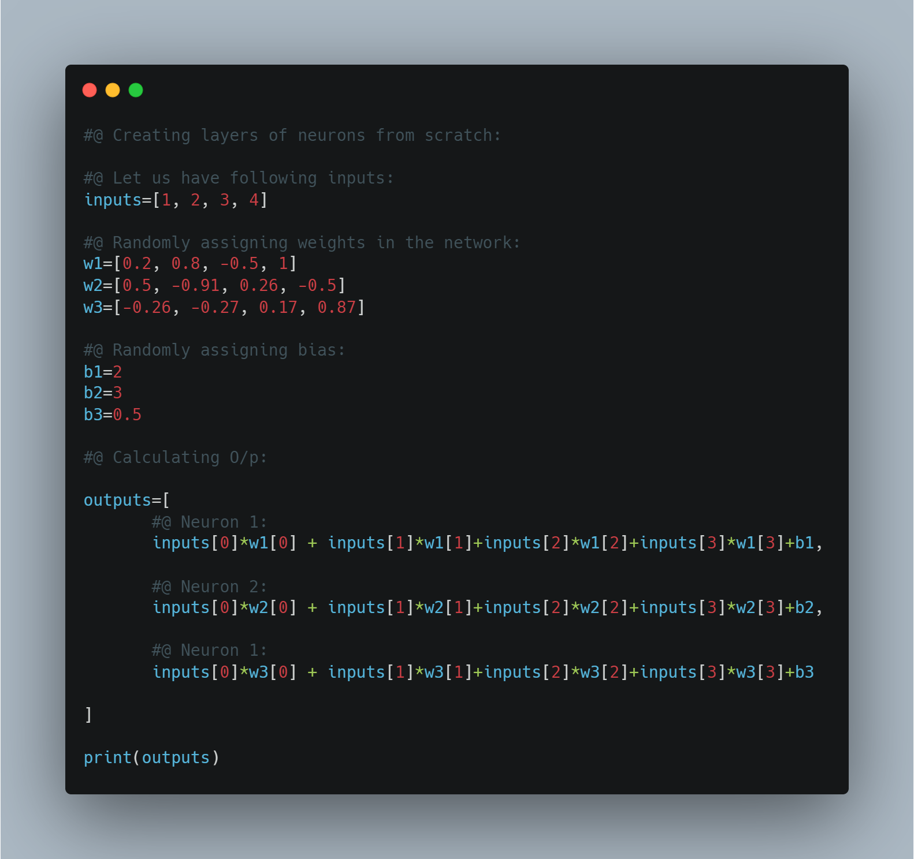

# Day 13
Today, I implemented code for dense layer from scratch and uderstood how forward propagation is done. First, I created a class named **Dense Layer** where I created simply two fucntions where one takes **no of inputs and no of neurons** and assign weights and biases with these inputs. Similarly, I created class for forward propagation which gives output using dot product(or say Matrix Multiplication) from calculated inputs, weights and biases and finally print out results.

- Below is the code snippet:

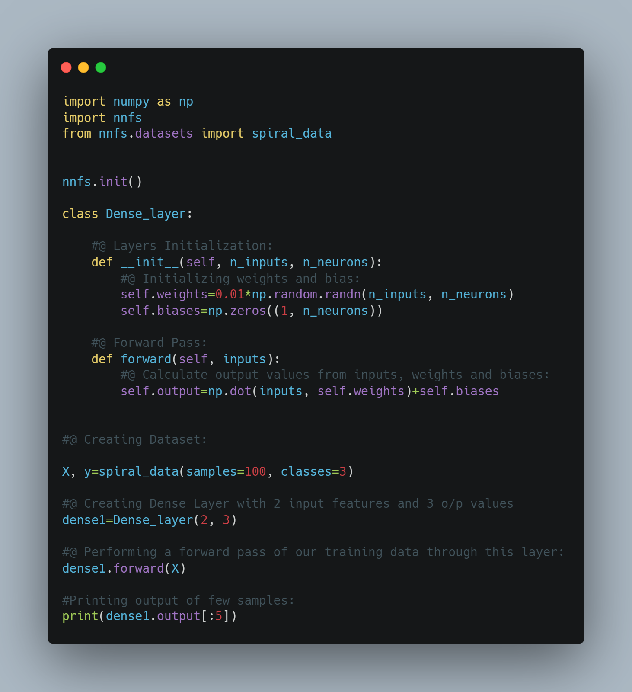

# Day 14
Implemented **RELU ACtivation Function** where ReLu stands for **Rectified Linear Unit**. It is as simple as other activation functions such as sigmoid, ect. The basic concept of RELU is it’s quite literally y=x, clipped at 0 from the negative side. If x is less than or equal to 0, then y is 0 — otherwise, y is equal to x. Also Saw their learning process from book **Neural Network From Scratch**.

-Below is the code implementation:

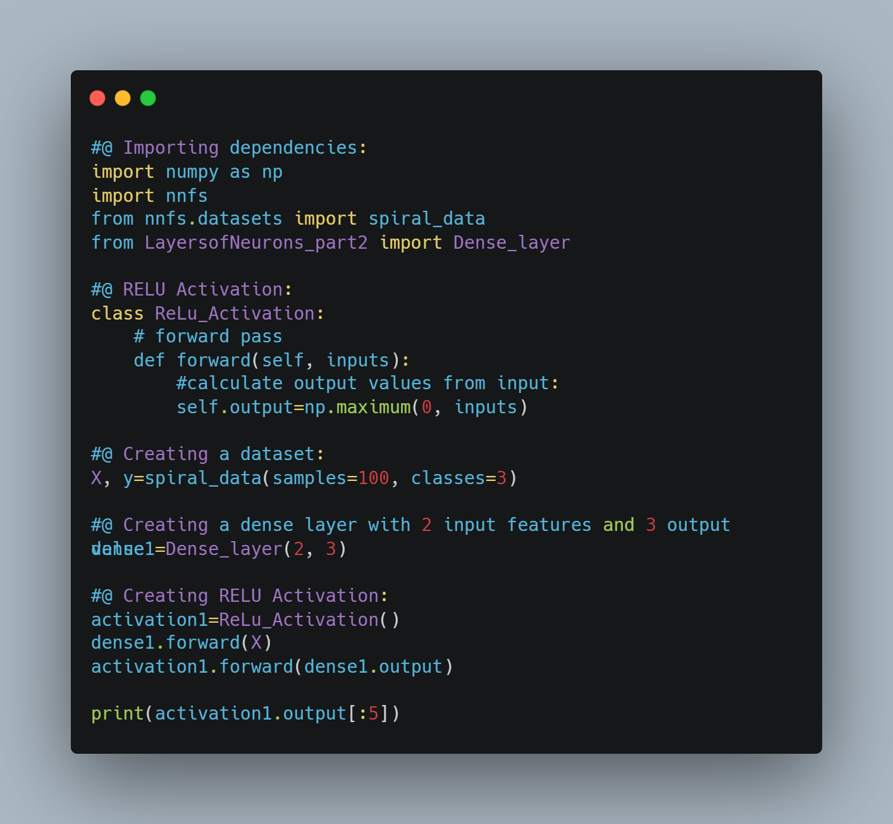

# Day 15
Today, I implemented **SOftmax Function**. The Softmax activation function addresses these limitations of ReLU Function by transforming the output into a probability distribution. 
 #### Properties of Softmax:
- **Normalization**: 
The outputs of the softmax function are probabilities that sum up to 1. This normalization provides a clear, interpretable measure of confidence for each class.
- **Bounded Outputs**: The output values are between 0 and 1, representing probabilities.
- **Contextual Output:** The probability for each class is calculated considering the scores of all classes, meaning each output is dependent on the others. This provides a comparative measure of confidence across all classes.

#### How Softmax Works in Classification:
When using softmax in the output layer of a neural network for classification:
- The network produces raw scores (logits) for each class.
- These logits are then transformed into probabilities using the softmax function.
- The class with the highest probability is considered the predicted class.

- Below is the code snippet:

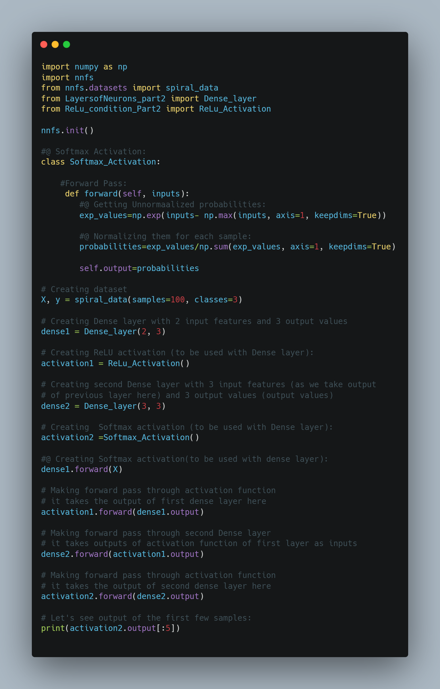

# Day 16
Today, I built the loss function for neural network from scratch. The loss function, also referred to as the cost function, is the algorithm that quantifies how wrong a model is.Loss is the measure of this metric. Since loss is the model’s error, we ideally want it to be 0. The model has a softmax activation function for the output layer, which means it’s
outputting a probability distribution. **Categorical cross-entropy** is explicitly used to compare a **“ground-truth” probability (y or “targets”)** and some predicted distribution **(y-hat or “predictions”)**, so it makes sense to use cross-entropy here. It is also one of the most commonly used loss functions with a softmax activation on the output layer.

- Below is the code snippet:

# Day 17
While loss is a useful metric for optimizing a model, the metric commonly used in practice along with loss is the **accuracy**, which describes how often the largest confidence is the correct class in terms of a fraction. Conveniently, we can reuse existing variable definitions to calculate the accuracy metric. We will use the argmax values from the softmax outputs and then compare these to the targets. This is as simple as doing (note that we slightly modified the softmax_outputs for the purpose of this example):

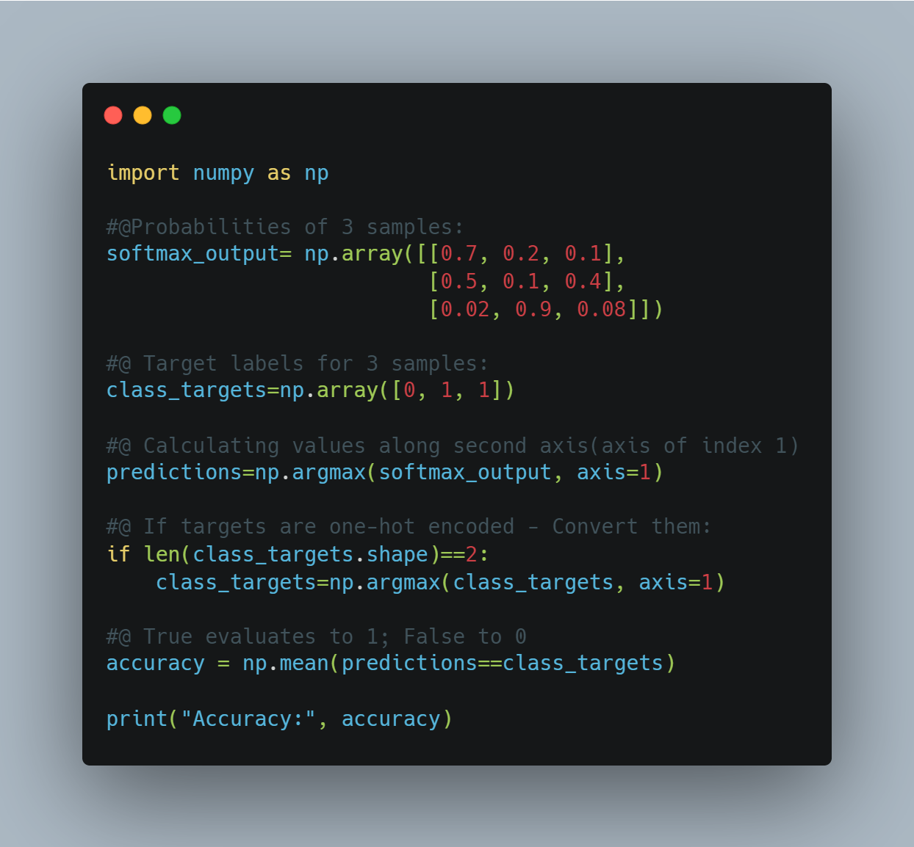

# Day 18
Today, Implmented Optimization for neural network. Now that the neural network is built, able to have data passed through it, and capable of calculating loss, the next step is to determine how to adjust the weights and biases to decrease the loss. Finding an intelligent way to adjust the neurons’ input’s weights and biases to minimize loss is the main difficulty of neural networks. The idea is instead of setting parameters with randomly-chosen values each iteration, apply a fraction of these values to parameters. With this, weights will be updated from what currently yields us the lowest loss instead of aimlessly randomly. If the adjustment decreases loss, we will make it the new point to adjust from. If loss instead increases due to the adjustment, then we will revert to the previous point. Using similar code from earlier, we will first change from randomly selecting weights and
biases to randomly adjusting them:

- Optimization:
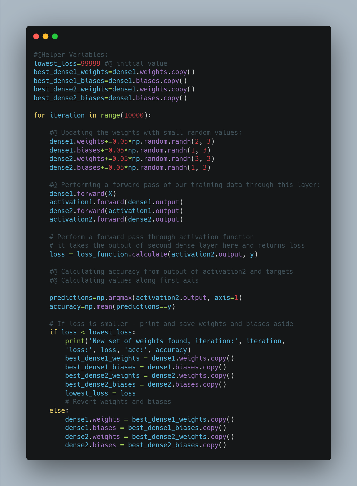

- Output:
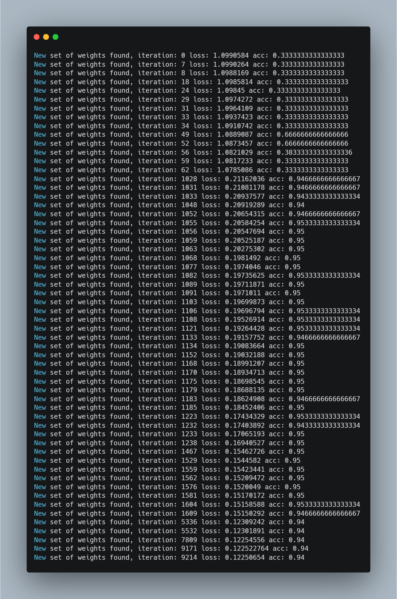

