 

| Books & Resources                                                | Completion Status |
|------------------------------------------------------------------|-------------------|
| [Deep Learning Playlist @CampusX](https://www.youtube.com/playlist?list=PLKnIA16_RmvYuZauWaPlRTC54KxSNLtNn) | üèä                 |
| [ MIT Deep Learning Playlist](https://www.youtube.com/playlist?list=PLtBw6njQRU-rwp5__7C0oIVt26ZgjG9NI) | üèä                 |

  # Day 1

  Deep Learning is the subset of Artificial Learning and Machine learning which is inspired by human brain and works on the concept of **Representational Learning**. That means, We don't have to do feature engineering like we do in machine learning, all we have to do is feed the proper and big data to deep learning algorithms and it will have layers which will automatically detect the features and then predicts.This is also the main difference between Machine Learning and Deep Learning.
  
  ### Key Difference Between Deep Learning and Machine Learning
 - **Data Dependecies:** Deep Learning need large data for prediction whereas minimal data can be used in machine learning.
 - **Hardware Dependencies:** Deep Learning is very slow with cpu only, hence need gpus with good memory whereas machine learning models can be train only on cpu.
 - **Training Time:** The training time for deep learning algorithm is very huge whereas ml model needs less training time.
 - **Feature Selection:** It is automatically done ny algo itself whereas feature engineering is manually done by humans in ml.
 - **Interpretability:** DL works in black box software engineering concpet so everything is hidden whereas in ml we know how we got that specific result.

 

 # Day 2
 
 In Deep Learning, the word deep means multiple hidden layers. Learning about the history of deep learning is very amazing. Deep Diving into the topic, today i learned about the certain types of neural network, they are; **Artificial Neural Network(ANN), Convoluational Neural Network(CNN), Recurrent Neural Network(RNN), etc.** All these have diiferent fucntionalities according to different use-cases. Multiple hidden neural network is later termed as **Deep Learning.**
 
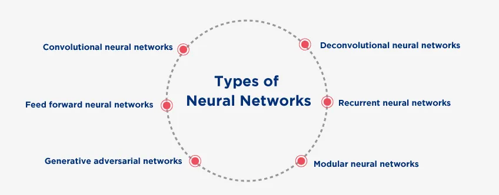

# Day 3

**Perceptron** is the basic unit of whole neural network. It is weakly inspired by Nerurons from human nervous system. Today, I understood the basics of perceptron and its geometric intuition. Perceptron works similar to that of machine learning models where data inputs are given and the preceptron will do prediction based on it's training with dataset. Perceptron works with more of linear sort of data and failes to maintain good accuracy on non linear data. 

- Basic Pictoral Representation of Perceptron:

- Data for perceptron:
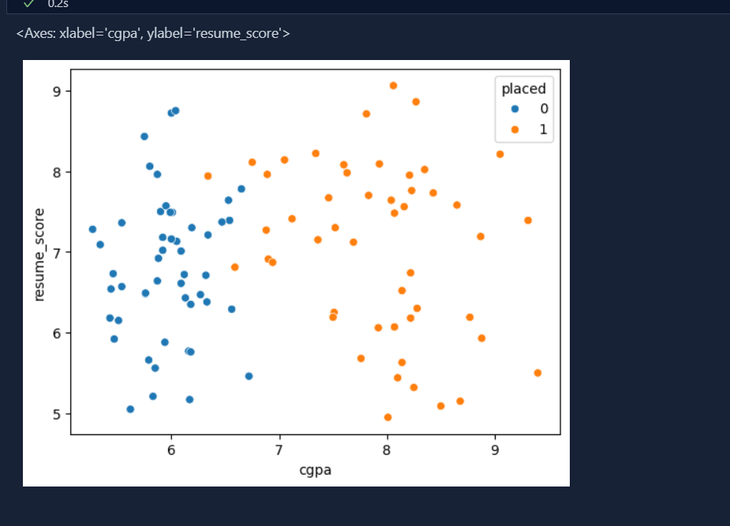

- classified Data using perceptron:

# Day 4

**Perceptron Training,** Today I learnt about perceptron training. First, I created a dataset for classification using sklearn and then developed perceptron model to train on those dataset.

#### Algorithm to train perceptron(trick):
- Step 1: train the built model with the dataset.
- Step 2: Select random datapoint from the dataset, if the actual value is 0 and predicted value is 1 then we should subtract that point with certain learning rate to old metric and update.
- Step 3: if the actual value is 1 and predicted value is 0 then we should add  that point with certain learning rate to old coefficient metric and update.
- Step 4: this step continues untill our coeff metric is stagnant.

- This is given by formula:
  
  New metric of eqn = old metric from eqn +learning_rate*(actual value- predicted_value)*datapoint

- Code Snippet:

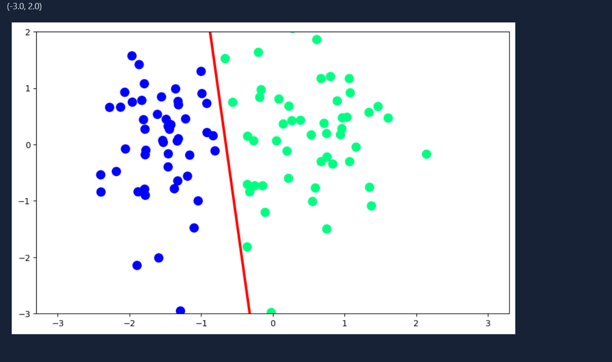

# Day 5
Yesterday, I learnt the trick to find the optimized line equation which will do deep learning classification. That trick might work must of the time but it doesn't guarantee the **convergence** and **Perfect seperation in line for classification**. Therefore, there is a need of **loss function**, which helps to find optimized weights and bias which will help in getting best separation line.
                                There are many loss function but we will use loss function similar to that of hinge loss function, which is 

- Loss Function = max(0, -Yi*f(Xi))  where Yi is the target value of each rows and F(Xi)=WiXi+b.

- Code Snippet:

# Day 6
Today, I learnt about other loss function in perceptron. Perceptron is very flexible in nature. It can be used as linear regression, softmax regression, logistic regression and as perceptron itself depending upon the activation function used along with the loss function.Below is the table, I created to overview using various activation function and loss function:

- Table:

# Day 7
Dive diving into perceptron, it is in the notice that perceptron works on the linear model only. If given non-linear dataset to perceptron, how many epochs will it takes but it won't be able  to classify dataset due to which perceptron as a concept in deep learning couldn't grow further more.

- Demonstration:

[Watch the video](https://drive.google.com/file/d/1bjEwrqMVKu4_cXiYtlqe44gsCh1VsHX9/view?usp=drive_link)

# Day 8
Perceptron wasn't solely enough to use for prediction in deep learning due to which the concept of Multi-Layered Perceptron(MLP). Today, I understood the notation of MLP and revised the fundamental concept of perceptron. Understanding the notation helps to understand training of mlp later in learning.

- SnapShot:

# Day 9
How MLP solves non linear decision boundary problems in complex data? Well, MLP does this by linear combination of different perceptrons and smoothening them.
What are the ways to improve performance in MLP?
- By adding nodes in hidden layer
- By adding nodes in input layer
- By adding nodes in output layer
- By adding hidden layers.

- Below is the snapshot of Tensorflow playground which depicts adding multiple hidden layers improves model performance of the model:

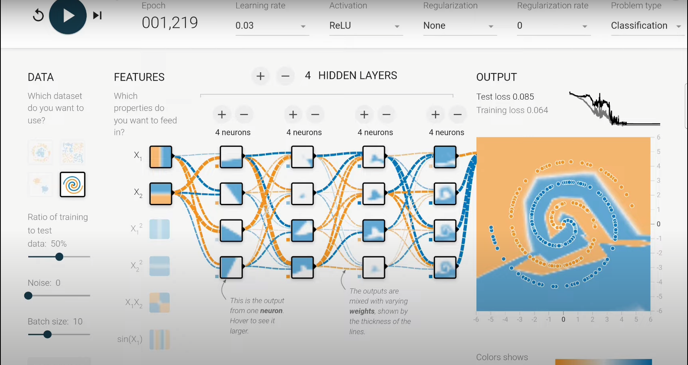

# Day 10
Today, I understood the concept of Forward Propagation in Neural network. It is very important to learn forward propagation in first place as it makes learning Back-Propagation easy.Forward Propagation is nothing but a method to feed data show that neural network can train itself and make prediction. We just have to feed data and all the other operations are handled by Linear algebra itself that's what the beauty of linear algebra. We shouldn't apply back propagation algorithm unless forward propagation is done.

- Below is the code snippet:

# Day 11
Today, I roughly trained ANN using keras and tensorflow where I learnt how prediction is made by neural networks.

- Below is the code snippet:
 

# Day 12
Today, I build the layers of neurons from scratch using python and saw how it does prediction which was all revision from forward propagation and saw how linear algebra work in deep learning.

# Day 13
Today, I implemented code for dense layer from scratch and uderstood how forward propagation is done. First, I created a class named **Dense Layer** where I created simply two fucntions where one takes **no of inputs and no of neurons** and assign weights and biases with these inputs. Similarly, I created class for forward propagation which gives output using dot product(or say Matrix Multiplication) from calculated inputs, weights and biases and finally print out results.

- Below is the code snippet:

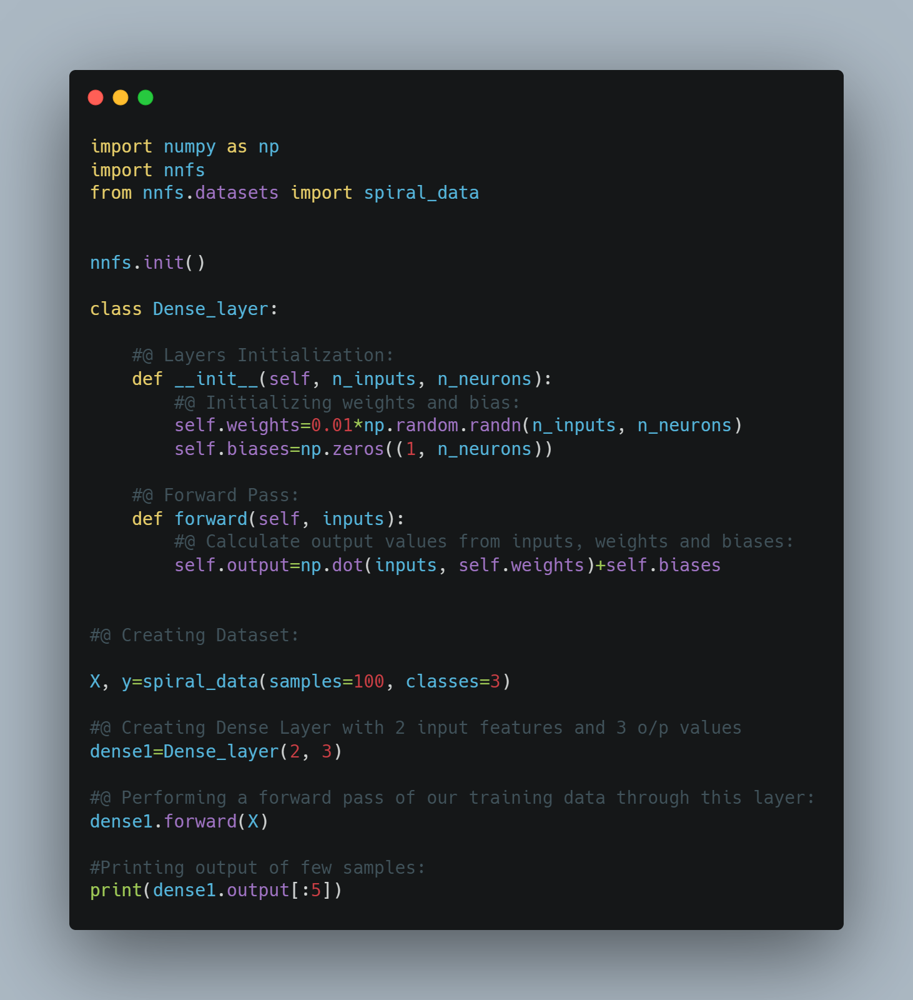

# Day 14
Implemented **RELU ACtivation Function** where ReLu stands for **Rectified Linear Unit**. It is as simple as other activation functions such as sigmoid, ect. The basic concept of RELU is it’s quite literally y=x, clipped at 0 from the negative side. If x is less than or equal to 0, then y is 0 — otherwise, y is equal to x. Also Saw their learning process from book **Neural Network From Scratch**.

-Below is the code implementation:

# Day 15
Today, I implemented **SOftmax Function**. The Softmax activation function addresses these limitations of ReLU Function by transforming the output into a probability distribution. 
 #### Properties of Softmax:
- **Normalization**: 
The outputs of the softmax function are probabilities that sum up to 1. This normalization provides a clear, interpretable measure of confidence for each class.
- **Bounded Outputs**: The output values are between 0 and 1, representing probabilities.
- **Contextual Output:** The probability for each class is calculated considering the scores of all classes, meaning each output is dependent on the others. This provides a comparative measure of confidence across all classes.

#### How Softmax Works in Classification:
When using softmax in the output layer of a neural network for classification:
- The network produces raw scores (logits) for each class.
- These logits are then transformed into probabilities using the softmax function.
- The class with the highest probability is considered the predicted class.

- Below is the code snippet:

# Day 16
Today, I built the loss function for neural network from scratch. The loss function, also referred to as the cost function, is the algorithm that quantifies how wrong a model is.Loss is the measure of this metric. Since loss is the model’s error, we ideally want it to be 0. The model has a softmax activation function for the output layer, which means it’s
outputting a probability distribution. **Categorical cross-entropy** is explicitly used to compare a **“ground-truth” probability (y or “targets”)** and some predicted distribution **(y-hat or “predictions”)**, so it makes sense to use cross-entropy here. It is also one of the most commonly used loss functions with a softmax activation on the output layer.

- Below is the code snippet:

# Day 17
While loss is a useful metric for optimizing a model, the metric commonly used in practice along with loss is the **accuracy**, which describes how often the largest confidence is the correct class in terms of a fraction. Conveniently, we can reuse existing variable definitions to calculate the accuracy metric. We will use the argmax values from the softmax outputs and then compare these to the targets. This is as simple as doing (note that we slightly modified the softmax_outputs for the purpose of this example):

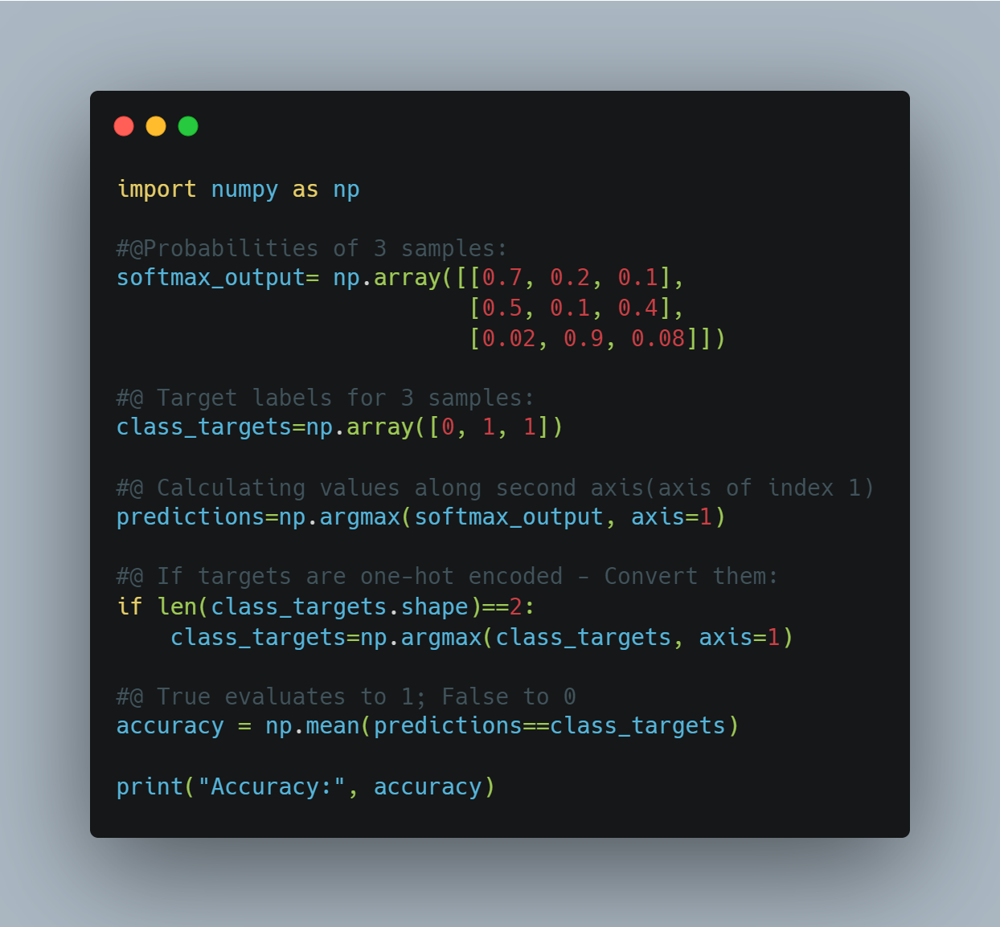

# Day 18
Today, Implmented Optimization for neural network. Now that the neural network is built, able to have data passed through it, and capable of calculating loss, the next step is to determine how to adjust the weights and biases to decrease the loss. Finding an intelligent way to adjust the neurons’ input’s weights and biases to minimize loss is the main difficulty of neural networks. The idea is instead of setting parameters with randomly-chosen values each iteration, apply a fraction of these values to parameters. With this, weights will be updated from what currently yields us the lowest loss instead of aimlessly randomly. If the adjustment decreases loss, we will make it the new point to adjust from. If loss instead increases due to the adjustment, then we will revert to the previous point. Using similar code from earlier, we will first change from randomly selecting weights and
biases to randomly adjusting them:

- Optimization:

- Output:

# Day 19
Today, I studied about Gradeint Descent. Gradient descent is an optimization algorithm which is commonly-used to train machine learning models and neural networks. It trains machine learning models by minimizing errors between predicted and actual results. Implemented gradient descent from scratch, First I have created function which has equation and then I built function for calculation of gredient descent using derivatives. After that using numpy, created random datapoints aligning with equation. After that I select one random data point which has to be descent and use loop to do so with learning rate and basic maths to make that data point global minima.

- Below is the code snippet:

# Day 20
Derivative is very important in neural network, which is widely used in backpropagation in neural network. Backpropagation is an optimization technique which is done combining both forward propagation and gradient descent. First, we train our neural network and predict value using forward propagation and then calculate loss afterwhich gradient descent comes into play and updates our trainable parameter. Today, I just calculated partial derivative of neural network.

- Below is the code snippet:
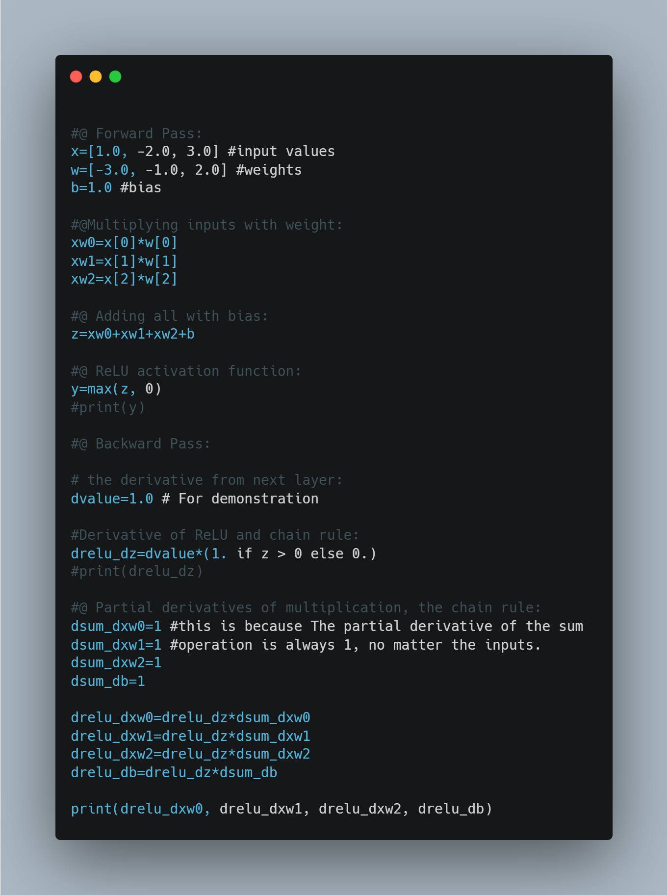

# Day 21
Completed backpropagation on single set of neuron and reduced the loss function. Now the main aim to pratice this under the deep neural network.

- Below is the snapshot:

# Day 22
Today, I implemented backpropagation for **Dense Layer, ReLU Activation and SoftMax Activation.** 

#### Dense Layer Backward Pass:
- Created backward function which takes dvalues which is  Gradient of the loss with respect to the output of this layer (this is the gradient flowing back from the next layer). After that, computed the gradient of the loss with respect to the weight, biases and input of the layer by dot product of transposed(repsective) matrix with dvalues (for weights and inputs) and by summing up dvalues across the samples (rows).

#### Backward pass for ReLU Activation:
- Created backward function which takes dvalues which is  Gradient of the loss with respect to the output of this layer (this is the gradient flowing back from the next layer).after that, copied values to preserve the original dvalues. Setting the gradient to zero where the input to the ReLU was zero or negative, because ReLU outputs zero in those regions during the forward pass and thus does not contribute to the gradient.

#### Softmax Activation Backward Pass:
-  Computes gradients using the Jacobian matrix of the softmax function, iterating over each sample.

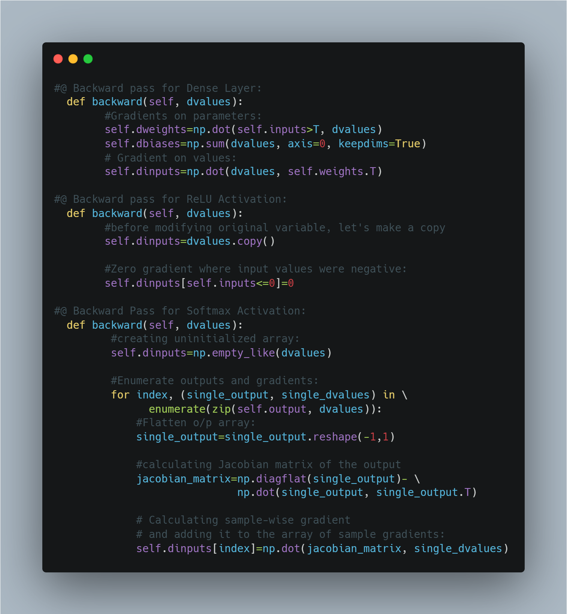

# Day 23
Created backward pass for **Common Loss and Categorical loss entropy**.
- **Backward Method:** Computed the gradient of the loss with respect to the input predictions, converting true labels to one-hot format if necessary, and normalizing the gradients.

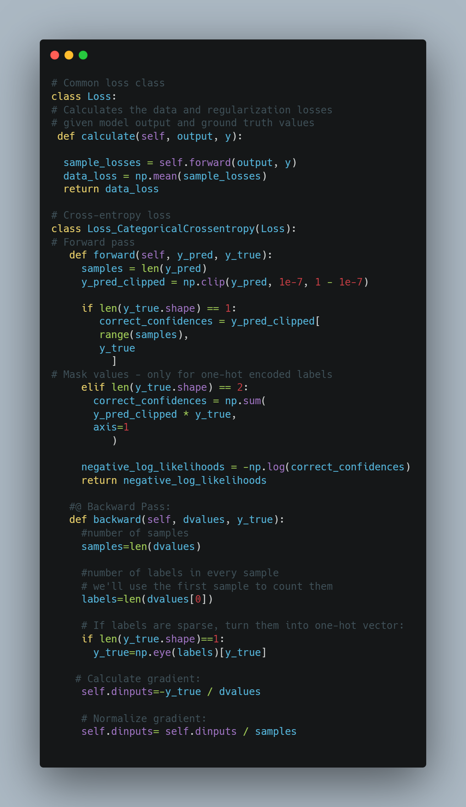

# Day 24
Today, I implemented code for both **Softmax and Loss Categorical Entropy** for both forward pass and backward pass. This class calculates the combined gradient of the loss and activation functions. Firstly, I did class initialization which will be called automatically when their objects are created.

#### Forward Pass
- Took input values and output values in the argument. afterthat fed input to softmax activation and got the result of prediction. Finally, returned loss by comparing with output values.

#### Backward Pass
- Took dvalues(the gradients of the loss with respect to the output of the softmax layer) and output values as argument. aftermath , if labels are one-hot encoded, turned them into discrete values because gradient calculation is based on class indices rather than one-hot vectors. Then copied dvalues to dinputs for safe modification. Finally, calculated gradient and normalized it.

- Below is the code snippet:
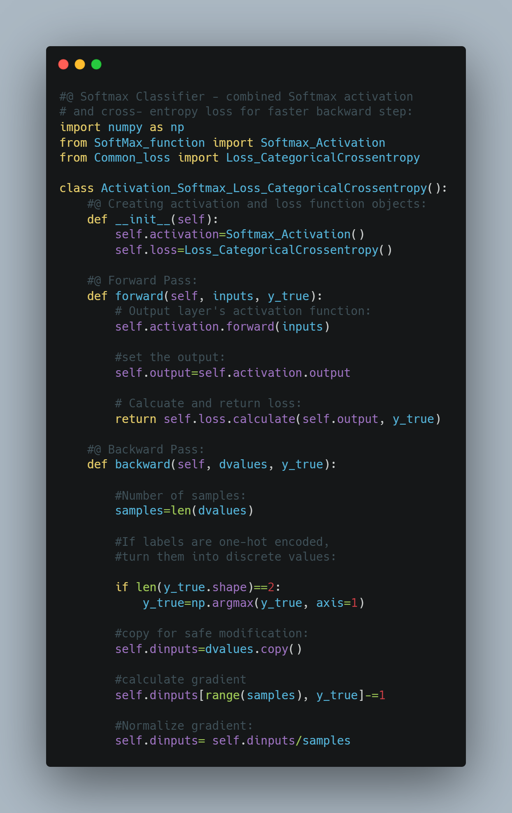

# Day 25
Today, I tested all the module that i have built over a period of time for training Neural network. I did Forward pass and Backpass and calculated loss and adjusted right weights and biases.At this point, thanks to gradients and backpropagation using the chain rule, we’re able to adjust the weights and biases with the goal of lowering loss, but we’d be doing it in a very rudimentaryway. This process of adjusting weights and biases using gradients to decrease loss is the job of the optimizer, which will study next. Here comes end for backpropagation.

- Below is the code snippet:

  

  # Day 26
Today, I performed **Stochastic Gradient Descent(SGD)** for neural network.In the case of Stochastic Gradient Descent, we choose a learning rate, such as 1.0. We then subtract the learning_rate · parameter_gradients from the actual parameter values. If our learning rate is 1, then we’re subtracting the exact amount of gradient from our parameters. We’re going to start with 1 to see the results, but we’ll be diving more into the learning rate shortly. Let’s create the SGD optimizer class code. The initialization method will take hyper-parameters, starting with the learning rate, for now, storing them in the class’ properties. The update_params method, given a layer object, performs the most basic optimization, the same way that we performed it in the previous chapter — it multiplies the gradients stored in the layers by the negated learning rate and adds the result to the layer’s parameters. It seems that, in the previous chapter, we performed SGD optimization without knowing it.

- Below is the code snippet:

# Day 27
Today I implemented 2 concepts in SGD Optimizer i.e. **Learning Rate Decay and Learning rate with Momentum**.

#### Learning Rate Decay
The idea of a learning rate decay is to start with a large learning rate, say 1.0 in our case, and then decrease it during training. There are a few methods for doing this. One is to decrease the learning rate in response to the loss across epochs — for example, if the loss begins to level out/plateau or starts “jumping” over large deltas. You can either program this behavior-monitoring logically or simply track your loss over time and manually decrease the learning rate when you deem it appropriate. Another option, which we will implement, is to program a Decay Rate, which steadily decays the learning rate per batch or epoch.

#### Learning rate with Momentum
Momentum creates a rolling average of gradients over some number of updates and uses this average with the unique gradient at each step. Another way of understanding this is to imagine a ball going down a hill — even if it finds a small hole or hill, momentum will let it go straight through it towards a lower minimum — the bottom of this hill. This can help in cases where you’re stuck in some local minimum (a hole), bouncing back and forth. With momentum, a model is more likely to pass through local minimums, further decreases.

- Below is the code snippet:

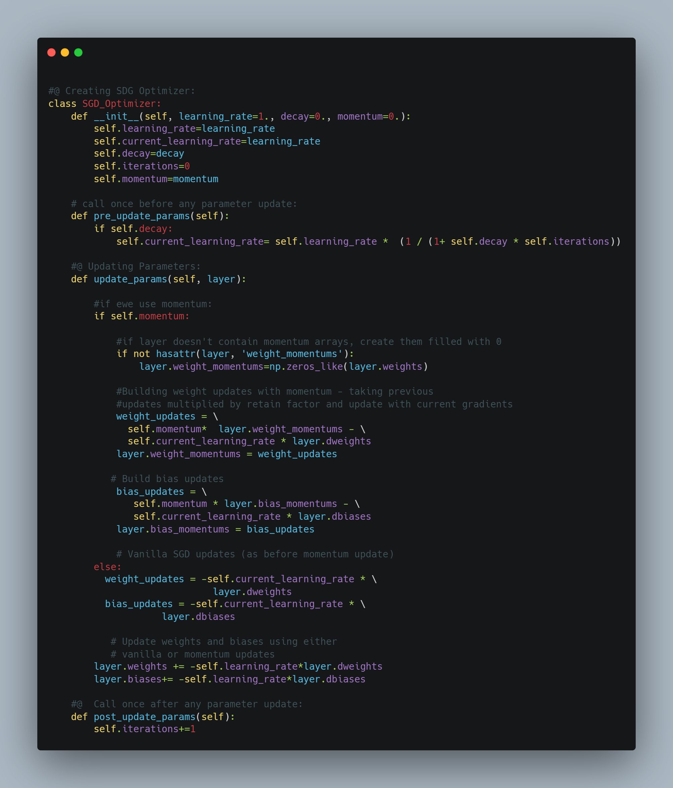

# Day 28
Adam, short for Adaptive Momentum, is currently the most widely-used optimizer and is built atop RMSProp, with the momentum concept from SGD added back in. This means that, instead
of applying current gradients, we’re going to apply momentums like in the SGD optimizer with momentum, then apply a per-weight adaptive learning rate with the cache as done in RMSProp. 
The Adam optimizer additionally adds a bias correction mechanism. Do not confuse this with the layer’s bias. The bias correction mechanism is applied to the cache and momentum, compensating for the initial zeroed values before they warm up with initial steps. To achieve this correction, both momentum and caches are divided by 1-betastep
. As step raises, betastep approaches 0 (a fraction to the power of a rising value decreases), solving this whole expression to a fraction during the first steps and approaching 1 as training progresses. For example, beta 1, a fraction of momentum to apply, defaults to 0.9.

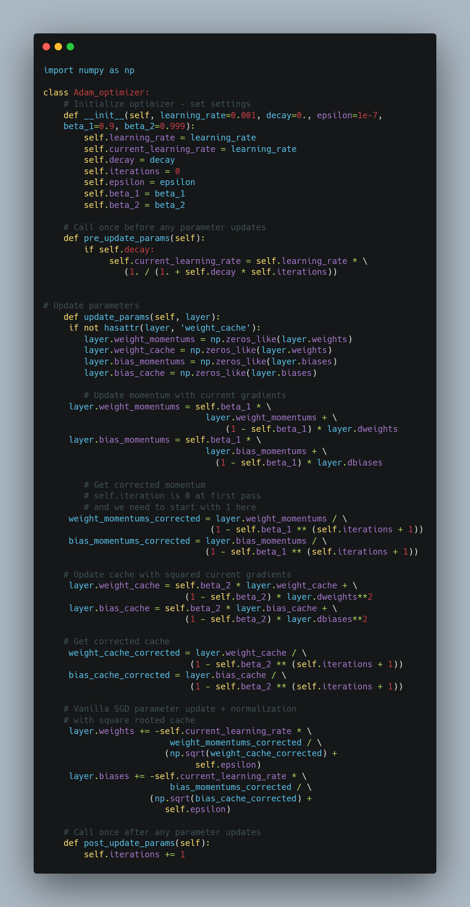

# Day 29
Did Practical implementation of code for Forward pass regularization. Types of Regularization present in Machine learning are:

#### L1 Regularization(Lasso)
- **Penalty Calculation:** L1 regularization adds up the absolute values of all the weights and biases in the model. This sum is the penalty that gets added to the model's loss.
- **Linear Nature:** The penalty increases directly in proportion to the weights' values. If you double a weight, its penalty also doubles.

###### Impact on Weights:
- **Sparsity:** L1 regularization often leads to many weights being exactly zero. This means the model uses fewer features, which can help in feature selection.
- **Small Weights:** L1 can make small weights go to zero, making the model ignore small inputs and focus on larger ones.

#### L2 Regularization(Ridge)
- **Penalty Calculation:**  L2 regularization adds up the squares of all the weights and biases. This sum is the penalty that gets added to the model's loss.
- **Non-Linear Nature:** The penalty increases faster as the weights grow. If you double a weight, its penalty quadruples.

##### Impact on Weights:
- **Discourages Large Weights:** L2 regularization heavily penalizes large weights, preventing any single weight from becoming too large.
- **Allows Small Weights:** It doesn't significantly penalize small weights, so the model remains sensitive to small variations in input.

#### Combining L1 and L2 (Elastic Net)
- Balanced Approach: Often, both L1 and L2 regularization are used together in a method called Elastic Net. This combines the benefits of both, creating models that are both sparse and well-regularized.

# Day 30 
Completed regularization for backward pass as well.

- L1 regularization’s derivative, on the other hand, requires more explanation. In the case of L1 regularization, we must calculate the derivative of the absolute value piecewise function, which effectively multiplies a value by -1 if it is less than 0; otherwise, it’s multiplied by 1.

- For L2, Lambda is a constant, so we can move it outside of the derivative term. We can remove the sum operator since we calculate the partial derivative with respect to the given
parameter only, and the sum of one element equals this element. So, we only need to calculate the derivative of w2, which we know is 2w. From the coding perspective, we will multiply all of the weights by 2λ. We’ll implement this with NumPy directly as it’s just a simple multiplicationoperation.

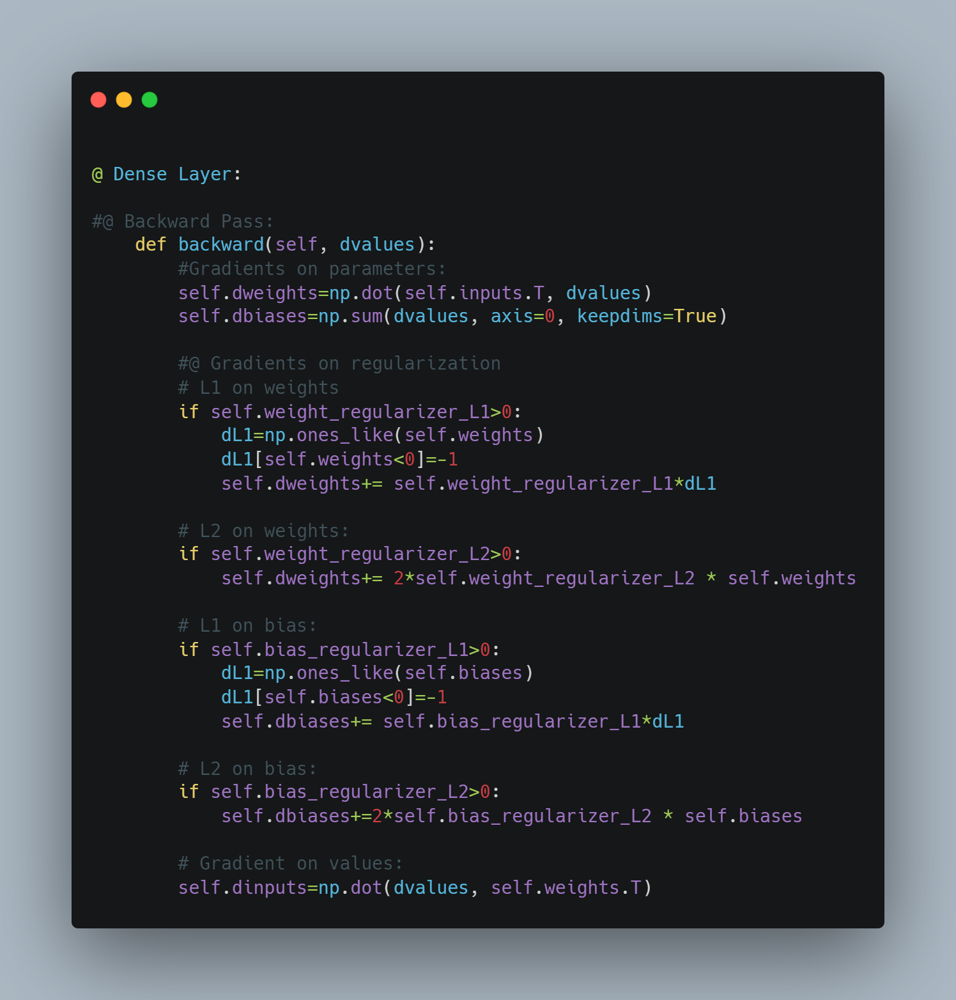

# Day 31
Another option for neural network regularization is adding a dropout layer. This type of layer disables some neurons, while the others pass through unchanged. The idea here
similarly to regularization, is to prevent a neural network from becoming too dependent on any neuron or for any neuron to be relied upon entirely in a specific instance (which can be common if a model overfits the training data).

While dropout helps a neural network generalize and is helpful for training, it’s not something we want to utilize when predicting. It’s not as simple as only omitting it because the magnitude of inputs to the next neurons can be dramatically different. If you have a dropout of 50%, for example, this would suggest that, on average, your inputs to the next layer neurons will be 50% smaller when summed, assuming they are fully-connected. What that means is that we used dropout during training, and, in this example, a random 50% of neurons output a value of 0 at each of the steps. Neurons in the next layer multiply inputs by weights, sum them, and receive values of 0 for half of their inputs. If we don’t use dropout during prediction, all neurons will output their values, and this state won’t match the state seen during training, since the sums will be statistically about twice as big. To handle this, during prediction, we might multiply all of the outputs by the dropout fraction, but that’d add another step for the forward pass, and there is a better way to achieve this. Instead, we want to scale the data back up after a dropout, during the training phase, to mimic the mean of the sum when all of the neurons output their values.

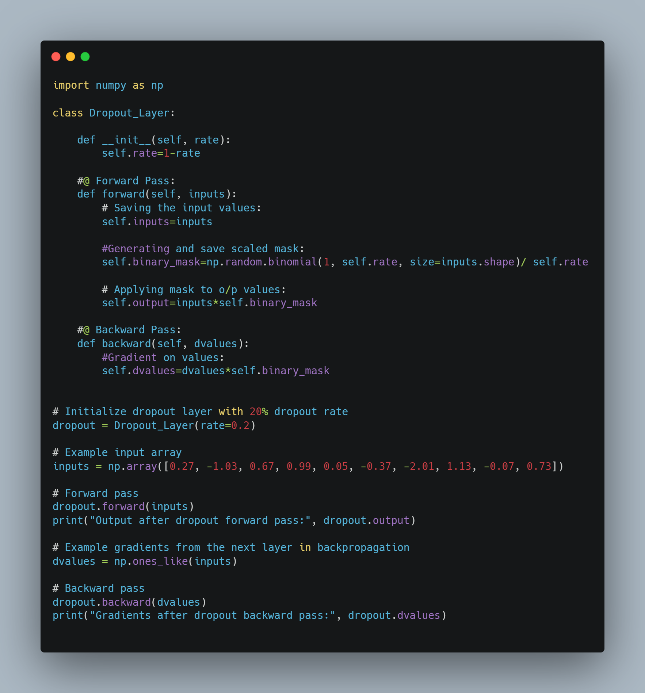

# Day 32
Today, I Revised the concept of Activation function, how Neural networks helps to solve the problem of non-linearity. Similarly, I revised the significance of Calculus(esp. Partial derivatives, chain rule, etc) in training neural nets. And finally, Watched MIT lecture on deep learning.

‚öí PS: Below is the Snapshot of how activation functions play a key role in handling non-linear data from the my current read "Deep Learning from Scratch"

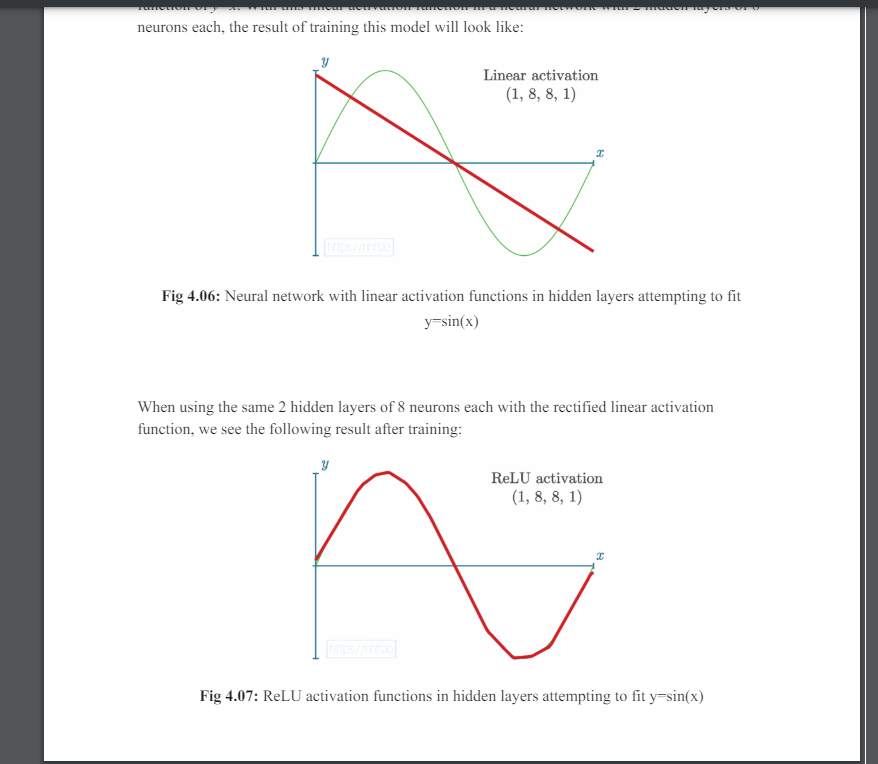

# Day 33
Today I implemented code for Binary Logistic Regression. Until now, we’ve used an output layer that is a probability distribution, where all of the values represent a confidence level of a given class being the correct class, and where these confidences sum to 1. We’re now going to cover an alternate output layer option, where each neuron separately represents two classes — 0 for one of the classes, and a 1 for the other. A model with this type of output layer is called binary logistic regression. This single neuron could represent two classes like cat vs. dog, but it could also represent cat vs. not cat or any combination of 2 classes, and you could have many of these. For example, a model may have two binary output neurons. One of these neurons could be distinguishing between person/not person, and the other neuron could be deciding between indoors/outdoors. Binary logistic regression is a regressor type of algorithm, which will differ as we’ll use a sigmoid activation function for the output layer rather than softmax, and binary cross-entropy rather than categorical cross-entropy for calculating loss.

# Day 34
Today, I implemented python code for regression task in neural network. I did three things today:

- Created Linear Activation function which passes input to the output: y=x. For the backward pass, we already know the derivative of f(x)=x is 1. so did same with gradients. We
do this only for completeness and clarity to see the activation function of the output layer in the
model definition code

- Created **Mean Squared Error** for calculating loss in regression analysis you square the difference between the predicted and true values of single outputs (as the model can have multiple regression outputs) and average those squared values. The idea here is to penalize more harshly the further away we get from the intended target.

- Created **Mean Absolute Error** that take the absolute difference between the predicted and true values in a single output and average those absolute values.This function, used as a loss, penalizes the error linearly.

# Day 35
Learnt about confusion matrix. **Confusion Matrix** is a matrix the summarize the performance of ML model on a set of test data.There are Four categories in confusion matrix, they are:

- **True Positive:** When the actual value is true and predicted value is also true.
- **True Negative:** when the actual value is false and predicted value is false.
- **False Positive:** when the predicted value is true but the actual value is false.
- **False Negative:** when the predicted value is false but the actual value is true.

##### Following metrics are calculated based on Confusion matrix data:
- **Accuracy:** It is used to measure performance of model.
       
           Accuracy=(TP+TN)/(TP+TN+FP+FN)

- **Recall:** It measures the effectiveness of a classification model in identifying all relevant instances from a dataset.
‚Äã
           
           Recall= TP/(TP+FN)

- **Precision:** It is a measure of how accurate a model’s positive predictions are.

             Precision= TP/(TP+FP)

- **F1-Score:** It is used to evaluate the overall performance of a classification model. 

 
         F1-Score= (2*Precision*Recall)/(Precision+Recall)

‚Äã

 
# Day 36
Today, I Implemented code for object modeling which helps to do things like save and load this object to use for future prediction tasks. Created **Model** class which has any array that contains the layers and set function for Loss and optimizer. Similarly, the main part of the code here is function **Finalize** which creates an input layer and sets next and prev references for each layer contained within the self.layers list of a model object. We wanted to create the Layer_Input class to set the prev property of the first hidden layer in a loop since we are going to call all of the layers in a uniform way. The next layer for the final layer will be the loss, which we already have created.

# Day 37
Continued for Object modeling where I implemented code for Backpropagation and calcualting loss and accuracy. First, I checked trainable parameter i.e weights in our case in class model. Similarly, I added remember trainable layer function in common loss class due to which we can iterate over the trainable layers to compute regularization loss for the entire model, rather than one layer at a time. Furthermore, I created appropriate prediction function in all activation function class.

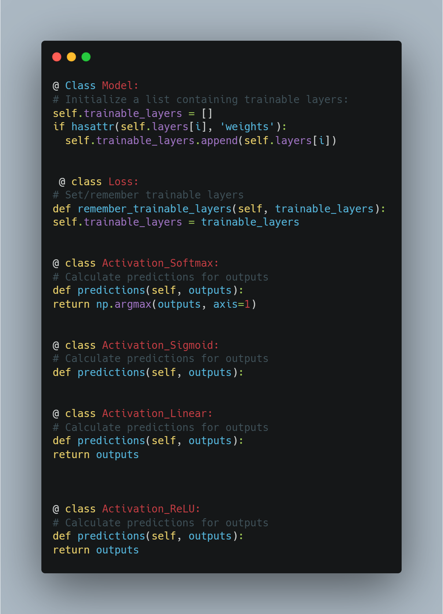

# Day 38
Today, I created accuracy class for forward pass in neural network. First, we’ll write a common Accuracy class containing (for now) just a single method, calculate, returning an accuracy calculated from comparison results. We’ve already added a call to the self.compare method that does not exist yet, but we’ll create it soon in other classes that will inherit from this Accuracy class. For now, it’s enough to know that it will return a list of True and False values, indicating if a prediction matches the ground-truth value. Next, we calculate the mean value (which treats True as 1 and False as 0) and return it as an accuracy.
‚Äã
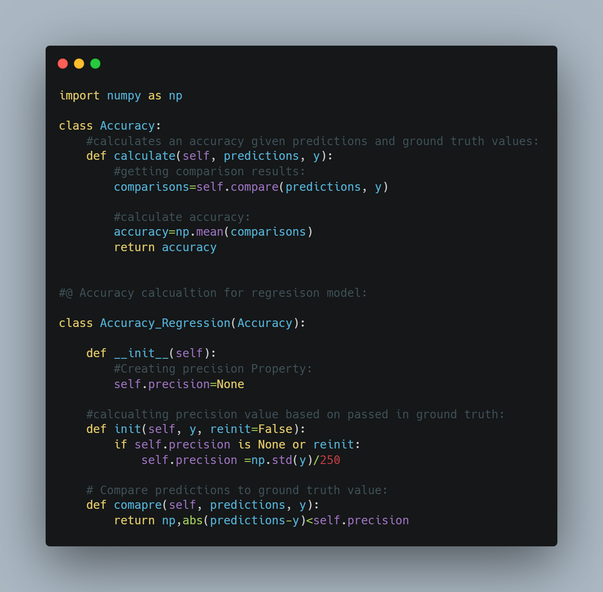

# Day 39:
Started reading The First Paper of Neural Network, "A LOGICAL CALCULUS OF THE IDEAS IMMANENT IN NERVOUS ACTIVITY". Read 3 page only but got some meaning insights. Some of which are:
 
üìåAll or None Law: 
Researcher have started with basic assumptions that a neuron either fires completely or does not fire at all with respect to the inputs.

üìåLogical Representation of Neural Activity: 
This can be done using propositional logic as said before by "All or None Law" and the interactions between neurons are represented using logical connectives like AND, OR, NOT, etc.

üìåComplexity with circuits(Nets with circles):
Not to be confused with backpropagation(if you know they are different things, I was confused at first sight). Recursive functions should be used to capture the temporal dependencies and feedback loops involved in neural signaling.

üìåIntroduction to Facilitation, Extinction and Learning:
- Facilitation: temporary increase in responsiveness to stimuli, 
- Extinction: temporary decrease in responsiveness, 
- Learning: permanent changes in responsiveness.

üìåFormal Equivalence and Predictive Power
Despite the simplifications inherent in using propositional logic to model neural activity, McCulloch and Pitts argue for the utility of formal equivalence. This means that their logical framework allows predictions about neural behavior that are consistent with experimental observations, even though the framework does not directly explain the underlying biological mechanisms.

- First page of Paper:
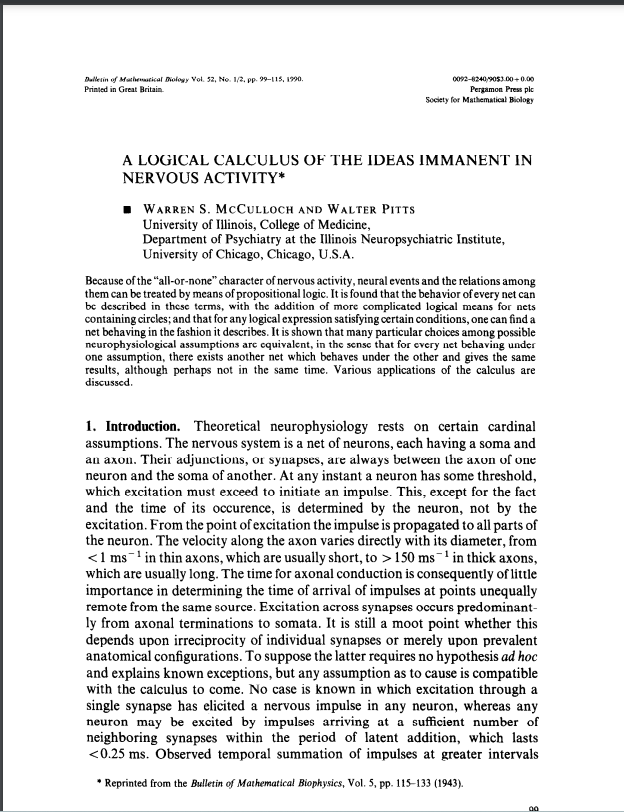

# Day 40:
Completed Implementing Object Modeling. Worked on Backpropagation and accuracy calculation. Added code for validation data during training. Similarly, Along with validation, Implemented Concept of Dropout to inform the layers if we are using during the training and let them “decide” on calculation to include. and finally, Separated Softmax  activation and Categorical Cross-Entropy loss objects, and handle just for the backward pass.

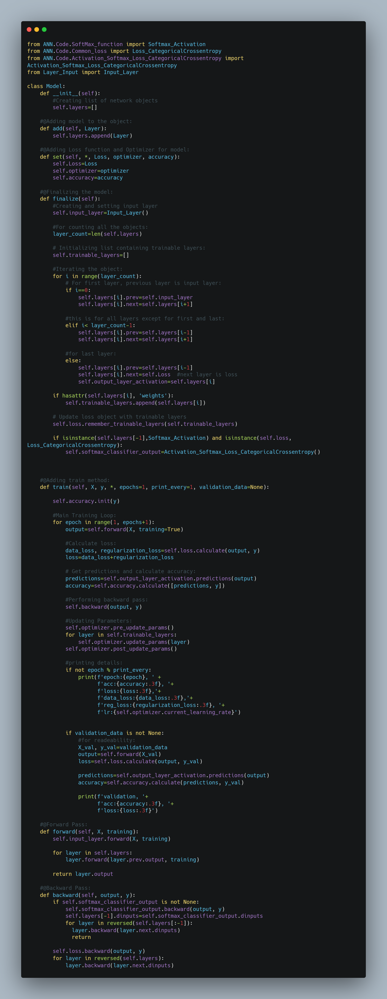

# Day 41:
- Started Project on Fashion MNIST since this would be my first project on ANN using the code that I have written in past days. This dataset has a collection of 60,000 training samples and 10,000 testing samples of 28x28 images of 10 various clothing items like shoes, boots, shirts, bags, and more. we have prepared and are hosting a preprocessed dataset consisting of .png images instead. It is usually wise to use lossless compression for images since lossy compression, like JPEG, affects images by changing their data. These images are also grouped by labels and separated into training and testing groups. The samples are the images of articles of clothing, and the labels are the classifications.

- Today, I did Data retrieval using python. After the implementation of code, we now have a directory called fashion_mnist_images, containing test and train directories and the data license. Inside of both the test and train directories, we have ten subdirectories, numbered 0 through 9. These numbers are classifications that correspond to the images within. For example, if we open directory 0, we can see these are images of shirts with either short sleeves or no sleeves at all.

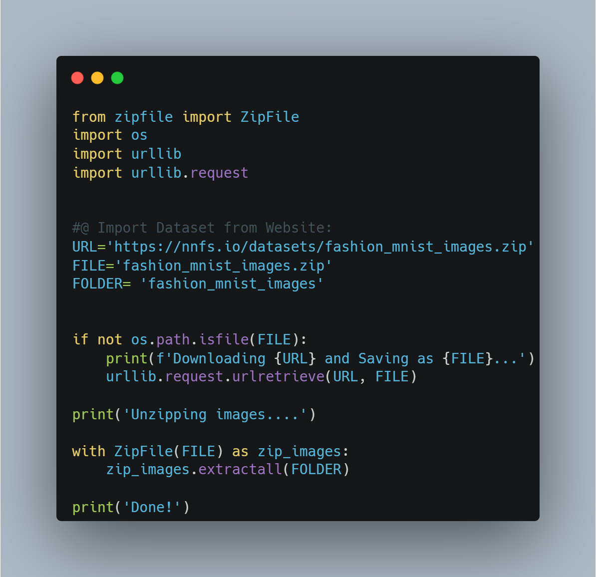

# Day 42:
Today, I implemented the data preprocessing(i,e scaling) and built basic function for the data loading which will be beneficial in upcoming future task. Similarly, Neural networks tend to work best with data in the range of either 0 to 1 or -1 to 1. Here, the image data are within the range 0 to 255. We have a decision to make with how to scale these data. Usually, this process will be some experimentation and trial and error. 

- For example, we could scale images to be between the range of -1 and 1 by taking each pixel value, subtracting half the maximum of all pixel values (i.e., 255/2 = 127.5), then dividing by this same half to produce a range bounded by -1 and 1. 

- Used OpenCV Library which is widely used for Convolution Neural Network. and revised some concept related to Artificial Neural Network.

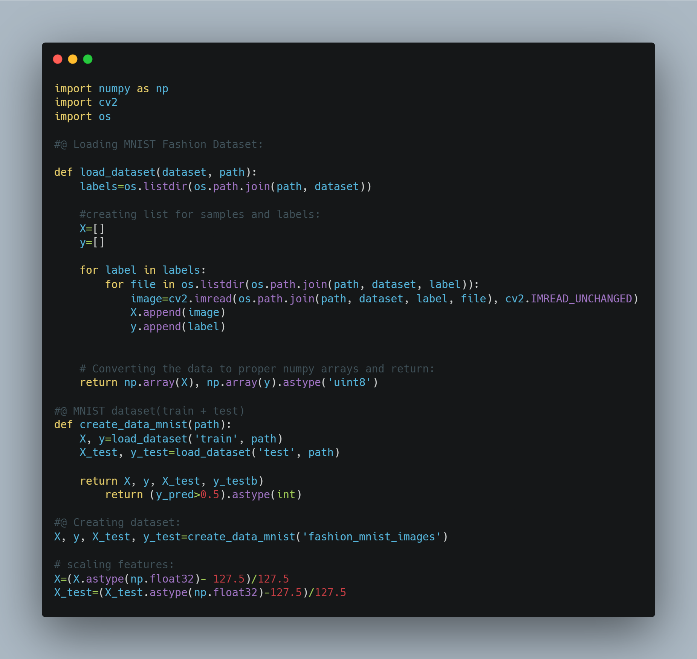

# Day 43:
Continued working on project where today I created code implementation for Dropout layer in my neural network. Remember Dropout layer from previous implementation? Yes, it's the same. This concept plays vital role in regularization of neural nets. The main task here is to use dropout for training purpose only but not during predictions and the main issue that arises here is how to maintain same predictibility with training and predictions? This is done by scaling where **Binomial Distribution** is used which ensure that the expected sum of the outputs remains the same as the sum of the inputs.It prevents overfitting. Applying Dropout forces the network to learn how to make accurate predictions with only a random part of neurons remaining. Things to Remember about Dropout Layer:

- Neurons Dropout means **Disabling neurons i.e it will always throw 0 o/p irrespective of inputs** not removing neurons from network.
- Training time is as same with or without dropout layer.

###### Github Link for Project: https://github.com/prijall/ANN-Fashion-Mnist-Project

# Day 44:
Created Activation functions for neural net of the project. Added Several functions which will be used for various purpose:

- **ReLU Activation:** To fire 0 ouput when the inputs are 0 or below and the same output as input when input is greater than 0.

- **softmax Activation:**
it is used for multi-class classification. It does probabilistic interpretation, output scaling and gradient calculation.

- **Sigmoid Activation:**
It is used for binary classification tasks where the output needs to represent a probability of belonging to one class

- **Linear Activation:**
 It is commonly used in the output layer of regression tasks, where the network directly predicts continuous values without any activation function.

- **Input layer:**
It  is essentially a pass-through layer that directly passes its input to its output. This can be useful in the context of neural networks where you might want to keep the input data accessible in a structured way.

###### Github Link for Project: https://github.com/prijall/ANN-Fashion-Mnist-Project

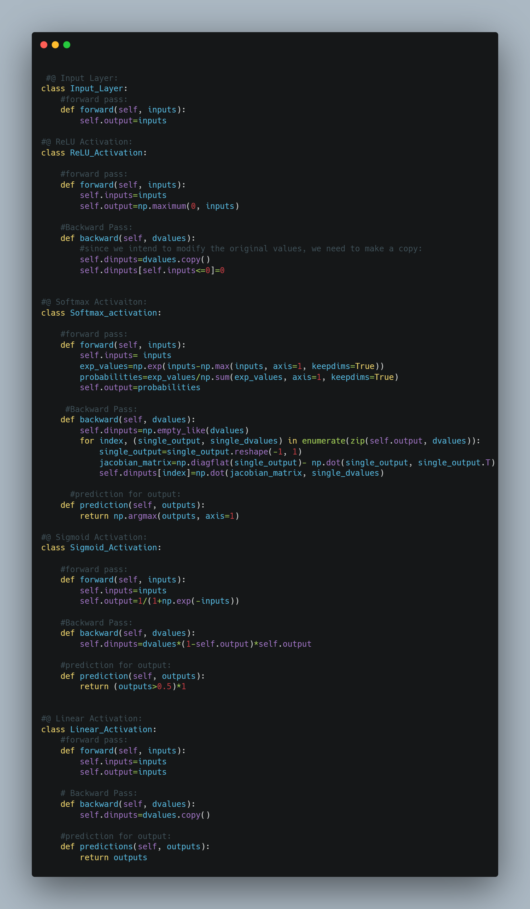

# Day 45 
Today, added loss function for both primary loss(data loss) and regularization. It includes methods to calculate the regularization loss for the model's layers, store trainable layers, compute the loss for individual batches, and calculate the accumulated loss over multiple batches in an epoch. The calculate method computes the mean data loss for a batch and optionally adds regularization loss. The calculate_accumulated method computes the average loss over all batches processed so far, providing a stable measure of the model's performance. The new_pass method resets the accumulated loss and count for a new epoch. Accumulated loss is important for stable and accurate performance monitoring, guiding optimization, and understanding the impact of regularization over an entire epoch.

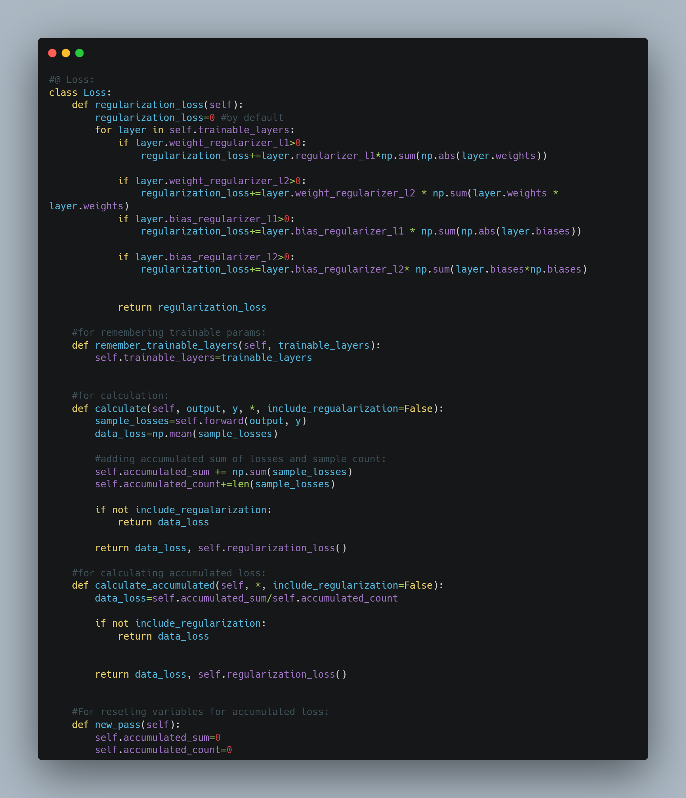

# Day 46 
Added accuracy model for my project. This is one of the important parameter in the development and testing of a project which helps to understand the performance of our model so that we can make it better with time. As it is clear that the neural nets that I am developing is capable to work on both categorical and numerical data so I created accuracy for both categorical and regression task. Having the concept of Confusion matrix helps a lot in knowing about accuracy, precision,etc.

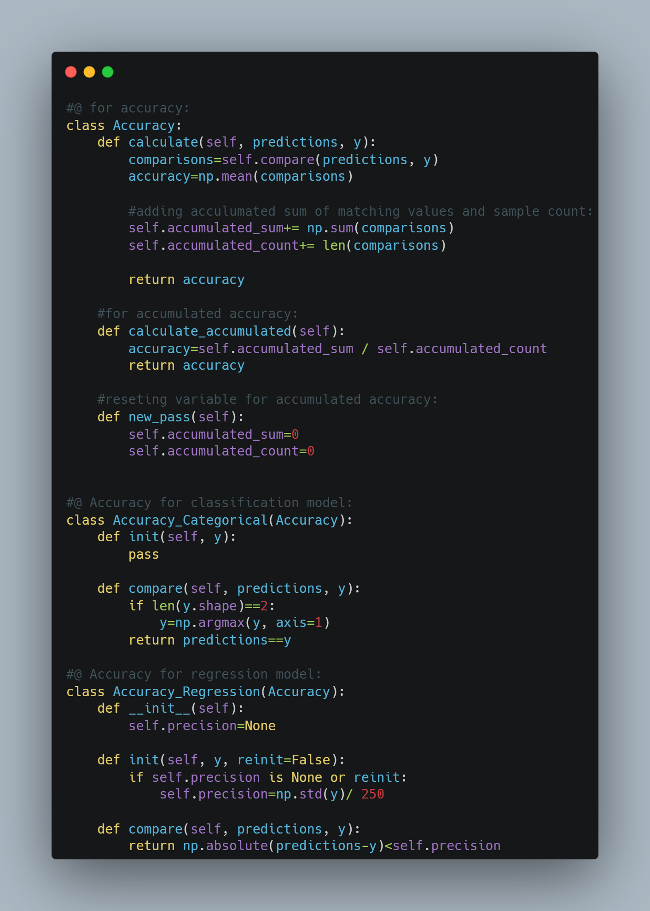

# Day 47
Added Model class for the project and added variosu different loss functions.

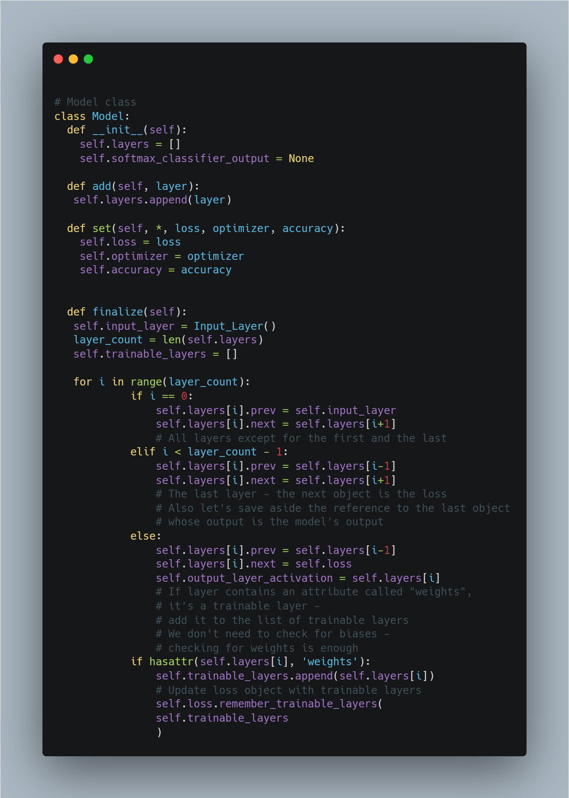

# Day 48
Today, I worked on project where, I created  functions for accessing dataset and splitiing them for train-test purpose after which I test my source code but I got loaded with too many errors. The most part of my time went int0 debugging the error which was daunting yet got chance to learn more!!!

- Code snippet:

# Day 49
spent time debuggging the code that I have implemented from scratch. Most of them are solve but my model is not trainin well due to which my loss is not updating and learning rate decaying is not working fine. I need to fix things asap.

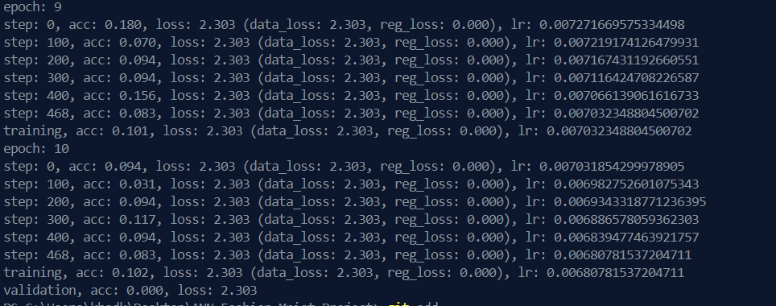

# Day 50
Added Model Evaluation which is one of the important aspect in deep learning projects. We generally, divide datasets into training and testing set whereas we have no data for validation. In this model, I have created validation dataset from test batch, which should be fine as of now to evaluate the performance of our model.

# Day 51:
Added code for Parameter Retreiving so that we can take closer look into the model parameter to see if we have dead or exploding neurons. Similary, added code for setting parameter which will iterate over the trainable layer and returns a new iterable with pairwise combinations of all the iterable passed in params. finally, amended code in object modeling so that we dont need optimizer as trained parameters are passed into model and we dont have to train.

# Day 52
Today I was thinking of the data size for Neural nets to train well and it is quite massive. But then I quickly remembered the concept that I learnt during my ML learning days, which was PCA(Principal Component Analysis). It is a dimension reduction techniques in machine learning with preserving the originality of the data.

### How PCA does Dimension Reduction?
PCA aims to find the directions of maximum variance in high-dimensional data and projects it onto a new subspace with equal or fewer dimensions than the original one. It is truly a boon to 'Curse of Dimensionality'.

**You can find Code Implementation here:** https://github.com/prijall/MachineLearning/blob/main/Code/PCAFromScratch.py

# Day 53

Completed Model Building of my project using ANN. For now I have only built a model and checked the accuracy but i will be deploying it later upon learning MLOPS in detail.

.png)

# Day 54
From today, I will be revising all the concept of Neural Network but from the Legend **Andrej Karpathy**. I am building a Micrograd model taught by Andrej which is a tiny scalar-valued auto-gradient engine and a neural net library on top of it with PyTorch-like API. This is a very basic model to help learn the forward pass and backpropagation of nueral network.

- Today, I implemented the python code to create a class that takes values and helps in performance of mathematical operations and visualize the forwards pass using multiplication and addition.

# Day 55
Learnt the implementation of Backpropagation and importance of gradient in the optimization using python. The Value of gradient is calcuted manually using the formula for derivative. And then the value was adjusted for better optimization.

# Day 56
For the first time, I implemented Pytorch for the first time. It is a Machine learning library used to built model especially for neural networks. It works using tensors.What actually are tensors? They are the building blocks of machine learning. Their job is to represent the data in numerical way. They are basically n-dimensional array.
     Today, I did basic implementation of forward pass and backward using pytorch. Here, in pytorch, we have explicitly declare the requirement of calculating gradient which is very necessary for backward pass.

- Basic pytorch implementation:
     
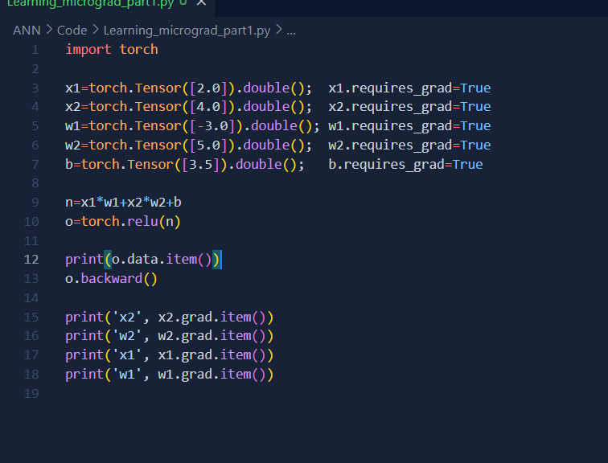

# Day 57
Continued reading paper **A LOGICAL CALCULUS OF THE IDEAS IMMANENT IN
NERVOUS ACTIVITY**. Today, I learnt about two theorems used by author to support their statement.

#### Theorem 1: Every net of order 0 can be solved in terrms of temporal propositional expression
- This theorem states that any simple neural network can be completely described using logical statements about what happens and when it happens.
- net of order of 0 means that signals in neuron travel in only one direction. It is basically neurons without loops.
- What are temporal propositional expression? They are the logical statement that describe events over time. Eg, If this happens, then that will be happen next.

#### Theorem 2: Every Temporal Propositional Expression (TPE) can be realized by a net of order zero.

- Theorem 2 tells us that any logical statement about events over time can be represented using a simple neural network without loops. This means we can design networks to perform specific logical functions and be confident that even complex temporal logic can be realized with these basic building blocks.

# Day 58
Continued learning paper where I studied theorem 3 which states, **"Let there be a complex sentence S, built up in any manner out of elementary sentences of the form p(z- zz) where zz is any numeral, by any of the propositional connections: negation, disjunction, conjunction, implication, and equivalence. Then S, is a TPE and only ifit isfalse when its constituent p(zl - zz) are all assumed false-i.e. replaced by false sentences-or that the last line in its truth-table contains an ‘F-or there is no term in its Hilbert disjunctive normal form composed exclusively of negated terms."**

- This means a complex logical sentence can be represented as a TPE if it becomes false when its simplest components are false. This ensures the logical structure of the sentence can be realized by a neural network, which operates under the same principles of propositional logic.

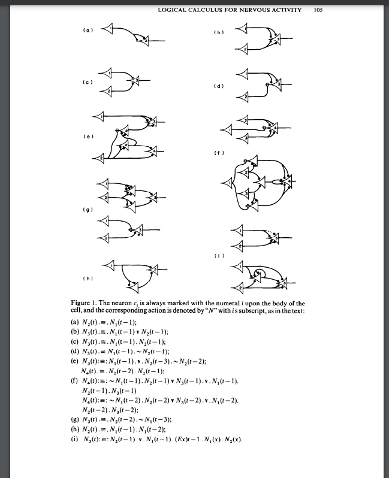

# Day 59 

**Theorem 4: Relative and Absolute Inhibition**
**Statement: Relative and absolute inhibition are equivalent in the extended sense.**

##### Explanation:

- Relative Inhibition: When an inhibitory synapse fires, it does not completely prevent the firing of a neuron but increases its threshold, meaning a greater number of excitatory synapses must fire concurrently to trigger it. The increase in the threshold is assumed to be unity for each inhibitory synapse.
Absolute Inhibition: When an inhibitory synapse fires, it completely prevents the neuron from firing at that time.

- Equivalence Proof:

Relative to Absolute Inhibition:
Consider a neuron ùëê<subscript>i</subscript> with a certain number of inhibitory synapses. If each inhibitory synapse increases the threshold by 1, this can be modeled by having an equivalent net where each inhibitory synapse is replaced by a corresponding increase in the threshold of the neuron.
For any given neuron, create a net that realizes the relative inhibition by ensuring the neuron only fires when its increased threshold due to inhibitory synapses is met by a sufficient number of excitatory inputs.

Absolute to Relative Inhibition:
Replace each absolute inhibitory synapse with multiple inhibitory synapses in the relative inhibition model. This ensures that the neuron only fires when the number of excitatory inputs exceeds the combined inhibitory effects.
In both cases, the behavior of the neuron under relative inhibition can be replicated by a network using absolute inhibition and vice versa, establishing their equivalence in the extended sense.

# Day 60
Continued learning for MicroGrad, where I learnt about basic pytorch operations.
 #### Matrix multiplication (is all you need)
One of the most common operations in machine learning and deep learning algorithms (like neural networks) is matrix multiplication.The main two rules for matrix multiplication to remember are:

- The inner dimensions must match:
(3, 2) @ (3, 2) won't work
(2, 3) @ (3, 2) will work
(3, 2) @ (2, 3) will work

- The resulting matrix has the shape of the outer dimensions:
(2, 3) @ (3, 2) -> (2, 2)
(3, 2) @ (2, 3) -> (3, 3)

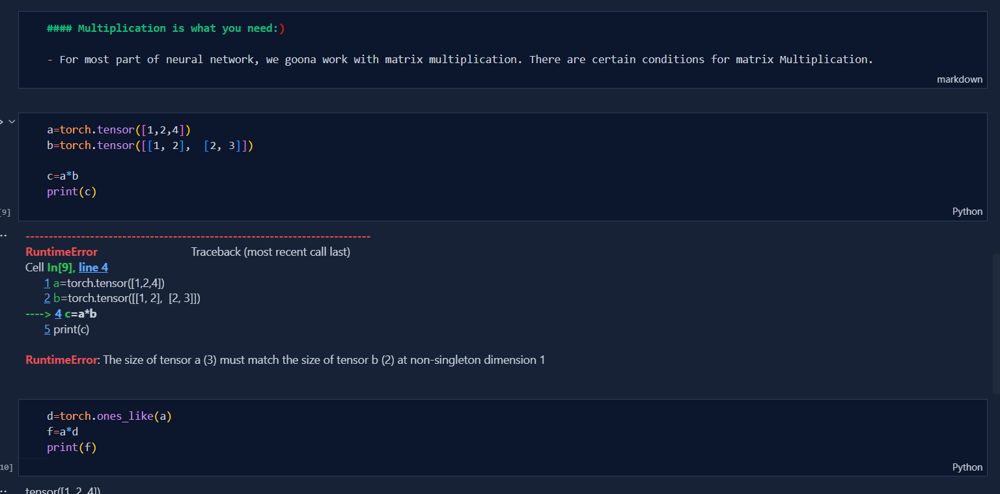

# Day 61

Today I use Pytorch to built Neural network. Similarly, got to know about **Compute Unified Device Architecture(CUDA)**. It allows developers to access the raw computing power of CUDA GPUs to process data faster than with traditional CPUs. CUDA Nvidia can achieve higher parallelism and efficiency than general-purpose CPU code using parallel processes and fine-grained streams.Just tried creating tensors on GPU.

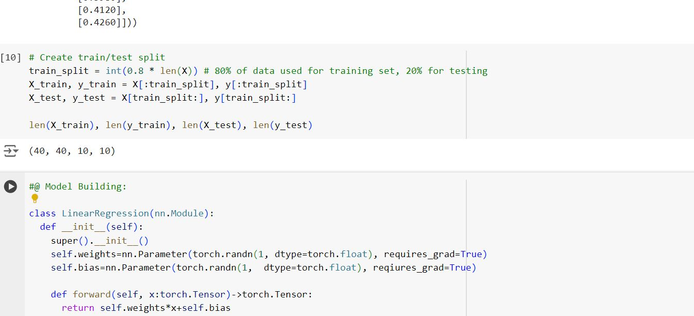

# Day 62
Explored pytorch for Neural network. Today, I implemented code for object creation of model built last time and did preliminary prediction.

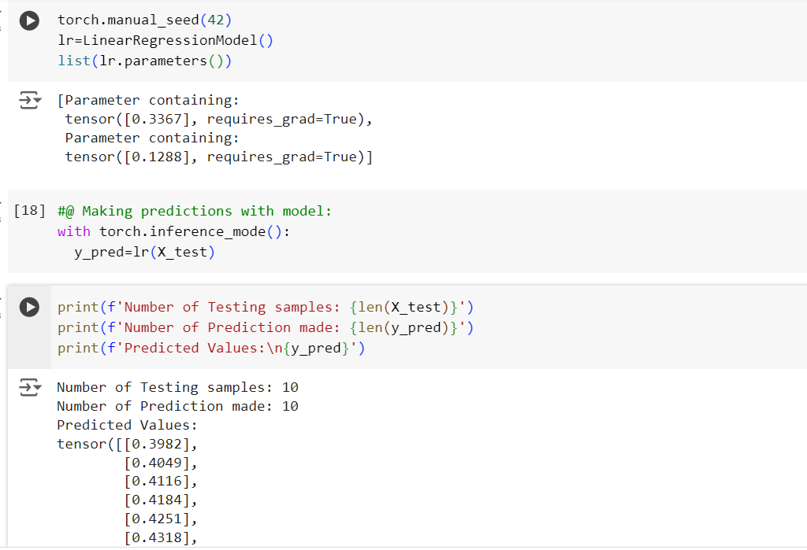

# Day 63
- Completed reading paper on **'Learning Representations by Backpropagating Errors'**, where in conclusion  the write talk about the most obvious drawback of the learning procedure is that the error-surface may contain local minima so that gradient descent is not guaranteed to find a global minimum. However, their experience with many tasks shows that the network very rarely gets stuck in poor local minima that are significantly worse than
the global minimum.

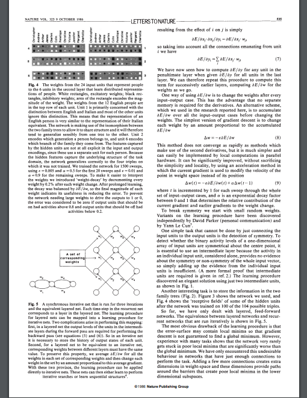

- Secondly, I practised the basic of pytorch and understood the difference between pytorch and numpy for mathematical operations by basic code implementations.

# Day 64
- Started reading paper of Convolution Neural Network on **'Neocognitron: A Self-organizing Neural Network Model for a Mechanism of Pattern Recognition Unaffected by Shift in Position'**. This Paper is believed to be the first paper of CNN. Today, I just read the abstract of this paper and here is  what i understood:
- This paper is inspired from the human eye and brain functioning exactly how CNN works i.e when our eyes see same objects for multiple times, our brain immediately recognozes it. Similar to that, we train our model with same object, it will recognise it irrespective of it's position. There are talks about the **C-cell and S-cell** of human eye.

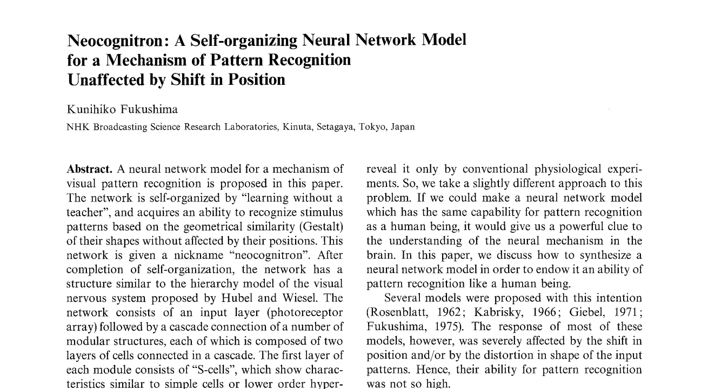

- Built Neural network using pytorch and calculate loss using pytorch built-in functions. I did this in google collab since i don't have enough gpu.

# Day 65
Added Optimizer and optimized loss value using pytorch. Following steps I took for optimization:

- Flushing previous epoch's gradients
- Computed loss 
- then Backpropagation
- updated weights moved into list 
- Visualization of optimization

# Day 66

Finally started Convolutional Neural Network(CNN) which is widely used Neural Network for Image Datasets. ANNs aren't used for Image datasets because they aren't invariant to small translations i.e they rely heavily on the position of features within the image which is why CNN is used and it solves the problems of traditional approaches. There are lots components of CNN, Among them I studied about **Filters**.

- **Filters:** It is a matrix of weights that are initialized randomly at the start and convolved with matrix of the original image and this process is called **Convolution**. The values(weights) in filter get optimized during backpropagation.

- The result of the Convolution will be always;
      for orginal image (m, m) and filter of (n,n), the convolution will be (m-n+1) x (m-n+1).

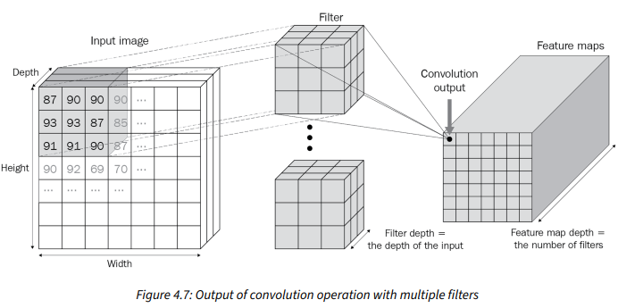

# Day 67

Learnt few more concepts today, where i studied about following things:

#### Strides
- In simple words, Stride is the steps to convolved filter in Input image matrix. By default each filter strides across the image -(1 row and 1 column). This can be tuned according to our need. The main reasons required to use strides are: **High Level Feature Capturing** and **Computational power(not really important now tho:)**
- The feature mapping after with stride is (((m-n)/s)+1) where s is the no of strides. 

#### Padding
- when convolving the matrix the left most elements and right most element are not involved as many times i.e edges are mostly ignored due to which padding is done. **It is the process of adding the layers to the matrix outside in all four sides to make the efficient use of edge element. Generally, Zeros are used in padding therefore called Zero Padding in literature.

#### Pooling
- It is very important concept in CNN. **It is the process of down sampling feature mapping.** It is generally done after convolution. Generally, three params are passed to setup the pooling: **Size, Stride and type.** There are various types of pooling, they are; MaxPooling, AvgPooling, SumPooling, etc.

##### Advantages:
- Reduced feature mapping size.
- Translation Invariance.
- Enhanced Feature(In case of Max Pooling)
- No need for training.

##### Disadvantages:
- During Image Segmentation
- Loss of lots of information

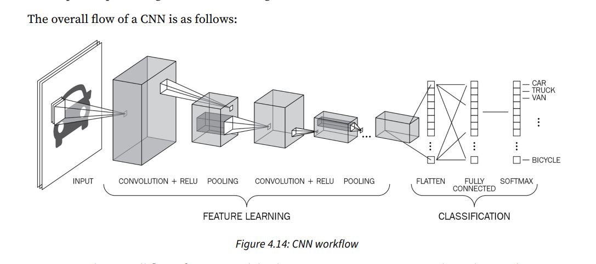

# Day 68
Implemented the CNN for the first time using pytorch. Implemented all the concepts that I have learnt from past 2 days. It is just a practise for testing and strengthening my concepts.

- Snapshot of today's work:

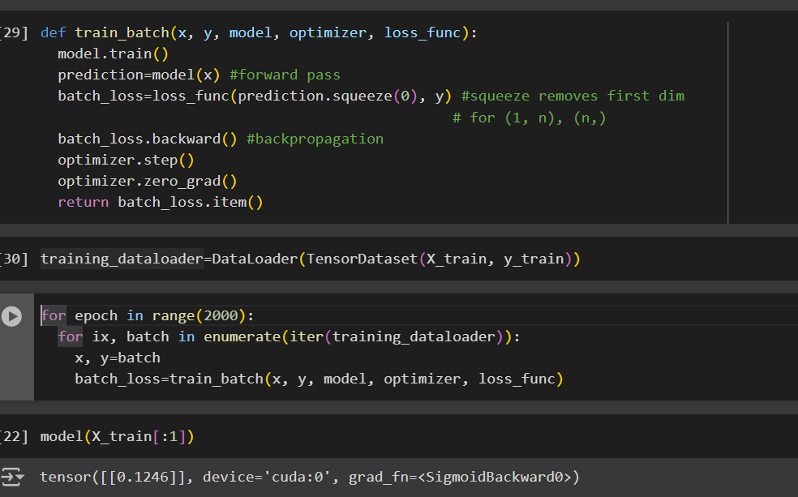

# Day 69
Trained FMNIST Dataset on CNN and Checked for training and Validation Loss and Accuracy using pytorch. It was bit diffcult to understand the behind working of the model with getting error more but did it anyway successfully untill training.

- Model Snapshot:
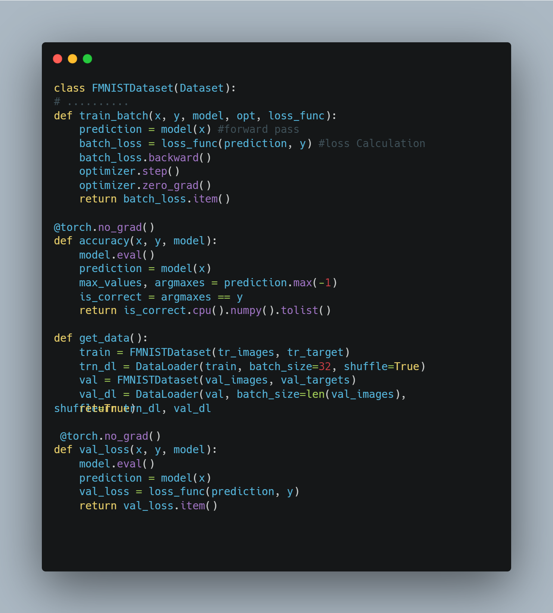

- Training Snapshot:

# Day 70
After Learning all the necessary concpets, today, I decided to train my Convolution Neural Network on real data which is of Cats and dogs. This data is directly imported from kaggle to the code base using Kaggle Token. Similary, I Found it very difficult to do preprocessing for RBG data. I just fetched the data and preprocessed the image for training. Will be training it tomorrow:)

- Data Preprocessing:

- image result:
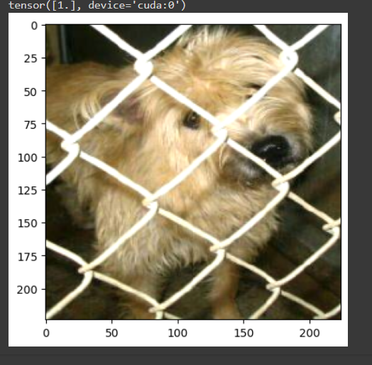

# Day 71
Trained the model for cat and Dog classification. Similarly, calculated loss and accuracy for both training set and validation set. The intereting thing in today's learning, i trained data in batch of size 32 and calcaluted the loss and accuracy over the batch samples. Got decent accuracy and got to know that training data in batches is mostly beneficial over trainig at once in many ways.

- Model training code:

- accuracy over epoch:

# Day 72
Studied about **Transfer learning** and **VGG16 Architecture**

##### Transfer Learning
Transfer learning is a technique where knowledge gained from one task is leveraged to solve another similar task. Imagine a model that is trained on millions of images that span thousands of object classes (not just cats and dogs). The various filters (kernels) of the model would activate for a wide variety of shapes, colors, and textures within the images. Those filters can then be reused to learn features on a new set of images. Post learning the features, they can be connected to a hidden layer prior to the final classification layer for customizing on the new data.

##### VGG16 Architecture
VGG stands for **Visual Geometry Group**, which is based out of the University of Oxford. 16 stands for the number of layers in the model. The VGG16 model is trained to classify objects in the ImageNet competition and stood as the runner-up architecture in 2014. The reason we are studying this architecture instead of the winning architecture (GoogleNet) is because of its simplicity and its broader use by the vision community for several other tasks.

# Day 73
Data Preprocessed for Implementing VGG architecture on Cats and Dogs datasets. The main difference between the cats_dogs class in this section and in previous one is the normalize function that we are applying using the Normalize function from the transforms module. 
                     When leveraging pretrained models, it is mandatory to resize, permute, and then normalize images (as appropriate for that pretrained model), where the images
are first scaled to a value between 0 and 1 across the 3 channels and then normalized to a mean of [0.485, 0.456, 0.406] and a standard deviation of [0.229, 0.224, 0.225] across the RGB channels.

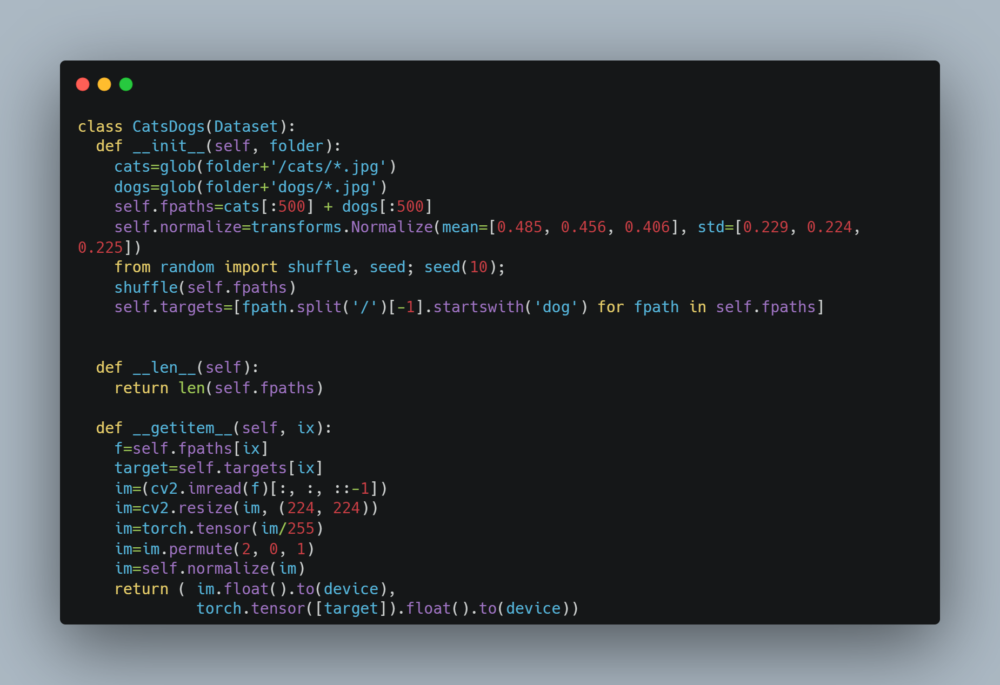

# Day 74 
Completed Implementing VGG on Cats and Dogs Dataset. Achieved an accuracy for training set with respect to valid set about 97% which is very good than the previous one implemented without any pretrained model. Similarly, the time taken by google collab to train the batches of size 32 was approx 10-15 min in without pre-trained model whereas for pretrained model it was about 2 min for 5 epochs.

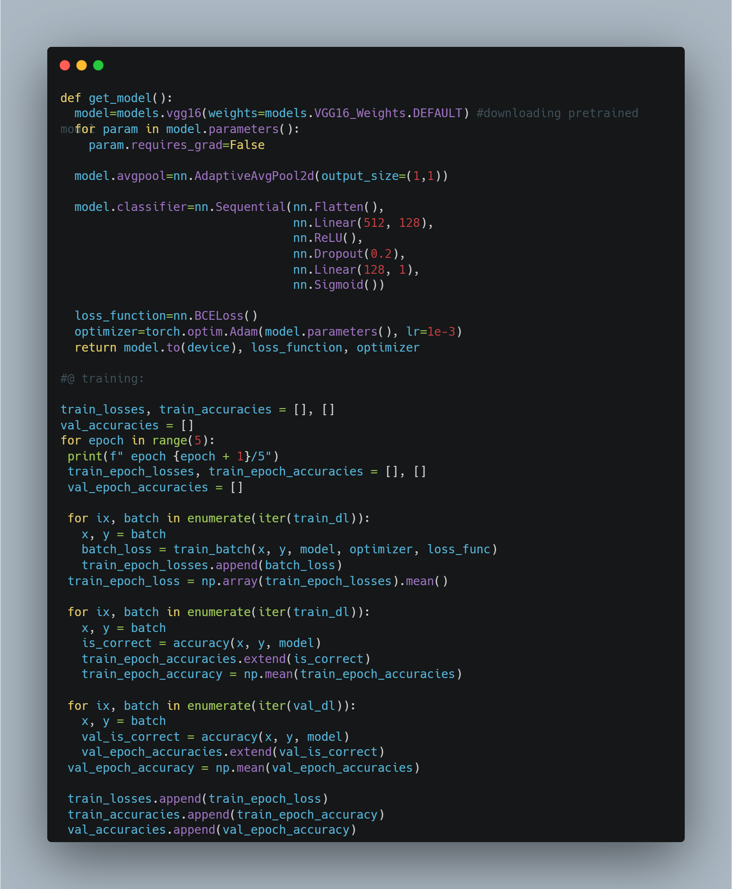

# Day 75
Learned the Basic intuition behind "ResNet" Architecture. These are introduced to solve the problems of the VGGNET Architecture, which is while increasing layer numbers from 16 to 19, we claim the accuracy from 97% to 98% which seem small but promising. But kept  on increasing causes decrease in accuracy.

###### The two major problems in VGGNET solved by ResNET are:

- While the network goes deep, it eventually forget what the original image was

- The problem of Vanishing Gradient, the gradient at the layers near to input becomes almost zeros.

These are solved by Resnet, will learn how it works tom:)

# Day 76
Learnt more on Resnet Architecture and its working. It is called ResNet(Residual Network) because instead of calculating the desired result and adding identity value to it i.e H(z) =F(z) + z, it calculates first gradient and then adds the identity value which is effective in computation as the value of differnce between target and prediction is easier to calculate than calculating entire requried function and adding identity value i.e  F(z) =H(z)-z and then adding F(z) + z. This is called identity mapping.

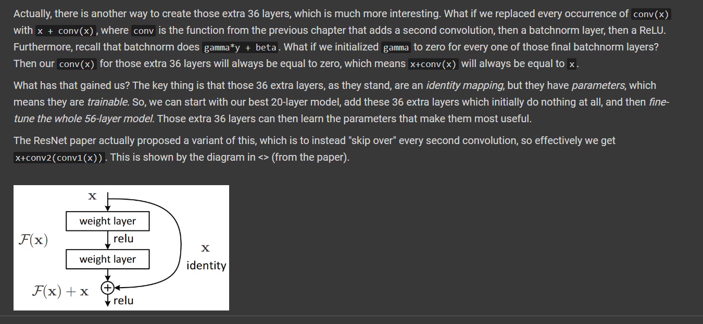

# Day 77
Implemented the ResNet Architecture and spent time reading and understanding paper.

- ResNet Paper SS:

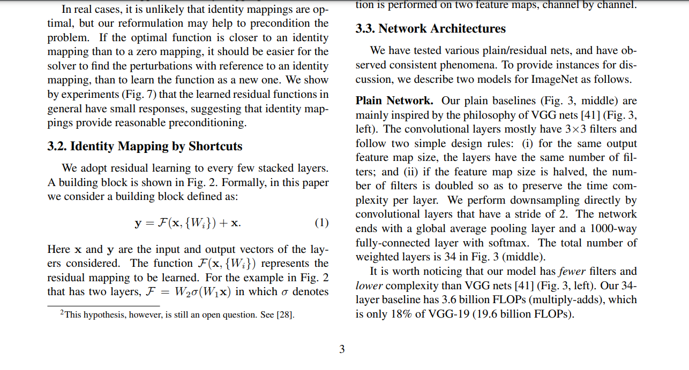

- Implementation:

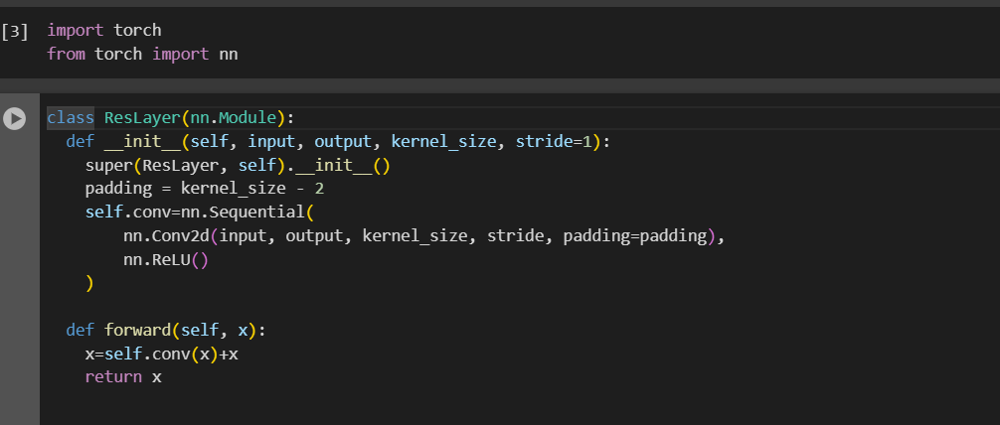

# Day 78
Built model for classification of Cats and Dogs Image data using ResNet18 Architecture. Today, developed model where at first freeze the architecture's model for the finetuning with disabling weights. Then used AdaptiveAvgPool with output_size=(1, 1) for the binary classification as the model has been train for multiclassification and finally created Fully connected layers and calculated loss with optiimizer(Adam).

- Code for model Building:

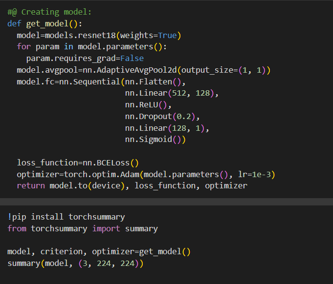

- Architecture lookalike:

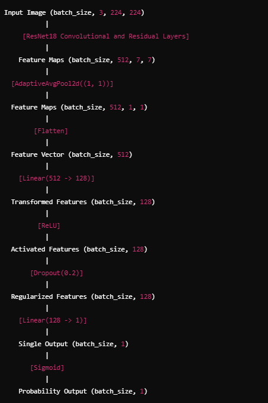

# Day 79
Updated the model with training model, accuracy and Dataset Loader which I have been doing for quite few times now. Implementing this helps to find the difference between building model from scratch and using pre- trained model.

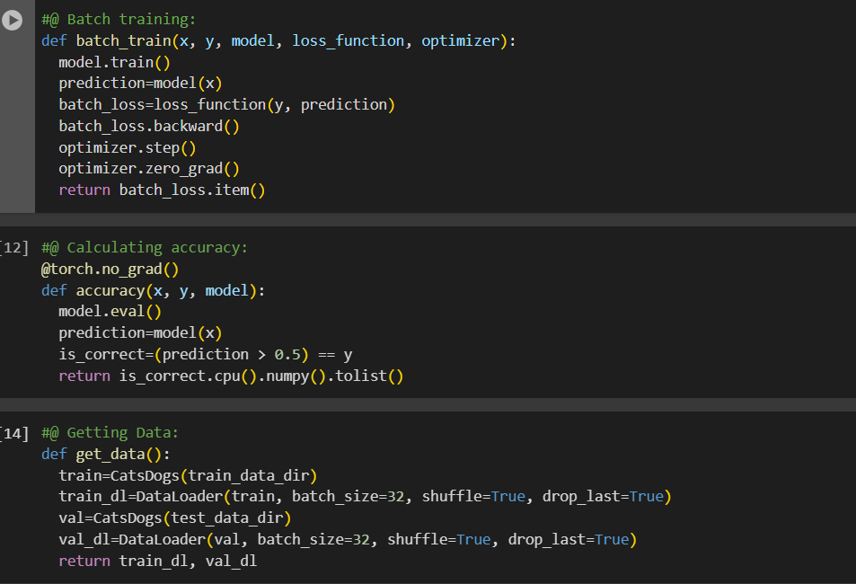

# Day 80 

Started Facial keypoints Detection on pre-trained models. They are used especially for **Multi-Regression** and **Multi-task Learning**.

##### Points to remember for Facial Detection

- Adjustment of images to standard image size
- Resize the image to a shape of 224 x 224 x 3
- Normalization
- Use of Sigmoid layer at the end to fetch data

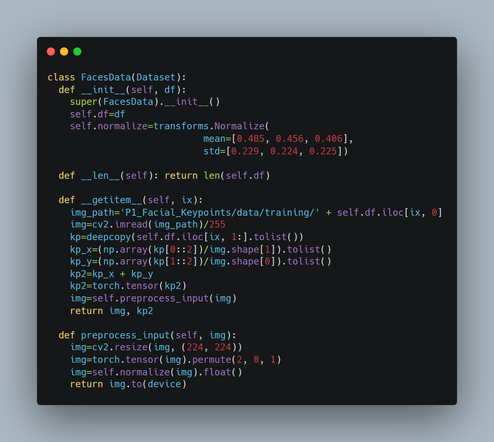

# Day 81
Training Neural Nets can be bit daunting, completed training model for detection of facial keypoints using VGG16 Architecture. I should have trained on more epochs for accurate detection but due to low GPU it was taking a lot time so I intentionally reduced no of epochs.

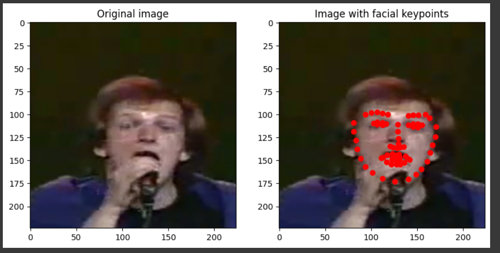

# Day 82

Leveraged a pretrained model that can detect the 2D and 3D keypoints present in the face. Did keypoints detection in 2D and Converted it into 3d.

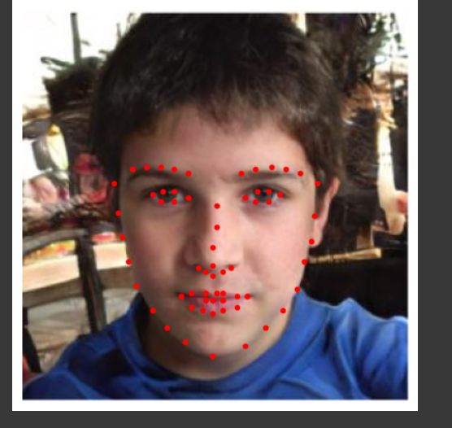

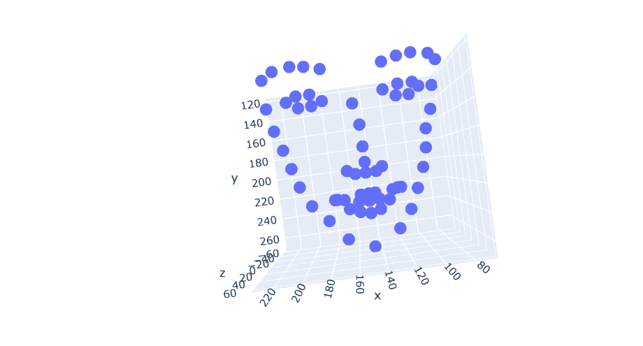

# Day 83

**Multi-task learning** is a branch of research where a single/few inputs are used to predict several different but ultimately connected outputs. For example, in a self-driving car, the model needs to identify obstacles, plan routes, and give the right amount of throttle/brake and steering, to name but a few.It needs to do all of these in a split second by considering the same set of inputs (which would come from several sensors). Furthermore, multi-task learning helps in learning domain-specific features that can be cross-leveraged across different tasks, potentially within the same domain.

- Built functions which takes dataset normalize it and returns age and gender as we are working on age estimation and gender classification. Similary, created **Collate Function** which scales the age so that value lies between 0 and 1, convert gender into float as it awas converted into boolean expression before in **__getitem()__** function and finally convert image, age and gender intp torch object and return.


# Day 84
Completed Multi-task learning on Gender-Age Dataset. AS usually, built function for model, training batch and validation. Training Model was the toughest part today, I took 1 hour to train the model but give pretty decent accuracy. Loved each part of learning today, still doubt on some portions but hopefully will get to work on those. 


# Day 85
Ever Wonder **why CNN model predicts what it predicts?**. For most part in Neural Nets, we believe the model is quite black box i.e we dont know what's happening internally but not anymore, the paper **"Grad-CAM: Visual Explanations from Deep Networks via Gradient-based Localization"** explains how it does. It's main principle is **'Interpretability Matters.'**

##### Main points to remmber:
 - If a certain pixel is important, then the CNN will have a large activation at those pixels.
 - If a certain convolutional channel is important with respect to the required class, the gradients at that channel will be very large.

 

 - Did Data Processing for CAM Implementation:

 

 # Day 86:

 Revisefd the concepts of image classifications on Age & Gender, where my most of the concpets got cleared. Similary, While learning about CAM, i got to understand the practical aspects to take care during model implementation:

 - **Imbalance Dataset:**
 for the classification of rare data, there would the no more training data which is why the result might not be better. Confusion matrix helps depicts the possibilties.

 - **Difference between training and validation data:**
 we should have the clear picture of why is model overfitting and underfitting and how to resolve them both. There may be maybe reasons including that of difference in resolutions, less numbers of training data, etc

 - Similarly, some other points include size of the objects, OpenCV Utilities, image sizes to train on GPUs, no of Convolution and pooling layers.

  

  # Day 87 
  Started the basic of object detection. When there are multiple images in a frame and we have to classify one then it will be very difficult for the image classification to detect the object due to its position. This is where object detection shines.Some various cases levaraging object detection includes the following examples; Security, Autonomous cars, Image Searching, automotives, etc.
    Today, I learnt about the Bounding Box Ground truth working using **ybat** which helps to find the cordinates of the images of desired classes.

  

# Day 88
Learnt about **Region Proposal & IOU**.

- **Region Proposal:**
is a technique that helps identify islands of regions where the pixels are similar to one another. Generating a region proposal comes in handy for object detection where we must identify the locations of objects present in an image. Additionally, given that a region proposal generates a proposal for a region, it aids in object localization where the task is to identify a bounding box that fits exactly around an object.

- **IOU**
The word intersection within the term intersection over union refers to measuring how much the predicted and actual bounding boxes overlap, while union refers to measuring the overall space possible for overlap. IoU is the ratio of the overlapping region between the two bounding boxes over the combined region of both bounding boxes.


# Day 89
Super excited to learn and implement **Advance Object Detection techniques and algorithm**. Today, I studied the basics of **Region based CNN, popularly known as R-CNN**. The more advanced version is known as **Fast R-CNN**. These techniques works on two disjoint network i.e one to identify the regions that likely contains an object and the other to make the bounding box where the object is identified. The major drawback is there are many forward propagation. But the modern detection algorithm focuses on training single neural network and have the capacity to detect all objects in one forward pass.
          Read Paper, **"Faster R-CNN: Towards Real-Time Object Detection with Region Proposal Networks"** for more details.


# Day 90
Implemented Faster R-CNN on custom dataset. Did data fetching from kaggle using API and created a class that takes dataset calculates length, gets item while doing all kinds of necessary preprocessing.

# Day 91
Started Reading Paper for **You Only Look Once(YOLO) Architecture** for object detection. Things I learnt for the from two different segments are:

##### Abstract
- Paper talks about the working algorithm for object detection. It frames object detection as regression problem to spatially separated bounding boxes and associated class probabilities rather than previous object detection algorithm. Similar, it compares with other art-of-state-detection algorithm and the main drawback is points is that it makes more localization error but less false positive error on background.

_Day1.jpg)

##### Introduction
- Yolo's working outlines is a single CNN  predicts multiples bounding boxes and class probabilities of those boxes and directly optimizes performance and detection through through model confidence. 
- The input image is resize to 448 x 448.
- It reasons globally which is why is better than other algo as see the entire image during training  and encodes context information and their apperances.

_Day1.jpg)

###### Also built batch training and validation for Faster RCNN model implementation.


# Day 92
 
 Learnt the **Unified Detection** in Yolo algorithm.

#### Key Points that I learnt:
- single Neural Network is used for model traininfg where the algorithm divides the images in grid and calculates the bounding boxes, their confidence score and class probabilities.
- Confidence is defined as **Prediction of object times IOU with respect to truth and predection**. If there is no objects in grid then the confidence score must be zeros.
- For calculation of class probabilities, conditional probabilities is used i.e Pr(Class(i)/Object).
- The predictions are encoded as an S x S x (B * 5 + C) tensor where S x S is the no of grid in width and height resp, B is Bounding Box and C is class probabilities.

_Day2.jpeg)

_Day2.jpeg)

# Day 93

Continued Reading Network architecture and Model Training for Yolo architecture. Need to implement all these concepts asap.

##### Network Architecture
- THere 24 CNN layers and 2 fully connected layers in our network. Yolo architecture is inspired by GooLeNet architecture(Yet to be studied;). The main important implementation here is the use of 1x1 features space reduction layers. MaxPooling is done after completion of each set of convolution in network.

_Day3.jpg)

##### Training
- Pretain on ImageNet dataset. 20-CNN layers used followed by AvgPooling and connected layers.
- Use of Darknet framework for all training and inference.(Yet to explore)
- Adding 4 layers and fully connected layer with randomly initialized weights.
- Normalize bounding box width and height by the image width and height.
- Use of Coord and noobj for model stability.
- Predicts multiple bounding boxes per grid cell and predicts the Box having highest IOU.
- Loss function penalizes classification error only if obj is present and bounding box error only of predictor is **responsible** for ground truth box.
- Random Scaling and translation of upto 20% of orginal image. 

_Day3.jpg)

# Day 94
While going through the paper, I came to Know about the interesting concept called **Non Max Suppression** which is used to select the accurate bounding box from multiple bounding boxes from the grid. The NMS takes two factor in considerations, they are:

- The objectiveness score of the bounding box
- IOU of the bounding boxes

- Before NMS:


- AFter NMS:


Similarly, Studied about the drawbacks of YoLo, which are:
- model struggles with the small objects in an image
- Struggles to generalize to objects in new aspect ratio
- Loss function treats errors the same in small bounding boxes vs large bounding boxes
- Main source of error is incorrect Localization

# Day 95
Tested Darknet for Yolo Detection. **DarkNet** is an open source neural network in C. It is written in C and Cuda.It is used mainly for object detection and have different architectures. eg feature extractor.

- PS: Worked on my personal project, got no more time to study DL.

- Installing Darknet:


- Testing:


# Day 96 
Faced trouble while training YoloV4 algorithm on **Truck-buses** images. Did basic stuff like downloading, extraction and reconfiguring Makefile for conversion of information into text files directly. It took more then 1 hr and 30 mins to train the images and suddenly google collab disconnected runtime which pissed me off and stoped right then there so to continue tomorrow.

.png)

- Revised the concept of learning rate from ANN portion, **Learning Rate** is a optimizer parameter which helps to optimizer the values of the gradient to minimize the loss function. After the gradients are calculated, we take the negative fraction of gradient and repeat this in loop. Similarly, while we may find the right direction towards the global manima, our optimizer may fail to reach the exact point this is where Momentum shines. In other word, it is called inertia.


# Day 97
Tested accessing Android Phone Camera using OpenCV which will be useful for implementing Object detection task. Tried building attendance system with face_recognition but failed due to page installation issues nevermind will try later:(. Other than worked on Personal Project.


# Day 98
Started MLOps for deployment of ML/DL projects. Today, I learnt about MLOps introduction. Documentation of MLOps can be found at: https://github.com/prijall/MLOps/blob/main/README.md.

# Day 99
Learnt about **Deployment in MLOps**.  Documentation of MLOps can be found at: https://github.com/prijall/MLOps/blob/main/README.md.

# Day 100
Studied Monitoring on MLOps which was theory, felt bored but did it anyway.  Documentation of MLOps can be found at: https://github.com/prijall/MLOps/blob/main/README.md. Worked on my personal projects and read some articles on Concept drifting and data drifting. 

# Day 101
Revised the concept of CNN Implementation from Scratch and implemented using pytorch. Read few articles on pytorch for Deep learning. **Geoffrey Hinton** won Nobel prize in Physics 
for his discovery that enabled ML using artificial neural networks. A teacher who I look upto when it comes to machine learning and deep learning. Read few articles about his work which
are really inspiring.

# Day 102
Learnt about another object detection technique called **Single-Shot Detector(SSD)**. It has few changes than Yolo architecture. This technique uses **VGG Archtectture** for feature extraction. First of all **Visual Geometry Group(VGG)** is used to for feature extraction and mapping then we use 6 convolution layer for objection layer and finally detect the object.
  Overview of how it works. Instead of using anchor boxes, it uses default boxes for the input images that have specific set of scale and aspect ratios. We will levarage all of the last few layers to make class and bounding box predictions rather than gradually convolving and pooling which we did in yolo. Finally, we chose one default box with higher IOU. Mostly, IOU over 50% are only considered. Similarly, image should have ground truth bounding boxes prior to convolution. More about Mathematical intuition tomorrow.


# Day 103
Learnt about the different scales and aspect ratios of default boxes. The SnapShot shows the working of default boxes in SSD. ALso, got thorough information about component in SSD Code also called SSD300 which has predominantly three sub-modules called 

- VGGBase, which returns 2 features vectors of dimensions (N, 512, 38, 38) and (N, 1024, 19, 19).
- AuxiliaryConvolutions, which returns more feature maps of dimensions  (N, 512, 10, 10), (N, 256, 5, 5), (N, 256, 3, 3), and (N, 256, 1, 1)
- Finally, the first output from VGGBase and these four feature maps are sent to PredictionConvolutions, which returns 8,732 anchor boxes, as we discussed previously.

- Mutlibox loss is loss function used in SSD which is sum of Localization loss(for bounding box regression) and confidence loss(for object detection).


# Day 104

Did Data proprocessing for SSD Implementation which looks more or less similar to that of YOLO implemntation or all i did before but if you look clearly there are changes in function. For the first part normalization is done and then code for denormalization just for visualization purpose. As implemented before, this time also permutation should be done as pytorch expects (Channel, Height, Width). Resizing Image to 300 x 300 pixels. Similarly, COnversion of Image to RGB format is very is necessary. Bilinear Interpolation is used for resizing.
 Labels are extracted and associated with the bounding boxes. This is a critical step in preparing the dataset for training or inference.


# Day 105
trained Custom Dataset using SSD300. Used different training code for both training set and validation set.


# Day 106
Completed Training SSD300 Architecture. Did with looking upto pdf but still have some sort of confusion but hopefully will clear it tomorrow. SSD mightnot be very handful for large scale production as the computational power is very high and the concept of default boxes for large production seems very unpleasing for me atleast:) as said due to requirement of less reponse time and low computation. 

- SSD training:


- SSD Result:


# Day 107
Learnt about memoryless property in exponential distribution. For context, Exponential distribution of random variable is used to predict the ocuurance of the 
next event. For example, How long does it take to prepare a food. The exponential distribution shows memoryless property as it is independent of the past event.
The best example can be understood with Geometry of the property. 
                      When the new light bulb is compared to used bulb upto x hours then we tend to believe that the used bulb is likely to burn out fast than the new
                      one but it doesn't happen according to exponential properties. The probabilities of running both bulbs additional t hrs is same always as old bulb is 
                      independent of its past event i.e it doesn't matter how hrs it had burnt before.

# Day 108 
Learnt about **model Training for MLOps**.  Documentation of MLOps can be found at: https://github.com/prijall/MLOps/blob/main/README.md.

# Day 109
Learnt about **MLflow and its implementation**.  Documentation of MLOps can be found at: https://github.com/prijall/MLOps/blob/main/README.md.

# Day 110
Learnt about **Model tracking and Management**.  Documentation of MLOps can be found at: https://github.com/prijall/MLOps/blob/main/README.md.

# Day 111
Did Paper implementation of YOLO. today, built model for training yolov1 architecture using paper reference where i create 6  main Convulation layers where there are total 24 CNN sub-modules. Read Paper thoroughly once in order to retain information as i have read paper properly upto model training.

Paper-Link: https://arxiv.org/pdf/1506.02640

- YOLO architecture:

_Day3.jpg)

- Implementation:


# Day 112
Prepared Data for Yolo implementation. Setup Configuration in separate file called **Config** which helps to make basic changes faster and helps to maintain configuration easy. Similarly, Did data augmentation where I did scaling and translation while rotation remais same. Wrote code for adjusting hue and saturation as part of augmentation. Then, did normalization and create grid format for object detection.

Similarly, Studied little on proofs in mathematics.

# Day 113
Augmented Bounding box for object detection. Yesterday, i have created grid cell for image on which today i design code system for bounding boxes in each cells. For training, bounding boxes need to be augmented so that we can catch the objects in the specific grid. It includes finding the center of the bounding boxes, min_x, min_y, max_x, max_y, etc. Another task to assign the classes to the bounding boxes using one hot encoding where instead of using one numeric value, i used binary vector.


# Day 114
Started creating loss function for training optimization for YOLOv1 architecture. Spent sometime making helper function on utils where it helps to get IOU and box attributes. Today, did implementation for loss optimization, the loss function combines various components, such as coordinate loss for localization, confidence loss for object detection, and penalties for incorrect/no object predictions. Similarly, created responsible: The model needs to assign responsibility for detecting the object to the bounding box with the highest IoU.


# Day 115
Developing loss fucntion is very daunting as there are lots of details to be taken care of. There are various components of loss function in training in YOLOv1, which are Bounnding Box coordinate loss, Bounding Box dimension loss, confidence score for no-object, confidence fo object present and classifiaction loss. Similarly, created a custom MSE loss function which assists above loss categories. Happy that this portion is complete:)

# Day 116
Implemented ResNet architecture on Yolov1. Nothing changed in the process like before, loading the pretrained weights and freezing the gradients. The main i did was to remove last 2 layers and add detection layers. While in journey of implementing this paper, i look up into various resources but one git repo, i found had implemented using DetectionNet which is last detection layers. Added helper function.


# Day 117
Tried training YOLO from scratch, it sucks. There were lots of probles in training the architecture. I took help from different resources including GPT(ofcourse). Most of my today's time spent doing this. And it brings me down to question, why am i even doing this at first place. Nonetheless, did data loading, batch training and  batch evaluation. Saving weights and metrics needs to be added.


# Day 118
Starting doing Projects using FastAi and its dependencies. The book focuses more on the pratical aspect of deep learning. Today, I read book's intro part and did liitle bit of hand's on with fastai library and built 6 liner image recognizer. Was little busy today, couldn't do more:(


# Day 119
Looked into basics of Image Segmentation and NLP basics with FASTAI. They were few liner codes but a lot to know the behind the intuition. Revised the impact of testing set and validation set in training neural nets.  For Image Segmentation, used dataset from CAMVID. Similarly, did segment analysis using fewer liner codes from fastai. I havent dwell in the topics more today, will do it later.


# Day 120
Started Project called Bear Detector. Read the basics on the project setup and fetched the data from duckduckgo(taken code from gpt, azure showed problems and solving them took a long time), otherwise azure would have been the easier to use. Nevertheless, then downloaded the images and checked for corrupted once, found none tho. Need to work harder:)


# Day 121
Completed Bear Detector project with end-to-end deployment but havent deployed it in server just in local machine only, will do it tomorrow. Today, trained to image dataset in **Vision_learner** from fastai which wasn't much intuitive but having prior concept helped. Similarly, for the first time i develop the widget for image upload and classify from fastai book.


# Day 122
Image Segmentation is very essential in deep learning. It is the combination of both image classification('what') and object detection('where'). It involves partitioning the image into smaller pixels. The output of image segmentation is a mask where each element indicates which class that pixels belongs to. 
 The most used image Segementation techiques is **U-Net** Architecture. There are encoders and decoder blocks connected by skip layers. Today, I learnt about Encoding layers, which is also called **Contracting Network**. There are altogether 4 blocks where each blocks contains two convolutional layers with a kernel size of 3*3 and valid padding, followed by a Relu activation function and Maxpooling.
 The Drawbacks of UNet Architecture are:
 - Redundant patches causing more computation,
 - slow training procedures.

 

 # Day 123
 Less Productive day with just completing the U-Net Architecture in pytorch. Added Data loading and Data Preprocessing for training.

 

 # Day 124
 Completed Implementation of U-Net Architecture for Image Segmentation. Today's part was more focused on training the images on architecture and prediction of masking for segmentation which i would say was decent. Used torch snippets' Report lib for training and visualization from the book 'Modern CV with Pytorch'.
 Below is the code snippet and output.

 

 

 # Day 125

 Started with the intro of RNN which stands for Recurrent Neural Network. it is the foundation for NLP, Natural Language Processing. RNN deals with the sequential data like text, audio, etc. Since, ANN and CNN fails to work with the sequential data, RNN was developed so to train NN which can understand the context of data. For example, 'My name is John' cannot be written as 'Name my John is' as it losses it's meaning due to which sequrnce of data is important here. There are mainly four types of RNN; **Many to One**, eg. Sentiment Analysis, **One to Many**, eg. caption generation, **Many to Many**, eg. Name entity recognition, **One to one** for eg. word translation. 

  
  
  

  # Day 126
  More on RNN Today. Just studied the background for NLP and its applications. Understood the base concept of language. As talked yesterday, there are various types of RNN architectures. They have the capacity to remember what they have processed. 
Similarly, learnt alot about languages and how it affects NLP application. Much theory part today. Built basic NLP 90's version chatbot but not showing it here as it is just if-else.


# Day 127
RNN has problem, that is of Vanishing gradients like we have seen in VGG architecture and other transfer learning architecture in CNN where ResNet comes into play. Similarly, In RNN, LSTM(abbr. Long Short Term Memory) comes in play. RNN has temporal memory due to which vanishing gradients is occuring. So what actually LSTM do? Today i learnt on what prospect of LSTM. LSTM does mainly two differnt than RNN and that are:
- Contains two state: One for short term and another for long term
- Secondly, Long term state keeps updating while short term does data processing and gives output.

- practised DSA but could not get solution.


# Day 128
Learnt the architecture and working of LSTM.

### Points to remember:
- Cell state(Long Term Memory), Hidden state(Short Term Memory), Units of node in NN and all other state in each stages should have same vector dimensions but input can be of any dimensions.
- The reason stages are called Gates is because it has right to pass all informations, half infos or none.

 ### The Inner architecture can be divided into 3 major parts:

##### Forget Gate:
This section is responsible for removing content from cell state also know as Long term memory. It has 2 steps, they are:
- Hidden state's value and input value for that particular cell is concatenated and applied sigmoid function on it which gives Ft which has right to forget all info, retain all info or half the informations.
- Point-Wise operation is done on Ft and previous value of cell state.


##### Input Gate:
This section has 3 steps:
- Hidden state and input values are concatenated and applied tanh function which gives Ct which is potential candidate of information that will be inserted into cell state
- Hidden state and input value are concatenated once again and applied sigmoid function which gives It which is filter for ct.
-Point wise Multiplication for selecting meaningful values and pointwise addition for adding information in cell state.

##### Output Gate:
This is the last stage having 3 steps again:
- Hidden state and input value are concatenated once again and applied sigmoid function which gives Ot which is filter for ct.
- Cell state is applied tanh function,
- Pointwise multiplication of step 2 and Ot.

# Day 129
Worked on a Project called 'Attendance System using Computer Vision' where I have built some function for image extraction, image identification and model training. Will be using KNN for model training as i have small data to train. Got to know about haarcasade frontal face detection pretrained model which i will be using it with computer vision. Will be continuing it in coming days.


# Day 130
Added function for attendance after face detection. Spent lot of time figuring out how things works in backend. Took help from various sources. Will try to implement my own tom:)


# Day 131
Started training digit classifier from fastai book. Today, did setup of the notebook along with getting images and visualize the handwritten digits in pixels and array/tensors.

Worked on Personal Project.


# Day 132
- Connected MongoDB to the project in attendance system. For past few days, i have been trying to keep the records for attendance in folder but now i have mitigated the records to be stored in database. Now later it will be used to view in frontend directly from DB per day.


- Studied the pytorch application book and understood few lines of code.


# Day 133
Practised Text preprocessing for NLP. There are quite few methods for text proprocessing in nlp which are:
- **Lowercasing:** while it doesnot matter much about casing but generally tendency is to lowercase the text.

- **Removal of Stopwords, punctuations, digits:** Stopwords includes articles(a, an, the), conjunctions(and, or,etc), etc which carry very little less meaning and are frequent, Punctuations like comma, full stop, semicolon, brackets, etc, digits and special characters are removed.

- **Stemming:** The process of removing suffixes and reducing a word to base form such that all the variants can be represented by same form. Eg. Cars to car. but it may be useful all the times especialy, for malicious, the stem word will be malici.

- **Lemmatization"** similar to that of stemming but instead of removing suffixes, it tries to map words into base form. for eg. playing to play, better to good, is to be, ran to run, etc.

**There is no fixed rule for text preprocessing.** 


# Day 134
Studied **text representation in detail.

- **One hot Encoding:**
It is the method of representing text/tokens into numerical values. for example, text='i love you'. now we spilt the sentence into tokens and each tokens
have unique vectors. The onehot encoding for the text can be [[1, 0, 0], [0, 1, 0], [0, 0,1]], where i=[1, 0, 0], love=[0, 1, 0], you=[0, 0, 1]. 
There are 3 elements in the vector because we have to create the vector size equal to that of size of token.


- **N-Grams bag of Word:**
It works by breaking text into chunks of n contiguous words (or tokens). This can help us capture some context, Each chunk is called an n-gram. 
The corpus vocabulary, V, is then nothing but acollection of all unique n-grams across the text corpus. Then, each document in the corpus is 
represented by a vector of length |V|. This vector simply contains the frequency counts of n-grams present in the document and zero for the n-grams 
that are not present.


- **tf-idf(term frequency-inverse document frequency):**
if a word w appears many times in a document di but does not occur much in the rest of the documents dj in the corpus, then the word w must be of 
great importance to the document di . The importance of w should increase in proportion to its frequency in di , but at the same time, its importance 
should decrease in proportion to the word’s frequency in other documents dj in the corpus. Mathematically, this is captured using two quantities: TF and IDF. 
The two are then combined to arrive at the TF-IDF score.


# Day 135
Built model for text classification(multiclasification). Followed the training process pipelines including Training data, preprocessing, feature extraction from texts and 
train and evaluate classifier to learn features-category mapping.

# Day 136 
Completed learning text classifier model building using pretrained Embeddings using GLoVE(Global Vector) and LSTM from the book 'Practical
Natural Language Processing'. Found it hard to do, need to work hard more:)

- Pretrained Emneddings:


- LSTM Model training:


# Day 137
Completed Sentiment Analysis Project from D2L website using Bidirectional LSTM where in there are two LSTM model for both forward pass and backward pass, where It combines the power of LSTM with bidirectional processing, allowing the model to capture both past and future context of the input sequence. 


# Day 138
- Keyword and Phrase Extraction(KPE) is one of the important area in NLP. Unlike text classification, it requires alot of understandings
of the data context. For example, it should be well aware of the following words, Albert, Albert Einstein, he, the scientist,etc are the same while describing about Einstein.

- Mostly Unsupervised methods are used for extraction where it treats the words and phrases as the nodes in a weighted graphs where the weight indicates the importance of keyphrase. Keyphrases are then identified based on how connected they are with rest of the graph.


# Day 139
Studied the thorough intro about the Sequence to Sequence learning. It is one of the important concept/area of NLP where there are sequence of data not only in input portion as we studied in LSTM but also Seqeunce of Output in prediction. The interesting point here to notice is that there are no fixed length of input data to same output data i.e here the input data and output predictions can be of different lengths. 
                        There are Encoder and decoder in this architecture where they contain LSTM architecture. The output of Encoder called Context vector is the input for decoder. Encoder takes the input data and tries to process while decoder with Softmax layer tries to decode them. Since, for large no of tokens, one hot encoding might not be computationally  cheap here we use embeddings at encoder.


# Day 140
Tried Learning Attention Mechanism in Sequence to Sequence learning. While didn't completed understood the workings but what i understood are:
- Attention Mechanism helps to show the role to each timestamp of encoder in prediction of decoder.
- For attention based Encoder-Decoder, we need to provide [Yi-1, Si-1, Ci], where Ci is attention i/p  calculated using ANN.
- It stabilizes BLEU(Bilingual Evaluation UnderStudy) Score which helps to measures the quality of machine translated text.
- Use of ANN while calculating weighted sum helps to plot Weights which helps to understand the impact of hidden states on each predictions.

.png)

# Day 141
Started Learning NER(Name Entity Recognition) system, today i did data loading and extraction for training NER Model. Built functions for getting features of all the tokens in sentence.
Features:
- **Token Context:** a window of 2 tokens on either side of current token, and current token.
- **POS Context:** a window of 2 tokens on either side of current tag, and current tag.


# Day 142
Completed training for NER. Used Helper functions for the book itself.

# Day 143 
While training, I used CRF(Conditional Random Field) model which was probablilistic model for training NER. I felt i should study the mathematical intuition behind  the model in simple manner and today i tried to do this. CRF is the special case of Markov Random Field(MRF). MRG is also a probabilistic graphical model with an undirected graph between random variables.

.jpg)

# Day 144
Started with the introduction of **Transformers**, the powerful neural networks yet available today. All the other high level architectures like GPT, BERT, etc are built on the top of transformers. The source for learning transformer i chose is from CampusX deep learning playlist. Today, got the basic insights on the origin of the transformer. Little information about the paper **Attention is all you need!** which implemented the concept of Self-attention(Excited to read the paper).


# Day 145
Studied the thorough intro and background from the paper, **Attention is all you Need** which is the first paper introducing transformers. The introduction and background talks about the various problems for RNN architecture. Some of them being:
- Slow Computation for long sequences
- Exploding or vanishing gradients
- Difficulty in accessing the information from long time ago.

Now this is where the concept of self-attention comes into the play.  It is an attention mechanism relating different position of a single sequence in order to compute the representation of sequence without aligned RNNs or CNN. What it means is that in traditional RNNs for processing sequence data, the word embeddings are created during training which will be used for the rest of the time i.e they are static but when the sequences are passed into self attention then it will create contextual embeddings, which understands what particular word is used in which context.


# Day 146
Learnt in detailed on How Self-Attention works in transformer and how dynamic embeddings are created in transformers. Self-attention supports parallel operations
which is why GPUs are very usefuls for training transformers.


# Day 147
Studied about **Scaled Dot Product attention** in transformer. The intuition behind using scaling in the attention formula is that when we have high dimension 
of keys then the variations will be very high causing vanishing gradient due to which paper choose to scale the dot product with 1/sqrt(dk).


# Day 148 
Studied Mutlihead Attention in transformer architecture. These were introduced as the sentences may have different meanings due to which single self attention might not be able to catch up hence multi head attention were introduced.


# Day 149 
Studied Postional Encoding in transformer which is added to the embedddings of the respective words before sending to self attention and is responsible for knowing the order of sequence in texts.


# Day 150
Studied the final component of transformer architecture called **Layer Normalization**. Now that the sharping of the axe has been done, from tomorrow i will start
transformer architecture working. Why Layer Norm is used when Batch Norm is prevalent in practice? The answer is that while normalizing activations we need to
do paddings because the length of input should be same for neural nets. While calculating the norm for each activation for batch norm, the padding value cause 
extra computation and importantly it does not represent acutal data points for activation as it normalizes vertical values. Layer Norm on other hand normalizes 
based on features i.e horizontally due to which paddings have no affect on other values.


# Day 151
Done with the Encoder part of transformer and understood the basics questions that arise while studying encoder.
- Why we use resuidal connection?
It is not answered in paper but the reason might be for training stability and prevent from gradient exploding/vanishing.

- Why use Feed-Forward NN?
To perform non-linearity with the help of ReLU.

- Why N=6(number of encoders) in paper?
experimented value but having more than 1 encoder helps to understand the data and process better.


# Day 152
For decoder in transformer, **Masked Mutli-Headed Attention** is very crucial. Let's understand why masked multi-headed attention is useful. 
**In decoder, transformer is auto-regressive during inference time and non auto-regressive inference during training.** What this means is that when predicting, 
the current prediction depends on previous predicted data points and future prediction is unknown to attention. But during when training, we provide the value 
from data inspite of what is predicted due to which transformer has prior information of prev and future data. This encourages parallel computation.

There is problem in this as prediction cannot be done for future points whithout having present point predicted but our model is non auto-regressive during 
training. To avoid this, Masked Multi-Headed Attention is used. In this we add one more step i.e. adding more matrix and adding to matrix before sending it to 
softmax as shown in fig below:


# Day 153
Completed Decoder for training(at least) and studied about Cross-Attention in Decoder. What **Cross-Attention** is and does in transformer?
- Simply, Cross-Attention is Multi-Headed Attention where the 3 inputs, **Queries** comes from previous layer of decoder but the **Keys and Values** comes from
the  output of the encoder.
- It allows every position in the decoder to attend over all positions in input sequence.


# Day 154 
Tried Implementing Multi-head Attention.

.png>)

# Day 155
For Last 3 days i have been understanding and trying to implement the code for encoder in transformer.


# Day 156
- For last week straight i tried implementing attention is all you need paper by using various resources but was quite daunting so stopped for a while. Now, I will be trying to built mmachine translation using transformer taking references from various github codes, medium articles and paper itself. For today, I did basic text preprocessing for data. This architecture will be focusing on English word to French Translation. Using Tensorflow lib for first time:)

- Revised Eigen value and vector concept from 3blue1brown video.


# Day 157
Completed Preprocessing and added Positional Encoding in machine translation project. Re-Read the paper for intuition again, enjoying so far:)


# Day 158 
Added Input Embeddings, Self-Attention and MultiHead Attention for Machine Translation.


# Day 159
Completed Upto encoder portion of transformer(Revised from the paper ofc). Learnt about Vector/linear subspaces in Linear algebra.


# Day 160
Decoder Portion added for machine translation project. Simple program with decoder component and how decoder is called for real application.


# Day 161 
- Explored Cuda Programmming with the help of LeetGPU for calculating square of elements in array. 
- Did Revision of some CNN Concepts.

Code Link: https://github.com/prijall/C/blob/main/Cuda_Example.cpp

# Day 162
- Spent 2 days bulding transformer architecture and debugging it as there was issue related to dimension. It is rightly said "Sometimes you're the bug' that's what happened to me.
- Studied introduction of BERT(Bidirectional Encoder Representations from Transformer)


# Day 163
Added code for **BLEU Score** metrics and Learning Rate Schedular.


# Day 164
Again spent 4-5 hrs fixing and training the model, this time model got trained with only 10 epochs though but still the model didn't translated anything not 
even a single token. As I tried figuring out, there was some issue with learning rate schedular, fixed it. Other reasons might be less training epoch will try with more epoch tom:{

  

# Day 165
- Trained transformer for machine translation, will be stopping it here for now.
- Read "BERT" working thoroughly, will continue tom.
- Worked on personal project.

.png)

# Day 166
Started with BERT Architecture today. Learnt the basic step on how bert works.

Link to repo: https://github.com/prijall/Paper-Implementations/tree/main/BERT


# Day 167
- Did some inspection of bert vocabulary. Bert has fixed vocabulary of 30,000 tokens. 
- Did my college project.


# Day 168
Completed BERT Input/Output Representations and BERT Pre-training.

# Day 169
Got no time to study today instead revised the concept of Transformer including Embeddings, positional Encodings, attention, multi-head attention and Softmax.


# Day 170 
Learnt the working of WordPiece algorithm for BERT and did some code implementation looking up hugging face nlp course. Today, I understood how wordpiece algorithm
works. To be precise, WordPiece tokenization breaks the words into sub-words and unlike Byte-pair encoding, it looks for rare word combination so that it leads
for the tokenization of rare and out of vocabulary(OOV) words.

##### The basic statistical formula used by WordPiece tokenizer is:
'
score=(frequency of pair)/(frequency of first element * frequency of second element)
'

- WP-Tokenizer training:


-WP-Tokenizer testing:

# Day 171
Decided Pre-train BERT Instead Fine-tuning. I will be exploring various to get best possible resource implementing pre-training bert. Today, got started With
data-preprocessing, still some work remaining. Mainly, did masking code, adding special tokens in inputs today.


# Day 172
Added code for Masked Language Model(MLM) and Next Sentence Prediction(NSP) which are main task for bert pretraining. These sections are added under preprocessing.

- MLM:


- NSP:


# Day 173
Didn't do much today. Added some more code of WordPiece tokenizer for bert pre-training.


# Day 174
Modeling started for BERT Pre-training where today, i added code for positional encoding and bert Emneddings as bert embedddings has **token embeddings, positional encoding and segment embedddings**.

During revision of positional encoding, i revised the amazing concept of positonal encoding. In the paper, writer state that, <b>we hypothesized it would allow the model
to easily learn to attend by relative position, since for any fixes offset k, PEpos+k can be represented as a linear function of PEpos which means that
with the help of sinusoidal encodings which create geometric structure where relative positions correspond to linear transformation making easier for model to learn to shift the 
attention by applying transformation based on k even for unseen squence length like attend to tokens 3 position away or prev.</b>

# Day 175
Added all the required transformer component for BERT. Today, I completed MultiHeaded Attention, Feed-Forward NN, and Encoder. From tomorrow, all the implementation 
related from BERT paper.


# Day 176
Finally completed Building BERT Model, now ready training. Added Next-Sentence-Prediction(NSP), Masked-Language-Model(MLM) and using both pre-training model.


# Day 177
Didnt do much today. Implemented Optimizer for BERT Pre-training. This important thing that this wrapper class is there are two major process that it goes through and that is it linearly increases and decays proportionally to 1/sqrt(d_model) which is also called warmup strategy inspired from transformer.


# Day 178
Did training for bert and now iterator portion remaining along with some portion tokenizer training prolly should be done by tom.


# Day 179
Completed BERT Pre-training. More Confusing, more i try to do, anyway i wil be starting GPT now.

- Today's work:

.png)

# Day 180 
Watch Video's and interviews of Leading AI scientist and researcher. Last video was about **Intro into Large Language Model** by Andrej Karpathy. He gave general insights on how llms like chatgpt works and the initial problems like jailbreak, prompt injections, etc which no longer exist today but was
quite insightful. Similarly, he talked about RLHF which i studied surfacely not in details but would love to continue.


# Day 181
started with GPT from scratch video by andrej karpathy. Did little bit of tokenization and encoding. Read abstract and intro of GPT 1 paper.


# Day 182
Due to exams couldn't do much today. 

- Implemented Batch sizing looking to andrej karpathy video, more to go:)


- Read related work section from GPT-1 paper, where authors talk about **Unsupervised pre-trainig, Semi-supervised learning and auxiliary training objectives**
The section highlights how GPT-1 builds on prior work by using unsupervised pre‚Äëtraining with transformer networks. This approach not only captures detailed word‚Äëlevel information 
but also effectively models higher‚Äëlevel linguistic structures and long‚Äërange dependencies, making it versatile for various NLP tasks. 
Auxiliary objectives are also discussed, but the emphasis is on how robust pre‚Äëtraining can serve as a strong foundation for transfer learning across multiple applications.


# Day 183

Implemented Bi-gram Language model from **GPT from Scratch video.** where it predicts the random value/tokens for preceeding value rather than whole for whole preceeding tokens as
this model is trained randomly.


# Day 184

Implemented Self-attention for GPT but new thing today i learnt from video **GPT from scratch** were the different styles of implementing attention which was
great. Due to exams couldn't do more:(


# Day 185

Revised everything that i did this week and practise some maths today:)


# Day 186
added Bigram Model Langauge training for GPT training. Fix bugs in transformer portion.


# Day 187 
- Started Revisiting the basics of CNN again, did some basic coding and hands-on.


- Started lecture from Stanford CS231n.

# Day 188
- Started Revision for training CNN From scratch of classifying Dog_cats image. Main aim is to write optimized  and efficient training code.
- Finish Lecture 2 of CS231n.


# Day 189
- Added more code for revision basic stuffs. 
- watched lecture 3 of CS231n and looked upon some mathematical concepts


# Day 190

- trained for cnn classifier. 
- watched cs321n lecture.


# Day 191
Revised transfer learning portion from CNN. Thorough revision of VGG and ResNet Architecture. Implemented pre-processing and collate function in data loader.
This plays crucial role while working with custom dataset when we dont use default batch dims.


# Day 192
Revised Unet Architecture. To sumup, the main points to remember are:
- It should have same size and structure of object in input and segmented output
- It should use fully convolutional layer(not flattened layers)


# Day 193
Started AutoEncoder in the section of Image Manipulation. AutoEncoder are used to create same image as output. But if we were to get the same image in output
then why even Neural Network? Could multiply by 1 simply but here is the catch in vanila AutoEncoder, it takes input images, stores it in lower dimensuions, 
and tries to reproduce same image as output. 
We use encoder segment at the beginning to encode information, bottleneck(code/latent) space to hold lower dims representation and decoder segment reproduces 
images.
- AutoEncoders are used to identify the images of similar types(that is to form cluster) and to generate new images. 
- They are self-supervised.


# Day 194
Practised Convolutional AutoEncoder which is better for images than yesterday's vanila autoencoder  as in convolution AutoEncoder, it learns local spatial feature
like edges, textures, etc.


# Day 195
We can reduce the 64-dimensional vector of a convolutional autoencoder to a two-dimensional space by using a technique called t-SNE, 
which helps in compressing information in such a way that similar data points are grouped together while dissimilar ones are grouped far away from each other. 


# Day 196
Studied thoroughly about Variational Auto Encoder(VAE) which is used to create/generate images from the bottleneck. VAEs help us resolve this problem by generating vectors that have a mean of 0 and a standard deviation
of 1, thereby ensuring that we generate images that have a mean of 0 and a standard deviation of 1.


# Day 197
Implemented VAE and understood its working.


# Day 198

Implemented KL Divergence Loss function for VAE. Studied more about entropy today.


# Day 199
Completed VAE Training and Output visualization.


# Day 200
Learnt about Image Adverserial Attack on images. Basically it refers to the changes that 
we make to input images values(pixels) so that we meet certain objectives. This helps our models 
to be robust so that they are not fooled by minor modification.


# Day 201

Did nothing much today. Just added bunch of code for adverserial attack for images. Revised AutoEncoder's once again.


# Day 202
Tried adding some more code but was surrounded with lot of errors. I will be stopping continuing this for now. Will retry again.

- Code for today:


- expected output:


# Day 203

Started **Neural Style Transfer**. It uses two kinds of images, **Content Image** and **Style Image** where these two images are combined in such a way that combined image preserves 
the content of the content image while  maintaining the style of the style image.

- Loss value is split into content loss and style loss. **Content Loss** is how different the generated image is from the content image whereas **Style Loss** is how correlated the 
style image is to generated image.

- The interesting here is that we dont compute loss between the generated image and original image instead what we do is we pass the content image and extract activations of feature 
layers from any specific layers. Similarly, we again pass the generated image and extract activations of feature from same layers and we compute the squared difference. This is done 
because we dont want to get exact picture generated.

- Below is the dipiction of NTS:


# Day 204
- Added GramLoss/Gram Matrix  for Neural Style Transfer. The Gram matrix captures the correlations between feature maps at a given layer of a convolutional neural network (CNN)
- The Gram matrix captures the overall texture and style of an image because:
It focuses on spatial correlations between feature maps.
It ignores the exact spatial location of features, preserving only the distribution of patterns and textures.
This is essential for style transfer since we want to replicate the patterns and textures from the style image in the generated image, without preserving the exact spatial structure.


# Day 205
Added Pretrained VGG19 modified for Neural Style Transfer. Similarly, revised the concept of gram loss.


# Day 206
We need to manipulate our image such that the style of the target image resembles style_image as much as possible. Hence, we compute the style_targets values of style_image by computing GramMatrix of features obtained from a few chosen layers of VGG. Since the overall content should be preserved, we choose the content_layer variable with which we compute the raw features from VGG.


# Day 207 
Completed Neural Style Transfer using VGG19.


# Day 208
- Started DeepFake. It is similar to that Unet architecture and AutoEncoder as we generate latent vector from Image A and Image B using encoder. Then we swap 
the vectors with each other and decoder to get say expression of Human in Image B to the face of Human in Image A.

- Today, Created Helper function for deepfake architecture.
  


# Day 209
Implemented Model Architecture for Deepfake.


# Day 210

Till date, I have studied about manipulating images and super-imposing the expression in one image on another. But Now learning more advance concepts of **Generative Adversarial Network(GANs)** where we give our network a bunch of images and ask it to come up with entirely new images on its own.

There are two part in GAN, they are:

- **Generator:** Which tries to generate the bunch of realistic images from the fed data where it tries to generate more realistic images in each iterations from the discriminator's feedback.

- **Discriminator:** which tries to identify whether the generated images are real and fake.


# Day 211
Implemented code for Generator Portion.


# Day 212 
implemented code for discriminator and added code for training it.


# Day 213
Added code for generated_Step_training and overall training of the model which took around 45 min but couldnt perform well so will try tom:)


# Day 214
Completed Generating MNIST Handwritten Digits using GANs. Training process is not enough so digits are not clear. 


# Day 215
Started Tiny project called **Generating Faces** using **DCGAN(Deep Convoluted General Adversarial Network)** where the idea is to use convolution and pooling 
along with GAN where CNN works best with images therefore leaveraging it along generative AI.


# Day 216
Added Weight initialization for efficient training of model and wrote code for discriminator model.


# Day 217
Implemented Code for image generator which is almost similar to the previous i did before. The main thing to here is the use of **ConvTranspose2d()** which helps to increase the spatial size by learning how to upsample efficiently. Similarly, use of Betas is done in Adam optimizer for stable training, where beta_1 controls momentum i.e accelarates learning by smoothing updates and beta_2 controls how fast the adaptive learning rate adjusts.


Added both code for generator and discriminator along with their step training which will help for smooth and stable training.


# Day 218
- Completed tiny project for face generated using DCGAN but the result is not so good. Maybe relatively less data and less training epochs.
- Tried reading paper


.png>)

# Day 219
- Retrained the model, got slightly better results. The only issue now is low training epochs.
- Read about use of U-Net Architecture as Discriminator.


# Day 220

Started learning Reinforcement learning specifically **Deep Q-Learning** portion for its use along with CNN. Today, Learnt about the state value and state-action value calculation. Will be exploring more:)


# Day 221
- Understood Gym Environment for fetching Qtable which stores information about various actions taken in various states.
- learnt about qtable and built one for FrozenLake-v1


# Day 222
Completed the Understanding overview of Exploration-Exploitation using reinforcement learning along with Q-value calculation using Frozen-Lake game.


# Day 223 
Will be doing simple project Customer Satisfaction using data centric approach using ZenML for understanding MLOps. All work is presented in:
https://github.com/prijall/MLOps/tree/main/Customer_Satisfaction_Project 

# Day 224
- Successfully created Blueprint for MLOps where I created Data Ingestion, Data Cleaning, Model training, evaluation but working code remains.
- Failed generating blueprint pipeline due to PydanticSchemaGenerationError, tried solving but couldn't will try tom.

All work is presented in:
https://github.com/prijall/MLOps/tree/main/Customer_Satisfaction_Project 

# Day 225
- Created file for data cleaning under src where i created abstract class for data strategy. With the help of the function, I created other classes for strategies like DataPreProcessingStrategy, DataDivisionStrategy and Data cleaning.

- Later implemented them in main data cleaning portion in steps.

All work is presented in:
https://github.com/prijall/MLOps/tree/main/Customer_Satisfaction_Project

# Day 226
 Just wrote code for model development and training. With the abstract class, We can create as many model for verification which can improve model performance.
Since, the project is really simple i am going to use very basic model.

All work is presented in:
https://github.com/prijall/MLOps/tree/main/Customer_Satisfaction_Project

# Dy 227
Completed Building steps on which today the evaluation portion is completed. There has been  issue with the ZenML version need to correct it so that i can rum the pipeline atleast.

All work is presented in:
https://github.com/prijall/MLOps/tree/main/Customer_Satisfaction_Project

# Day 228
Due to Laptop system crash time and again couldnt do any ml related work so chose light-weight work of writing blog for the first time. Will be continuing:)

# Day 229
- Completed experimental tracking where added model deployer and experimental tracker. Face issue to register local deployer for cloud server, the utimate solution was to disconnet with the server and create container for this.
- Solved the config fuction importing issue with pydantic lib(used for data validation and settings management)

All work is presented in: https://github.com/prijall/MLOps/tree/main/Customer_Satisfaction_Project

# Day 230
Developed Blueprint for the pipeline deployment where the concept is to make to kinds of pipeline i.e deployment pipeline(used during training) and inference pipeline(used during prediction). will continue to work tomorrow:)
All work is presented in: https://github.com/prijall/MLOps/tree/main/Customer_Satisfaction_Project

# Day 231
Prepared Continuous Deployment Pipeline by setting criteria for minimum accuracy upon which to model will get deployed into the server. Couldn't test it out today, main running pipeline in incompelete as i couldn't understand some integration.

All work is presented in: https://github.com/prijall/MLOps/tree/main/Customer_Satisfaction_Project

# Day 232
Completed code for model deployment, couldn't deploy it as inference deployment is remaining, once inference pipeline will be completed hopefully everything should fall in place:)

All work is presented in: https://github.com/prijall/MLOps/tree/main/Customer_Satisfaction_Project

# Day 233
Completed Inference training code and deployment to streamlit. There were lots of bugs in the code tried solving half of them but will be leaving the rest as it was the first project under full fledge MLOPs. Will be doing other projects with more clear vision.

All work is presented in: https://github.com/prijall/MLOps/tree/main/Customer_Satisfaction_Project

# Day 234
- Revised LSTM today as I will be starting VIT(Vision Transformer) in few days so i need to brush up my knowledge for that.
- Read intro part of Seq-to-Seq Neural nets paper
- did some DSA


# Day 235
Revised Attention is all you need paper especially self attention portion. Love re-reading the paper. First will be relearning encoder from transformer and then encoder from ViT.

# Day 236
- Started Reading Vision Transforme(ViT) paper, i don't know where it will take but seems very promising. Understood the underhood of inductive bias in SOTA CNNs and ViT. Though there are various opinion regarding ViT but i am hopeful it will take vision/image task to next level like transformer did to NLP.

- Did array-oriented DSA.


# Day 237
- Before understanding the mathematical intuition of ViT, got hands on CLIP(Constrastive Language-Image Pretraining) by OpenAI which help turn ViT into Language-aware Visual model enabling task like Zero shot Classification, image-text generations,etc. By the way, got the little gist of how multi model system works.

- Built the intuition of Top K frequent elements from array oriented DSA.


# Day 238
Read method of paper which explains the architecture of ViT with mathematical expressions. Thorougly understood the most components but the questions of why are they used remains unanswered today, will look into it more:)


# Day 239
- Read paper of ViT architecture and its mathematical intuition.


- Getting started with FoodVision project where goal is classify food using ViT just for understanding purpose.


# Day 240
Implemented Patch embedding portion from the paper and class token little bit today. Worked on Some DSA Skill where I practised famous array based question.


# Day 241
Completed Patches Embedding, class Tokens and Positional Embedding. With that now will start transformer encoder.


# Day 242
Added Component code for MultiHeaded Self Attention for the genrating contextual embeddings of the patches while MLP helps to make sequential dense network for the output. Instead of widely used activation functions like ReLU, the paper focuses on GeLU for smoothness which gradient stability.


# Day 243
Couldn't do much today, just added code for transformer block and summing up the architecture. After this, only training, hyperparameter tuning and inference remains.


# Day 244
Completed Architecture building. Was daunting but did it anyway): now remains training.


# Day 245
Trained with mininal setup. Didnt get  good accuracy due to less dataset, will explore using pre-trained model tom.


# Day 246
Completed ViT project implementation using pre-training as well. Due to use of default model weight, the accuracy achieved was descent than from custom model. 


# Day 247
From now on will be completely focusing NLP for 3-4 months, revising all the concepts and implementing. Meanwhile will be starting GenAI playlist by CampusX where User's perspect for GenAI is being taught. Today, got the intuition of GenAI and did some array stuff coding.

# Day 248 
Not much today, just intro into langchain and high level overview of application development and practised some coding related to soduku and two pointers.

# Day 249
- Done learning the components of LangChain, from tom real coding starts really excited.
- Did some coding(revision of some concepts)


# Day 250
- Learnt how LangChain supports various LLMs API with minimal code and how use of LLMs and ChatModels in projects using LangChain.
- Bonus: implement fork method and studied Byte ordering in C from Network Programming as guided in my course work:)


# Day 251
- Revisited some concept in deep learning today as i was running out of time. Tried writing the stable softmax loss function which bring stable calculation in cross entropy loss and neural network training.
- Practised some DSA questions.

# Day 252
- Watch video lecture on Embedding ChatModels and how cosine similaity plays role in query embedding to document embedding.
- Studied two pointer algorithm and practised some code
- revised bert, planning to read distilbert and distilgpt


# Day 253
- Created simple research paper summarizer using langchain with llama model api. Understood how prompt plays cruial role in llm output geneation.
- Learnt about how messages are generated in llm chatbot where use of System messages, Human Messages and AI messages demonstrated.
- Learnt about the chatbot with chat_history for efficient communication.


# Day 254
- Revised LSTM and leart about the different variations of LSTM
- Worked on Personal Project and did hashing oriented data structure coding.


# Day 255
- Learnt about Structured Output in LLM functioning.

- First technique is by using Type Dictionary, which uses classes to specify the data parsing and validation but it's implementation is very weak i.e we can pass string which the typedict is int. Similarly, the use of annotation for description, Optional, Literal makes this very powerful.

- Second one being Pydantic which is very strict in its implementation where it helps to maintain data validation and data parsing so that the data we are using are correct and safe to use. It works damn good with python.

- Json being another is useful especially when we are using different language in production phase. Json works on all language. Here we have to mention properties of the required topics like for key_themes, the properties would be type(array), items types(str), description, etc.
 


# Day 256
Learnt and implemented the concept of Parser in Langchain and how it helps in generating output. It works both with and without structured Output and makes the effective use of chaining. During the output of the model, it gives lots of meta-data, parser helps to output the requrired content.


# Day 257
- Implemented Runnable chains in Langchain. Studied about Sequential, Parallel and Conditional Chains.
- Implementing WordPiece Tokenizer from Scratch.

# Day 258
- Not much today, Studied about Data Loaders in RAG application. Studied Intro portion from RAG paper. Needs to grind more:)


# Day 259
- Implemented Score Computation portion in WordPiece Tokenizer
- Tinker with Notebook LM where i gave pdf of RAG and generated podcast, mind maps, FAQS, etc. Will study RAG seriously from tom:)

 

 # Day 260
 - Added code for pair merging in WPE

 

 - Document Ingestion for Youtube Chatbot using RAG.

 

# Day 261
Completed WordPiece Embedding training and tokenizer with fine-grained small size vocabulary.


# Day 262
- Added Text Spliting and retreiver for RAG Application.


# Day 263
- Experimenting RAG Application with Docker, dont know if it works or not.
- Array and hashing bubble sort based question solved.


# Day 264
- Improved code on RAG Application.
- Revised Cross Attention concept and Softmax cross entropy loss using stable softmax.


# Day 265
- revised Complete Decoder architecture from transformer and the use of mask self attention in decoder and its nature of non auto-regressive during training.


# Day 266
- Sharing what i have been trying to do from last few tries different things, still figuring out tho but learning has been rollercoster.
-  Read arcticles on vector embeddings/graphs for rag
  
PS: couldnt share code as my laptop didnt open:(


# Day 267
- Started Reading Paper from GPT-3
- Revised TF-IDF Intuition and solved daily temperature problems.


# Day 268
- Types of learning from GPT3 paper and how traditional fine-tuning from pre-training can cause spurious correlation in inference explanation studied with the help of Notebook LM
- Revisited the code from the project of MLOps which dealt with the deployment of the pipeline
  


# Day 269
- Thoroughly completed GPT3 paper without going in more detail. Will be re-reading bert for knowledge distillation.
- Experimenting RAG Application continues hopefully will land up completing it:)

  

# Day 270
- Revised BERT Paper and Code thoroughly:)
- 

